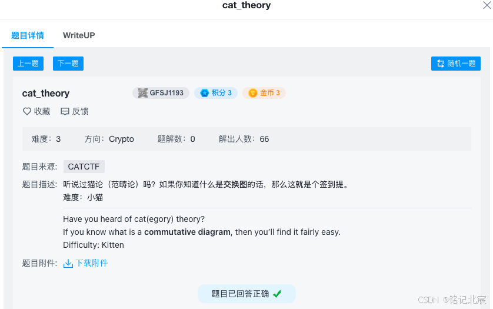
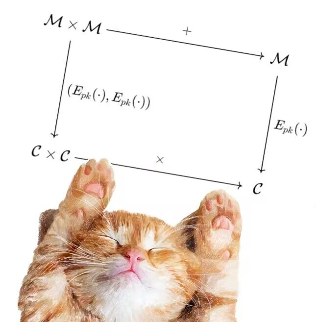

# Cat_thery



附件下载后是一个jpg文件和一个[sage](https://so.csdn.net/so/search?q=sage&spm=1001.2101.3001.7020)文件（python）：



```python
from Crypto.Util.number import bytes_to_long, getStrongPrime, getRandomRange, getRandomNBitInteger
from secret import flag


class CatCrypto():
    
    def get_p_q(self) -> tuple:
        def get_blum_prime():
            while True:
                p = getStrongPrime(self.nbits // 2)
                if p % 4 == 3:
                    return p

        p = get_blum_prime()
        q = 2
        while gcd(p-1, q-1) != 2:
            q = get_blum_prime()
            
        return p, q
    
    # KeyGen:
    def __init__(self, nbits=1024):
        self.nbits = nbits
        
        self.p, self.q =  self.get_p_q()
        p, q = self.p, self.q
        
        self.n = p * q
        n = self.n
        
        self.lam = (p-1) * (q-1) // 2
        
        self.g = self.n + 1
        
        x = getRandomRange(1, n)
        h = -x^2 
        self.hs = int(pow(h, n, n^2))

        
    # Enc(pk, -) = Epk(-):
    def enc(self, m: int) -> int:
        n = self.n
        hs = self.hs
        
        a = getRandomNBitInteger(ceil( n.bit_length() / 2 ))
        c = (1 + m*n) * pow(hs, a, n^2)
        return int(c)
        
    # Dec(sk, -) = Dsk(-):
    def dec(self, c: int) -> int:
        lam = self.lam
        n = self.n
        
        L = lambda x: (x-1)//n
        
        mu = inverse_mod(lam, n)
        m = L( int(pow(c, lam, n^2)) ) * mu % n
        return m
        
        
    @property
    def nbits(self):
        return self.__nbits
    
    @nbits.setter
    def nbits(self, nbits):
        self.__nbits = nbits

cat = CatCrypto(nbits=1024)

m = bytes_to_long(flag)
assert m.bit_length() < 1024

m1 = getRandomNBitInteger(m.bit_length() - 1)
m2 = getRandomNBitInteger(m.bit_length() - 2)
m3 = m - m1 - m2

c1 = cat.enc(m1)
c2 = cat.enc(m2)
c3 = cat.enc(m3)

print(f'dec(c1*c2) = {cat.dec(c1*c2)}')
print(f'dec(c2*c3) = {cat.dec(c2*c3)}')
print(f'dec(c3*c1) = {cat.dec(c3*c1)}')

"""
dec(c1*c2) = 127944711034541246075233071021313730868540484520031868999992890340295169126051051162110
dec(c2*c3) = 63052655568318504263890690011897854119750959265293397753485911143830537816733719293484
dec(c3*c1) = 70799336441419314836992058855562202282043225138455808154518156432965089076630602398416
"""
```

### 1. 分析图片（.jpg 文件）

这个交换图展示的是一个加密系统的 **同态加密** 性质，其核心思想是：加密前的操作与加密后的操作具有某种兼容性。

#### 图中符号解释

1. **M\mathcal{M}M** 表示明文空间，即未加密的数据集合。
2. **C\mathcal{C}C** 表示密文空间，即加密后的数据集合。
3. **Epk(⋅)E_{pk}(\cdot)Epk(⋅)**  表示加密算法，输入明文，输出密文，公钥为 pkpkpk。
4. 箭头上的符号：

    * +++：表示在明文空间上的加法操作。
    * ×\\times×：表示在密文空间上的乘法操作。

#### 图的含义

##### 上方路径（明文操作后加密）

1. 从左上角开始，(m1,m2)∈M×M(m\_1, m\_2) \\in \\mathcal{M} \\times \\mathcal{M}(m1,m2)∈M×M，这是两个明文。
2. 对这两个明文进行加法运算：m1+m2∈Mm\_1 + m\_2 \\in \\mathcal{M}m1+m2∈M。
3. 将加法结果加密，得到密文：Epk(m1+m2)∈CE\_{pk}(m\_1 + m\_2) \\in \\mathcal{C}Epk(m1+m2)∈C。

##### 下方路径（分别加密后在密文空间操作）

1. 从左上角的明文对 (m1,m2)(m\_1, m\_2)(m1,m2)，分别对 m1m\_1m1 和 m2m\_2m2 进行加密，得到密文对 (Epk(m1),Epk(m2))∈C×C(E\_{pk}(m\_1), E\_{pk}(m\_2)) \\in \\mathcal{C} \\times \\mathcal{C}(Epk(m1),Epk(m2))∈C×C。
2. 在密文空间对这两个密文进行乘法操作：Epk(m1)×Epk(m2)∈CE\_{pk}(m\_1) \\times E\_{pk}(m\_2) \\in \\mathcal{C}Epk(m1)×Epk(m2)∈C。

##### 图的交换性质

      无论是 **先对明文加法然后加密**，还是 **先分别加密然后对密文执行乘法**，最终的结果都是相同的： Epk(m1+m2)\=Epk(m1)×Epk(m2)E\_{pk}(m\_1 + m\_2) \= E\_{pk}(m\_1) \\times E\_{pk}(m\_2)Epk(m1+m2)\=Epk(m1)×Epk(m2)

### 2. 分析代码（.sage 文件），已添加详细注释

```python
# 引入必要的库函数
from Crypto.Util.number import bytes_to_long, getStrongPrime, getRandomRange, getRandomNBitInteger
from secret import flag  # 导入flag（秘密信息）
 
class CatCrypto():
    """
    CatCrypto 类定义了一个加密系统，包括生成密钥对、加密和解密的实现。
    """
 
    def get_p_q(self) -> tuple:
        """
        生成符合要求的两个质数 p 和 q。
        p 是一个布卢姆质数（满足 p ≡ 3 (mod 4)）。
        q 满足 gcd(p-1, q-1) = 2 的约束。
        """
        def get_blum_prime():
            """
            生成一个布卢姆质数。
            """
            while True:
                # 随机生成一个强质数，位数为 nbits 的一半
                p = getStrongPrime(self.nbits // 2)
                # 检查是否为布卢姆质数（p ≡ 3 (mod 4)）
                if p % 4 == 3:
                    return p
 
        p = get_blum_prime()  # 生成第一个布卢姆质数 p
        q = 2  # 初始化 q 为 2（用于后续循环生成）
        # 确保 gcd(p-1, q-1) = 2
        while gcd(p-1, q-1) != 2:
            q = get_blum_prime()
            
        return p, q  # 返回生成的 p 和 q
    
    # 密钥生成器（KeyGen）
    def __init__(self, nbits=1024):
        """
        初始化 CatCrypto 实例，并生成加密系统的密钥。
        """
        self.nbits = nbits  # 设置密钥位数
        self.p, self.q = self.get_p_q()  # 生成质数 p 和 q
        p, q = self.p, self.q
 
        # 模数 n = p * q
        self.n = p * q
        n = self.n
 
        # λ = (p-1) * (q-1) // 2，是拉姆达函数的一种形式
        self.lam = (p-1) * (q-1) // 2
 
        # g 是 n + 1，这是一个特殊的选择
        self.g = self.n + 1
 
        # 生成随机数 x 并计算 h
        x = getRandomRange(1, n)  # 从 1 到 n-1 中随机选择 x
        h = -x^2  # 计算 h 为 -x^2
        # 计算 hs = h^n mod n^2
        self.hs = int(pow(h, n, n^2))
 
    # 加密（Enc）
    def enc(self, m: int) -> int:
        """
        加密一个明文整数 m。
        """
        n = self.n  # 模数 n
        hs = self.hs  # hs 是密钥中的一个参数
        
        # 随机选择一个 a，位数为 n 位的一半
        a = getRandomNBitInteger(ceil(n.bit_length() / 2))
        # 计算密文 c = (1 + m*n) * hs^a mod n^2
        c = (1 + m * n) * pow(hs, a, n^2)
        return int(c)  # 返回加密后的密文
        
    # 解密（Dec）
    def dec(self, c: int) -> int:
        """
        解密一个密文整数 c。
        """
        lam = self.lam  # 拉姆达值
        n = self.n  # 模数 n
        
        # 定义 L 函数：L(x) = (x-1) // n
        L = lambda x: (x - 1) // n
        
        # 计算模逆 mu = lam^-1 mod n
        mu = inverse_mod(lam, n)
        # 使用解密公式计算明文 m
        m = L(int(pow(c, lam, n^2))) * mu % n
        return m  # 返回解密后的明文
        
    # 定义 nbits 的属性方法（getter 和 setter）
    @property
    def nbits(self):
        return self.__nbits
    
    @nbits.setter
    def nbits(self, nbits):
        self.__nbits = nbits
 
# 初始化加密系统
cat = CatCrypto(nbits=1024)
 
# 将 flag 转换为整数 m
m = bytes_to_long(flag)
# 确保 m 的位数小于 1024 位
assert m.bit_length() < 1024
 
# 随机生成三个部分 m1, m2, m3，使得 m = m1 + m2 + m3
m1 = getRandomNBitInteger(m.bit_length() - 1)
m2 = getRandomNBitInteger(m.bit_length() - 2)
m3 = m - m1 - m2
 
# 加密三个部分
c1 = cat.enc(m1)
c2 = cat.enc(m2)
c3 = cat.enc(m3)
 
# 测试加密和解密结果
print(f'dec(c1*c2) = {cat.dec(c1*c2)}')
print(f'dec(c2*c3) = {cat.dec(c2*c3)}')
print(f'dec(c3*c1) = {cat.dec(c3*c1)}')
 
"""
dec(c1*c2) = 127944711034541246075233071021313730868540484520031868999992890340295169126051051162110
dec(c2*c3) = 63052655568318504263890690011897854119750959265293397753485911143830537816733719293484
dec(c3*c1) = 70799336441419314836992058855562202282043225138455808154518156432965089076630602398416
"""
```

3. 解题算法  
    问题分解
4. 我们有三个加密后的解密结果：

    * m1+m2
    * m2+m3
    * m3+m1
5. 目标是通过这些和值恢复原始值 m1,m2,m3 的总和 m=m1+m2+m3。
6. 数学上，这三个和值的总和为：

    (m1+m2)+(m2+m3)+(m3+m1)=2×(m1+m2+m3)
7. 换句话说：

    m1+m2+m3=[(m1+m2)+(m2+m3)+(m3+m1)]/2

计算的逻辑  
通过提供的三个解密结果：

* m1+m2=127944711034541246075233071021313730868540484520031868999992890340295169126051051162110
* m2+m3=63052655568318504263890690011897854119750959265293397753485911143830537816733719293484
* m3+m1=70799336441419314836992058855562202282043225138455808154518156432965089076630602398416

将它们代入公式：

m=[(m1+m2)+(m2+m3)+(m3+m1)]/2

计算得：

m=127944711034541246075233071021313730868540484520031868999992890340295169126051051162110+63052655568318504263890690011897854119750959265293397753485911143830537816733719293484+707993364414193148369920588555622022820432251384558081545181564329650890766306023984162

结果即为明文 m1+m2+m3，而原始明文 flag 即是 m1+m2+m3的字节形式。

### 4. 算法实现

```python
from Crypto.Util.number import long_to_bytes
 
m1_plus_m2 = 127944711034541246075233071021313730868540484520031868999992890340295169126051051162110
m2_plus_m3 = 63052655568318504263890690011897854119750959265293397753485911143830537816733719293484
m3_plus_m1 = 70799336441419314836992058855562202282043225138455808154518156432965089076630602398416
 
m = (m1_plus_m2 + m2_plus_m3 + m3_plus_m1) // 2
print(long_to_bytes(m))
```


