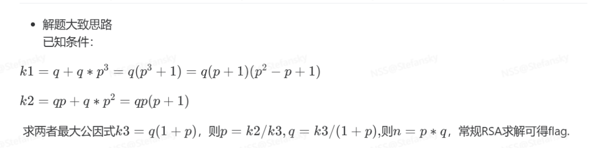

# SWPU 2020 happy

# 一：题目类型

[P11.共享素数-N不互素](原理学习笔记/密码学/RSA加密算法/RSA基础篇/P05.基于N分解的题目/P11.共享素数-N不互素.md)

# 二：题目

```python
('c=', '0x7a7e031f14f6b6c3292d11a41161d2491ce8bcdc67ef1baa9eL')
('e=', '0x872a335')
#q + q*p^3 =1285367317452089980789441829580397855321901891350429414413655782431779727560841427444135440068248152908241981758331600586
#qp + q *p^2 = 1109691832903289208389283296592510864729403914873734836011311325874120780079555500202475594
```

# 三：解题思路



# 四：解题代码

```python
#k1=q + q*p^3=q(p^3 + 1)=q(p + 1)(p^2 - p + 1)
#k2=qp + q *p^2 =qp(p+1)
import libnum
import gmpy2
c = 0x7a7e031f14f6b6c3292d11a41161d2491ce8bcdc67ef1baa9e
e = 0x872a335
k1 =1285367317452089980789441829580397855321901891350429414413655782431779727560841427444135440068248152908241981758331600586
k2 = 1109691832903289208389283296592510864729403914873734836011311325874120780079555500202475594
k3=gmpy2.gcd(k1,k2)
p = k2//k3
q = k3//(p+1)
n=p*q
phi_n=(q-1)*(p-1)
d=libnum.invmod(e,phi_n)
m=pow(c,d,n)
print(m)
print(libnum.n2s(int(m)))
```


