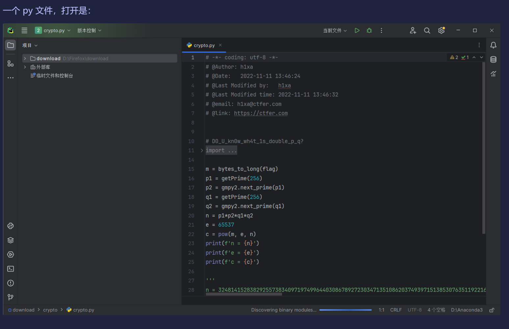
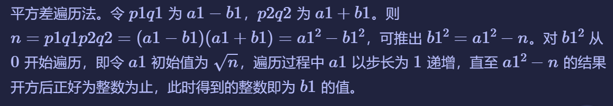
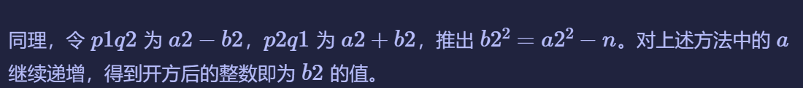

# g4的密码小课堂

# 题目



# 分析

​`根据内容可以判断为 RSA 算法。需要得出两对`​$p$和$q$后算出$\varphi(n)$，结合$e$得到$d$，由$c^d\equiv m \mod n$计算出m，将m转换为bytes类型即可得到flag。

```python
# -*- coding: utf-8 -*-
# @Author: h1xa
# @Date:   2022-11-11 13:46:24
# @Last Modified by:   h1xa
# @Last Modified time: 2022-11-11 13:46:32
# @email: h1xa@ctfer.com
# @link: https://ctfer.com
 
 
# D0_U_kn0w_wh4t_1s_double_p_q?
from Crypto.Util.number import *
import gmpy2
from secret import flag
 
m = bytes_to_long(flag)  # 根据函数名判断是个bytes类型转long的函数
p1 = getPrime(256)  # 获取长度为256bits的素数p1
p2 = gmpy2.next_prime(p1)  # 获取p1后的下一个素数p2
q1 = getPrime(256)  # 获取长度为256bits的素数q1
q2 = gmpy2.next_prime(q1)  # 获取q1后的下一个素数q2
n = p1*p2*q1*q2  # 连乘四个素数得到n
e = 65537
c = pow(m, e, n)  # 计算m的e次方模n得到c
print(f'n = {n}')  # 输出“n=”+n的值
print(f'e = {e}')  # 输出“e=”+e的值
print(f'c = {c}')  # 输出“c=”+c的值
 
'''
n = 32481415283829255738340971974996440308678927230347135108620374939715138530763511922162670183907243606574444169915409791604348383760619870966025875897723568019791384873824917630615306169399783499416450554084947937964622799112489092007113967359069561646966430880857626323529067736582503070705981530002918845439
e = 65537
c = 13000287388412632836037240605681731720629565122285665653580432791960428695510699983959843546876647788034949392762752577597448919397451077080119543495058705350347758604475392673242110787093172219487592930482799866421316089027633497253411081184454114601840835490688775466505809830410778091437211186254631834255
'''
```

根据代码可以判断，n由两个p及两个q相乘得到，而p2，q2均取p1，q1的后一个素数，因此对n开根号得到数的范围在（p1q1,p2q2)与（p1q2,p2q1)之间。





```python
import gmpy2
 
pq = []  # 存放分解结果
a = gmpy2.iroot(num, 2)[0]  # n开根号，返回整数部分
while 1:
    B_2 = pow(a, 2) - n  # 根号n整数部分的平方 - n
    if gmpy2.is_square(B_2):  # 判断B_2是否为完全平方数
        b = gmpy2.iroot(B_2, 2)[0]  # B_2开根号，返回整数部分
        pq_1 = a - b
        pq_2 = a + b
        pq.append([pq_1, pq_2])  # 存入p1q1,p2q2和p1q2,p2q1
        if len(pq) == 2:  # 如果存入两组数据
            break  # 退出循环
    a += 1  # 如果B_2不是完全平方数，a加1后重新循环
 
```

最后通过p1，q1，p2，q2计算$\varphi(n)$,d,m,最终得到flag。

```python
import gmpy2
from Crypto.Util.number import *
 
varphi_n = (p1-1)*(q1-1)*(p2-1)*(q2-1)  # 求varphi_n
d = gmpy2.invert(e, varphi_n)  # 求e模varphi_n的逆元d
m = pow(c, d, n)  # 求m
return long_to_bytes(m)
 
```

完整代码如下：

```python
import gmpy2
from Crypto.Util.number import *
 
n = 32481415283829255738340971974996440308678927230347135108620374939715138530763511922162670183907243606574444169915409791604348383760619870966025875897723568019791384873824917630615306169399783499416450554084947937964622799112489092007113967359069561646966430880857626323529067736582503070705981530002918845439
e = 65537
c = 13000287388412632836037240605681731720629565122285665653580432791960428695510699983959843546876647788034949392762752577597448919397451077080119543495058705350347758604475392673242110787093172219487592930482799866421316089027633497253411081184454114601840835490688775466505809830410778091437211186254631834255
 
 
def factor(num):
    pq = []  # 存放分解结果
    a = gmpy2.iroot(num, 2)[0]  # n开根号，返回整数部分
    while 1:
        B_2 = pow(a, 2) - n  # 根号n整数部分的平方 - n
        if gmpy2.is_square(B_2):  # 判断B_2是否为完全平方数
            b = gmpy2.iroot(B_2, 2)[0]  # B_2开根号，返回整数部分
            pq_1 = a - b
            pq_2 = a + b
            pq.append([pq_1, pq_2])  # 存入p1q1,p2q2和p1q2,p2q1
            if len(pq) == 2:  # 如果存入两组数据
                break  # 退出循环
        a += 1  # 如果B_2不是完全平方数，a加1后重新循环
 
    p1q1, p2q2 = pq[0]
    p1q2, p2q1 = pq[1]
    p1 = gmpy2.gcd(p1q1, p1q2)
    p2 = gmpy2.gcd(p2q1, p2q2)
    q1 = p1q1 // p1  # 需要整除，直接除生成的q1为mpfr类型
    q2 = p2q2 // p2
 
    varphi_n = (p1-1)*(q1-1)*(p2-1)*(q2-1)  # 求varphi_n
    d = gmpy2.invert(e, varphi_n)  # 求e模varphi_n的逆元d
    m = pow(c, d, n)  # 求m
    return long_to_bytes(m)
 
 
if __name__ == '__main__':
    print(factor(n))
 
```

# Flag

​`ctfshow{you_Know__doub1e_g2_1s_g4_s1m0n}`​

# 参考

[【Loading 8/9】Crypto_ctfshow_WriteUp | _新手必刷_菜狗杯 - Guanz - 博客园](https://www.cnblogs.com/Guanz/p/17909958.html#%E9%A2%98%E7%9B%AE-4)

[P24.平方差遍历法](原理学习笔记/密码学/RSA加密算法/RSA基础篇/P24.平方差遍历法.md)


