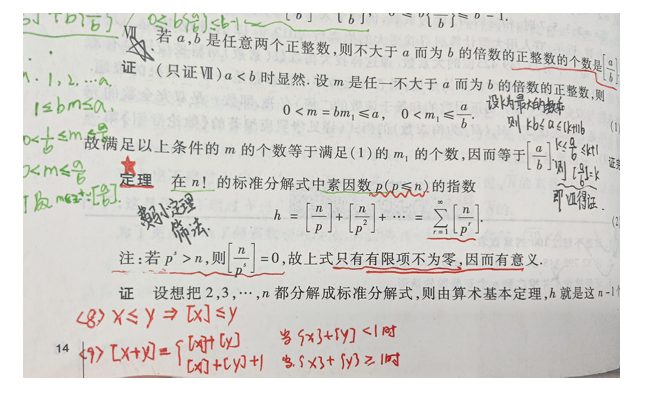
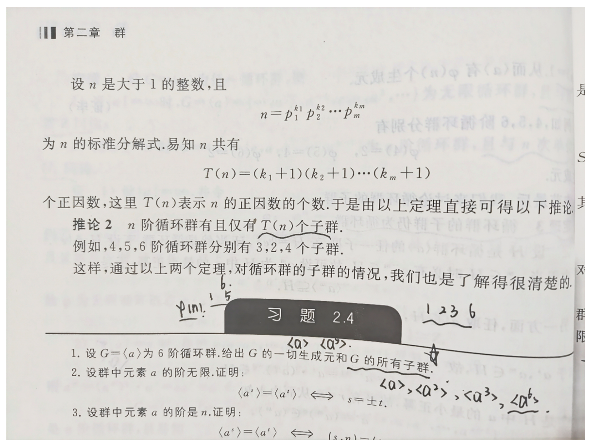

# math_rsa

## 题目

```python
from random import random
from Crypto.Util.number import *
from math import factorial
flag = b'ctfshow{******}'
def get_d(n):
    d = 0
    leak = 0
    n_factorial = factorial(n) # n!
    for x in range(1,11**111111111111111111111111111111111111111111111111111):
        for y in range(1,11**11111111111111111111111111111111111111111111111111):
            if (x + y) * n_factorial == x * y: # assert (x+y)N!=xy
                d = (d + 1) % key
    while True:
        if isPrime(d):
            break
        else:
            hint = getPrime(1111)
            d += hint
            leak += hint
    return [d,leak]

p = getPrime(512)
q = getPrime(512)
n = p * q
phi_n = (p - 1) * (q - 1)
key = bytes_to_long(b'ctfshow' * 11)
d,leak = get_d(1111111)
e = inverse(d,phi_n)
c = pow(m,e,n)
print("n = {}".format(n))
print("c = {}".format(c))
print("leak = {}".format(leak))


‍```
n = 54574114381718620167617516254929393779619478308097113614916675753251123548928131184783684874283433005383416329333515148795542347110691860676572758697931909264778996887013262158676437681328356540522795904026051878217112848328807404132186855022441100415245863609800487131682707570632405183635021611108835267759
c = 6152360020770587319042211616230221955276231957369900018326509075246049533065274193822064664954312088370274199977933471629773286341632192578865475616294549753212257409853382739383167314755235136431546938621288480401985886224522239505956567272435201576625728864298081471539244545838583231944620511300185831132
leak = 16102974322718628332775750617032895793782360562291434204500149732571174230338263002384756014760949775420804601441832387500764784508882168206386996211671060761357982709828010115692143995397973526517421403555634084184433318856377393377764138389228581916413401245531536422259037376817202123767631518253694641004207511682233164891541552631514
‍```


```

# 分析

这是一道基于一道初等数论的题目，原来的题目是基于求解下面这个式子的正整数解的个数。但是为了降低难度，我把他直接改为了后面的形式。之后的下面就是该题的推导过程，思路来源于一道国外的ACM算法竞赛，同时也有2024MoeCTF的启发。

$$
{1\over x}+{1\over y}={1\over n!}\Rightarrow(x+y)n!=xy
$$

$$
n!=\prod_{p≤n}p^{\sum_{i=1}^{\infty}{[\frac{n}{p^r}]}}
$$

$$
N!(X+Y)=XY\Rightarrow (X-N!)(Y-N!)=(N!)^2\quad\quad\quad X,Y>N!\\ 设s=X-N!,t=Y-N!\Rightarrow st=(N!)^2\Rightarrow求解(N!)^2的正因子即可。\\ 由上述定理可知对于N!可求得其素数分解指数。\quad\quad\quad\quad 此处算数基本定理\\ n=p_1^{\alpha_1}p_2^{\alpha_2}\cdots p_n^{\alpha_n}\Rightarrow正因子数量是(\alpha_1+1)(\alpha_2+1)\cdots(\alpha_n+1)\\ 基于这道题就是result = (2\alpha_1+1)(2\alpha_2+1)\cdots(2\alpha_n+1)
$$





```python
from Crypto.Util.number import *
from math import factorial
n = 103330542626516420807301905726573387550867494686143103887055474807988149955966648224665284044332607855248093779005449265788306991052880948813033233406715644673143191264099963477552819389772596196119992522467978004445575034117135146509896140678120473030324574891847960932697323867619909565684490583102149023851
c = 2181606427804928425412374624139560251545183354353030861962774760561929474665302913091226094474595052977775951819550728457537013736174886037964128497444618287780682988087357383630222110192522189542788450110082368769046943383505075407529784646403928654625029946321839202089037015087736326469145473927991457442
leak = 7984238721801883603742066937979056487427527820255138457621992419047663220266057552116574052834630375690375092046026192256277125777600409615468415746067419711597861327524926228830220090285012561895746259869940471782310304230371017992158689421484753453100087478226738476784103463669781531682756920053005095835793234130712926392464976681384
key = bytes_to_long(b'ctfshow'*11)
def solve_e(n, p):
    count = 0
    while n > 0:
        n //= p
        count += n
    return count
def Solve(n):
    is_prime = [True] * (n + 1)
    p = 2
    primes = []
    while p * p <= n:
        if is_prime[p]:
            for i in range(p * p, n + 1, p):
                is_prime[i] = False
        p += 1
    for p in range(2, n + 1):
        if is_prime[p]:
            primes.append(p)
    counter = 1
    for prime in primes:
        power = solve_e(n, prime)
        counter = counter * (2 * power + 1) % key
    return counter
d = Solve(1111111) + leak
m = pow(c,d,n)
print(long_to_bytes(m))

```

```python
from Crypto.Util.number import *
from math import factorial
n = 103330542626516420807301905726573387550867494686143103887055474807988149955966648224665284044332607855248093779005449265788306991052880948813033233406715644673143191264099963477552819389772596196119992522467978004445575034117135146509896140678120473030324574891847960932697323867619909565684490583102149023851
c = 2181606427804928425412374624139560251545183354353030861962774760561929474665302913091226094474595052977775951819550728457537013736174886037964128497444618287780682988087357383630222110192522189542788450110082368769046943383505075407529784646403928654625029946321839202089037015087736326469145473927991457442
leak = 7984238721801883603742066937979056487427527820255138457621992419047663220266057552116574052834630375690375092046026192256277125777600409615468415746067419711597861327524926228830220090285012561895746259869940471782310304230371017992158689421484753453100087478226738476784103463669781531682756920053005095835793234130712926392464976681384
key = bytes_to_long(b'ctfshow'*11)
prime_factors_cache = {}
# 计算N!质因数分解
def prime_factors(n):
    if n in prime_factors_cache:
        return prime_factors_cache[n]
    factors = {}
    count = 0
    # 计算2的幂次
    while n % 2 == 0:
        count += 1
        n //= 2
    if count > 0:
        factors[2] = count
    # 计算奇数质因数
    for i in range(3, int(n ** 0.5) + 1, 2):
        count = 0
        while n % i == 0:
            count += 1
            n //= i
        if count > 0:
            factors[i] = count
    # 如果n是质数，则记录其幂次
    if n > 2:
        factors[n] = 1
    # 记录缓存
    prime_factors_cache[n] = factors
    return factors
# 记录每个质数在N!中的最高幂
factorization_cache = {}
# 计算N!的组合数
def count_factorial(n):
    # 如果结果已缓存，则直接返回
    if n in factorization_cache:
        return factorization_cache[n]
    factorization = {}
    # 遍历每个数，计算其质因数分解
    for i in range(2, n + 1):
        factors = prime_factors(i)
        for prime, e in factors.items():
            factorization[prime] = factorization.get(prime, 0) + e
    # 计算组合数
    counter = 1
    for e in factorization.values():
        counter = counter * (2 * e + 1) % key
    # 缓存结果并返回
    factorization_cache[n] = counter
    return counter

d = count_factorial(1111111) + leak
m = pow(c,d,n)
print(long_to_bytes(m))

```

# Flag

```python
ctfshow{1i_I1_d@n_Sh3n}
```

# 参考

‍


