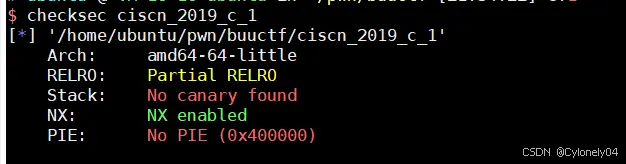

# CTF-Pwn入门基础工具——Checksec

拿到[pwn](https://so.csdn.net/so/search?q=pwn&spm=1001.2101.3001.7020)题的第一步大都是运行下，再拿checksec看开启了哪些保护机制，这篇文章主要介绍checksec的安装和使用要点。

1. 安装

    ```bush
    git clone https://github.com/slimm609/checksec.sh.git
    cd checksec.sh
    sudo ln –sf checksec /usr/bin/checksec
    (gdb-peda自带老版本的checksec，最后会做对比）
    ```
2. 使用（peda内置）

    ```bush
    checksec --file=

    ```



**1.Relro：Full Relro（重定位表只读）**   
　　Relocation Read Only， 重定位表只读。重定位表即.got 和 .plt 两个表。  
**2.Stack：No Canary found（能栈溢出）**   
　　Canary, 金丝雀。金丝雀原来是石油工人用来判断气体是否有毒。而应用于在栈保护上则是在初始化一个栈帧时在栈底（stack overflow 发生的高位区域的尾部）设置一个随机的 canary 值，当函数返回之时检测 canary 的值是否经过了改变，以此来判断 stack/buffer overflow 是否发生，若改变则说明栈溢出发生，程序走另一个流程结束，以免漏洞利用成功。 因此我们需要获取 Canary 的值，或者防止触发 stack_chk_fail 函数，或是利用此函数。  
**3.NX： NX enable（不可执行内存）**   
　　Non-Executable Memory，不可执行内存。了解 Linux 的都知道其文件有三种属性，即 rwx，而 NX 即没有 x 属性。如果没有 w 属性，我们就不能向内存单元中写入数据，如果没有 x 属性，写入的 shellcode 就无法执行。所以，我们此时应该使用其他方法来 pwn 掉程序，其中最常见的方法为 ROP (Return-Oriented Programming 返回导向编程)，利用栈溢出在栈上布置地址，每个内存地址对应一个 gadget，利用 ret 等指令进行衔接来执行某项功能，最终达到 pwn 掉程序的目的。  
**4.PIE： PIE enable（开启ASLR 地址随机化）**   
　　Address space layout randomization，地址空间布局随机化。通过将数据随机放置来防止攻击。


