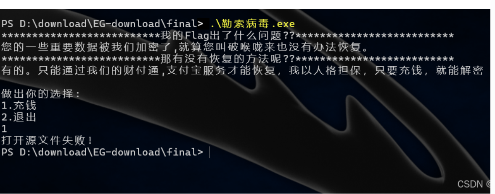

# Re2

# 题目



# 分析

下载附件后尝试运行，选择充钱，但是返回打开源文件失败


使用 ida64 [反编译](https://so.csdn.net/so/search?q=%E5%8F%8D%E7%BC%96%E8%AF%91&spm=1001.2101.3001.7020)看看伪代码，先定位到 main 函数


跟进 main_0


由于我们当前目录下并没有名为 flag.txt 的文件，因此会返回打开源文件失败!


新建一个 flag.txt 后即可正常进入到下一步，也就是输入密钥


定位关键函数 sub_401069 ，应该是对输入密钥 Str 进行了处理


跟进 sub_401069 看看


继续跟进 sub_401A70 函数，就来到了加密逻辑的地方


将 Str 中的每个字符与 0x1F 异或，结果存储在 Str1 中，之后将 Str1 与[字符串](https://so.csdn.net/so/search?q=%E5%AD%97%E7%AC%A6%E4%B8%B2&spm=1001.2101.3001.7020) "DH<sub>mqqvqxB^||zll@Jq</sub>jkwpmvez{" 进行比较，如果两个字符串相同则返回充值成功。

这里说明一下，strcmp 函数返回 0 表示两个字符串相同。

逆向异或即可得到 str：

```python
str1 = "DH~mqqvqxB^||zll@Jq~jkwpmvez{"
str = ''
for i in str1:
    str += chr(0x1f^ord(i))
    print(str)
```


得到 str 即密钥为：[Warnning]Access_Unauthorized


显示充值成功但是没有看到 flag


那就继续跟进下一个函数 sub_401028


跟进 sub_4014E0 函数


东西有点多，扔给 GPT 看看


> * **初始化阶段**：
>
>   * ​`sub_401780`​ 初始化密钥流。
>   * ​`sub_401800`​ 根据密钥初始化状态数组。
>   * ​`sub_4018E0`​ 进行密钥调度，交换状态数组中的元素。
> * **加密 / 解密阶段**：
>
>   * ​`sub_4015E0`​ 使用 RC4 算法对文件内容进行加密或解密，将结果输出到另一个文件流。

判断为 RC4 算法，核心函数是 sub_4015E0


那么这里处理的数据其实就是文件流 Stream 中的字节数据，即我们的文件 enflag.txt

写脚本 RC4 解密即可，exp：

```python
# 逆向异或获取密钥
# str1 = "DH~mqqvqxB^||zll@Jq~jkwpmvez{"
# str = ''
# for i in str1:
#     str += chr(0x1f^ord(i))
# print(str)
 
 
def rc4(key, data):
    # 初始化 S 算法状态表
    S = list(range(256))
    j = 0
    key_len = len(key)
 
    # 初始化 S 表
    for i in range(256):
        j = (j + S[i] + key[i % key_len]) % 256
        S[i], S[j] = S[j], S[i]
 
    # 加密/解密数据
    i = 0
    j = 0
    result = bytearray()
 
    for byte in data:
        i = (i + 1) % 256
        j = (j + S[i]) % 256
        S[i], S[j] = S[j], S[i]
        k = S[(S[i] + S[j]) % 256]
        result.append(byte ^ k)
 
    return bytes(result)
 
 
def decrypt_file(key, input_file):
    # 将密钥转换为字节形式
    key_bytes = key.encode('utf-8')
 
    # 读取加密文件
    with open(input_file, 'rb') as f:
        encrypted_data = f.read()
 
    # 使用 RC4 解密文件内容
    decrypted_data = rc4(key_bytes, encrypted_data)
 
    # 将解密后的内容输出到控制台
    print("解密后的内容：")
    print(decrypted_data.decode('utf-8', errors='ignore'))
 
 
# 解密 enflag.txt 文件并输出结果
decrypt_file("[Warnning]Access_Unauthorized", "enflag.txt")
```


拿到 flag：flag{RC4&->ENc0d3F1le}

# Flag

flag{RC4&->ENc0d3F1le}

# 参考

[RC4加密解密算法](原理学习笔记/逆向/二进制逆向/RC4加密解密算法.md)


