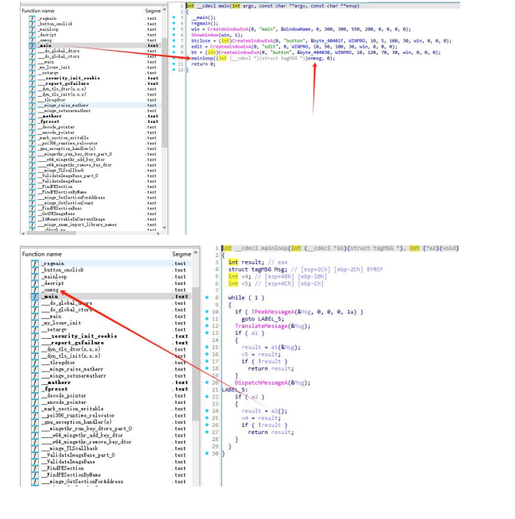
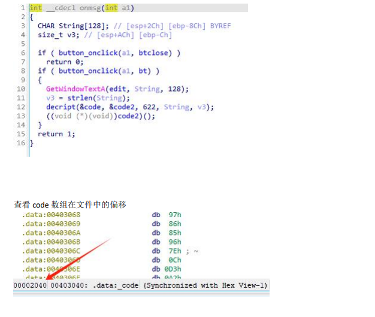
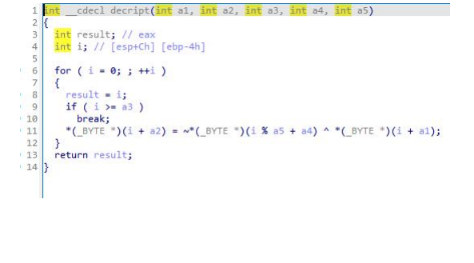

# easy_re

# 分析

打开 IDA，查看 main 函数，发现执行进入 mainloop 函数,根据函数名与分析程序体可知 这是 windows 窗口程序的主循环。 发现当 PeekMessageA 判断为有消息时会执行一个传入 mainloop 的函数指针，查看 main 函 数可以发现此函数是 onmsg



分析 onmsg 函数，可以推测用户输入注册码点注册后会存入 String 数组然后调用 decript 函数解密，解密过程是把 code 数组中存的代码通过 String 数组密钥解密后存入 code2 数组， 然后跳转到 code2 数组去执行，如果解密失败强制执行就会造成程序崩溃。这里可知 code 在文件中偏移地址为 0x2040,数组长度 622。



查看 decript 函数，解密方法是把密钥取反后和密文异或



编写解密程序，思路是暴力破解直到解密出”ctfshow”字样

```python
CTF='ctfshow'.encode()

def decript(L,n,password,k):
    T=[]
    for i in range(n):
        j=i%k
        T.append(L[i]^(0xff-password[j]))
    res=bytes(T)
    return CTF in res

def brute(fname):
    f=open(fname,'rb')
    exe=f.read()
    f.close()
    offset=0x2040
    n=622
    code=exe[offset:offset+n]
    L=list(code)
    charset=list(range(0x41,0x41+26))+list(range(0x61,0x61+26))
    R=[]
    for a in charset:
        for b in charset:
            for c in charset:
                r=decript(L,n,[a,b,c],3)
                #print(a,b,c,r)
                if r:
                    s=chr(a)+chr(b)+chr(c)
                    print(s,'is ok!!!')
                    R.append(s)
    print(R)
    return R

```

# Flag

ctfshow{caf3149204aa7dd58af81369046a3ac6}

# 参考


