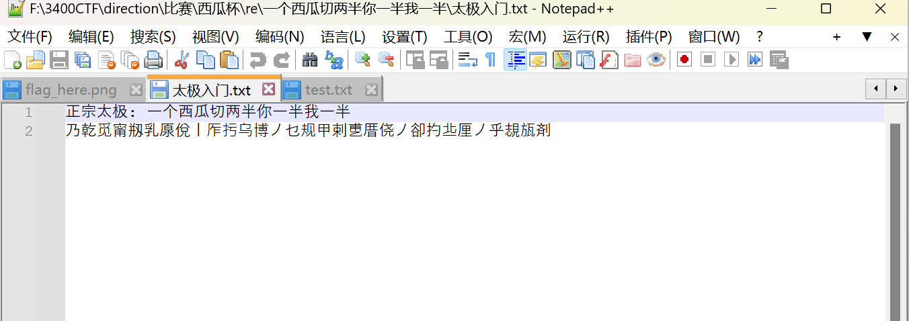

# 一个西瓜切两半你一半我一半

# 题目



# 分析

使用反编译工具  uncompyle6 .\\tm.cpython-36.pyc

```python
# uncompyle6 version 3.9.1
# Python bytecode version base 3.11 (3495)
# Decompiled from: Python 3.11.1 (tags/v3.11.1:a7a450f, Dec  6 2022, 19:58:39) [MSC v.1934 64 bit (AMD64)]
# Embedded file name: 题目.py
# Compiled at: 2024-07-01 23:25:16
# Size of source mod 2**32: 426 bytes

Unsupported Python version, 3.11, for decompilation


# Unsupported bytecode in file .\题目.cpython-311.pyc
# Unsupported Python version, 3.11, for decompilation
flag = "ctfshow{this_is_fake_flag}"
key = "这是假的密钥"
tmp = ""
for i in flag:
    tmp += chr(ord(i) - 32)

crypt = ""
for i in range(len(tmp)):
    crypt += chr(ord(tmp[i]) + ord(key[i % len(key)]))

print(crypt)

# okay decompiling .\tm.cpython-36.pyc

```

给的另一个文件里 一个西瓜切两半你一半我一半 是key

下面的中文是加密后的结果

将代码逆向得如下代码

```python
crypt = '乃乾觅甯剏乳厡侻丨厏扝乌博丿乜规甲剌乶厝侥丿卻扚丠厘丿乎覟瓬剤'
key = '一个西瓜切两半你一半我一半'

t1 = ''
for i in range(len(crypt)):
    t1 += chr(ord(crypt[i]) - ord(key[i % len(key)]))
flag = ''
for i in t1:
    flag += chr(ord(i) + 32)
print(flag)

```

# Flag

ctfshow{Hell0_Reverse_Qi@n_D@0}

# 参考

[Python Uncompyle6 反编译工具使用 与 Magic Number 详解](原理学习笔记/密码学/一些工具/Python%20Uncompyle6%20反编译工具使用%20与%20Magic%20Number%20详解.md)


