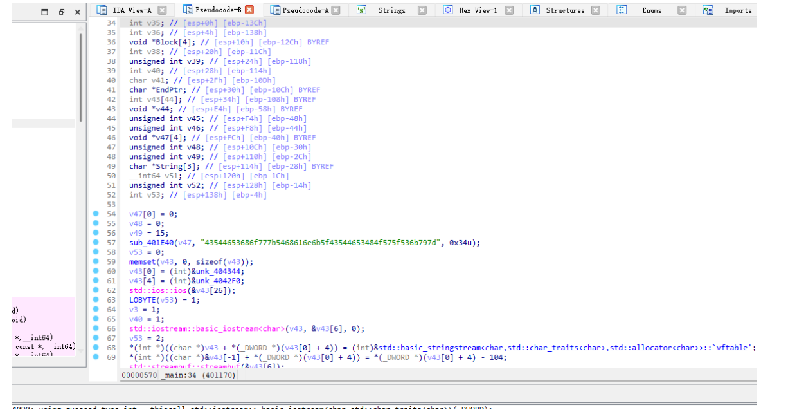

# 探索进制的奥秘

# 题目



# 分析

发现是进制转换。

```python
hex_string = "43544653686f777b5468616e6b5f43544653484f575f536b797d"
byte_data = bytes.fromhex(hex_string)
text = byte_data.decode('utf-8')
print(text)
```

# Flag

CTFShow{Thank\_CTFSHOW\_Sky}

# 参考


