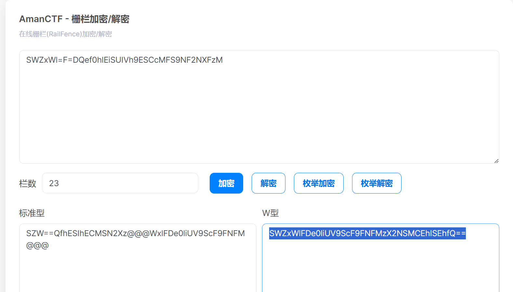
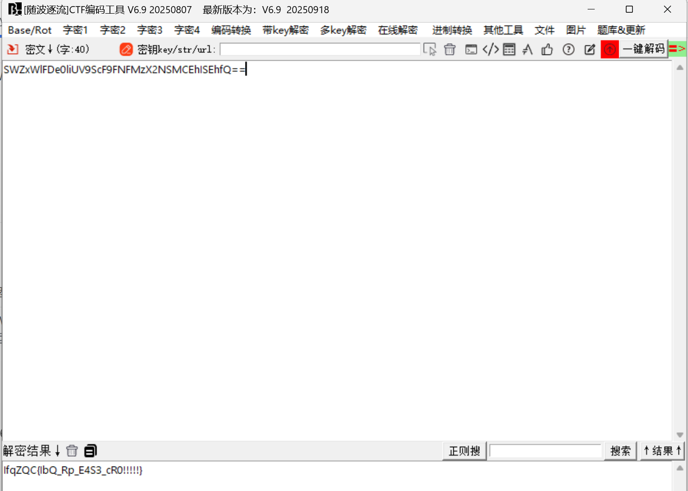
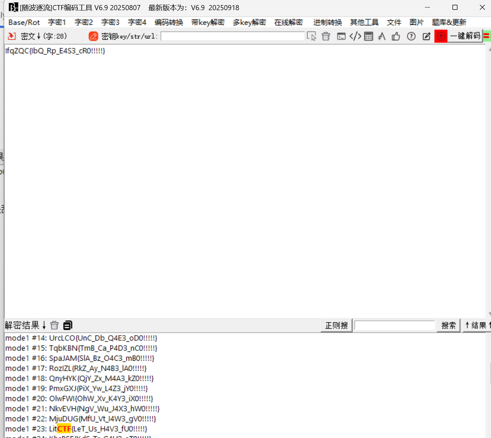

# Is this only base

# 题目

SWZxWl=F=DQef0hlEiSUIVh9ESCcMFS9NF2NXFzM  
今年是本世纪的第23年呢

# 分析

需要动动脑子，看到两个等号可以判断是base64加密，题目又提示23，可以判断是栅栏加密：

然后base64解密：

解出来是乱码，试试凯撒：

# Flag

NSSCTF{LeT_Us_H4V3_fU0!!!!!}

# 参考

