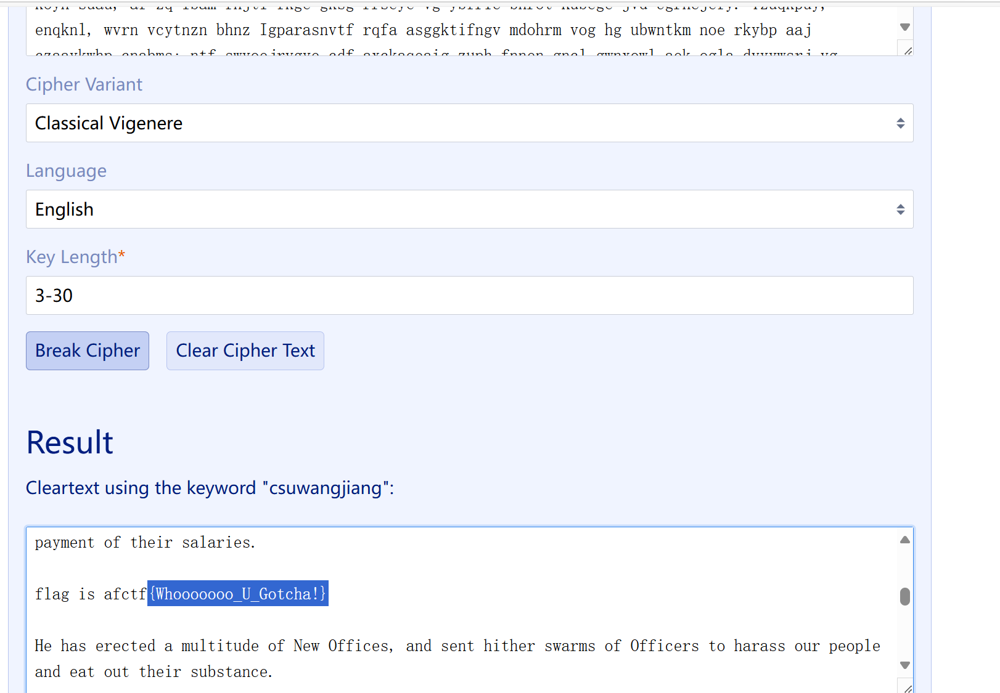

# Vigenère

# 题目

```c
#include <stdio.h>
#include <string.h>
#include <stdlib.h>

int main()
{
	freopen("flag.txt","r",stdin);
	freopen("flag_encode.txt","w",stdout);
	char key[] = /*SADLY SAYING! Key is eaten by Monster!*/;
	int len = strlen(key);
	char ch;
	int index = 0;
	while((ch = getchar()) != EOF){
		if(ch>='a'&&ch<='z'){
			putchar((ch-'a'+key[index%len]-'a')%26+'a');
			++index;
		}else if(ch>='A'&&ch<='Z'){
			putchar((ch-'A'+key[index%len]-'a')%26+'A');
			++index;
		}else{
			putchar(ch);
		}
	}
	return 0;
}

```

# 分析

提示是维吉尼亚加密了，还给了篇文章，直接维吉尼亚解密就行了。

[Vigenere Solver | guballa.de](https://www.guballa.de/vigenere-solver)



# Flag

NSSCTF{Whooooooo_U_Gotcha!}

# 参考


