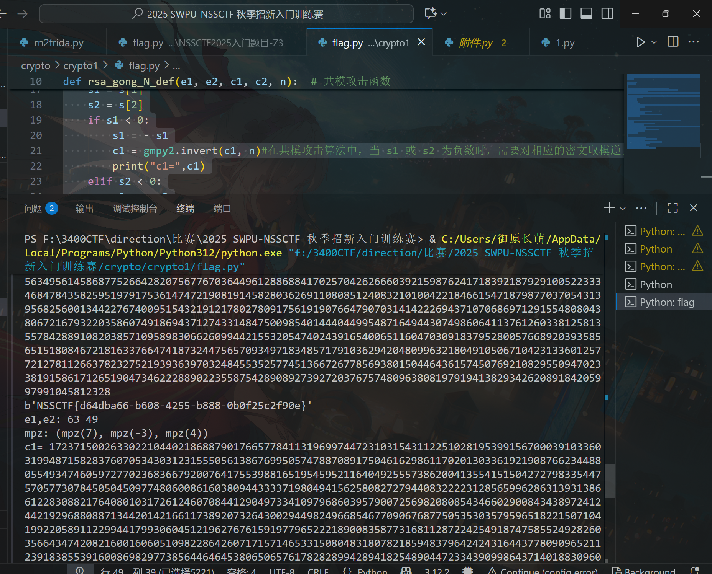

# crypto1

# 题目

```python
from gmpy2 import *
from Crypto.Util.number import *

flag  = '****************************'
flag = {"asfajgfbiagbwe"}
p = getPrime(2048)
q = getPrime(2048)
m1 = bytes_to_long(bytes(flag.encode()))

e1e2 = 3087
n = p*q
print()

flag1 = pow(m1,e1,n)
flag2 = pow(m1,e2,n)
print('flag1= '+str(flag1))
print('flag2= '+str(flag2))
print('n= '+str(n))

#flag1= 463634070971821449698012827631572665302589213868521491855038966879005784397309389922926838028598122795187584361359142761652619958273094398420314927073008031088375892957173280915904309949716842152249806486027920136603248454946737961650252641668562626310035983343018705370077783879047584582817271215517599531278507300104564011142229942160380563527291388260832749808727470291331902902518196932928128107067117198707209620169906575791373793854773799564060536121390593687449884988936522369331738199522700261116496965863870682295858957952661531894477603953742494526632841396338388879198270913523572980574440793543571757278020533565628285714358815083303489096524318164071888139412436112963845619981511061231001617406815056986634680975142352197476024575809514978857034477688443230263761729039797859697947454810551009108031457294164840611157524719173343259485881089252938664456637673337362424443150013961181619441267926981848009107466576314685961478748352388452114042115892243272514245081604607798243817586737546663059737344687130881861357423084448027959893402445303299089606081931041217035955143939567456782107203447898345284731038150377722447329202078375870541529539840051415759436083384408203659613313535094343772238691393447475364806171594
#flag2= 130959534275704453216282334815034647265875632781798750901627773826812657339274362406246297925411291822193191483409847323315110393729020700526946712786793380991675008128561863631081095222226285788412970362518398757423705216112313533155390315204875516645459370629706277876211656753247984282379731850770447978537855070379324935282789327428625259945250066774049650951465043700088958965762054418615838049340724639373351248933494355591934236360506778496741051064156771092798005112534162050165095430065000827916096893408569751085550379620558282942254606978819033885539221416335848319082054806148859427713144286777516251724474319613960327799643723278205969253636514684757409059003348229151341200451785288395596484563480261212963114071064979559812327582474674812225260616757099890896900340007990585501470484762752362734968297532533654846190900571017635959385883945858334995884341767905619567505341752047589731815868489295690574109758825021386698440670611361127170896689015108432408490763723594673299472336065575301681055583084547847733168801030191262122130369687497236959760366874106043801542493392227424890925595734150487586757484304609945827925762382889592743709682485229267604771944535469557860120878491329984792448597107256325783346904408
#n= 609305637099654478882754880905638123124918364116173050874864700996165096776233155524277418132679727857702738043786588380577485490575591029930152718828075976000078971987922107645530323356525126496562423491563365836491753476840795804040219013880969539154444387313029522565456897962200817021423704204077133003361140660038327458057898764857872645377236870759691588009666047187685654297678987435769051762120388537868493789773766688347724903911796741124237476823452505450704989455260077833828660552130714794889208291939055406292476845194489525212129635173284301782141617878483740788532998492403101324795726865866661786740345862631916793208037250277376942046905892342213663197755010315060990871143919384283302925469309777769989798197913048813940747488087191697903624669415774198027063997058701217124640082074789591591494106726857376728759663074734040755438623372683762856958888826373151815914621262862750497078245369680378038995425628467728412953392359090775734440671874387905724083226246587924716226512631671786591611586774947156657178654343092123117255372954798131265566301316033414311712092913492774989048057650627801991277862963173961355088082419091848569675686058581383542877982979697235829206442087786927939745804017455244315305118437


```

# 分析

[P15.共模攻击](原理学习笔记/密码学/RSA加密算法/RSA基础篇/P15.共模攻击.md)

可以分析出是共模攻击，然后把两段flag拼起来。唯一有区别的是e需要爆破，写一段代码把e爆破出来就行。

```python
c1= 463634070971821449698012827631572665302589213868521491855038966879005784397309389922926838028598122795187584361359142761652619958273094398420314927073008031088375892957173280915904309949716842152249806486027920136603248454946737961650252641668562626310035983343018705370077783879047584582817271215517599531278507300104564011142229942160380563527291388260832749808727470291331902902518196932928128107067117198707209620169906575791373793854773799564060536121390593687449884988936522369331738199522700261116496965863870682295858957952661531894477603953742494526632841396338388879198270913523572980574440793543571757278020533565628285714358815083303489096524318164071888139412436112963845619981511061231001617406815056986634680975142352197476024575809514978857034477688443230263761729039797859697947454810551009108031457294164840611157524719173343259485881089252938664456637673337362424443150013961181619441267926981848009107466576314685961478748352388452114042115892243272514245081604607798243817586737546663059737344687130881861357423084448027959893402445303299089606081931041217035955143939567456782107203447898345284731038150377722447329202078375870541529539840051415759436083384408203659613313535094343772238691393447475364806171594
c2= 130959534275704453216282334815034647265875632781798750901627773826812657339274362406246297925411291822193191483409847323315110393729020700526946712786793380991675008128561863631081095222226285788412970362518398757423705216112313533155390315204875516645459370629706277876211656753247984282379731850770447978537855070379324935282789327428625259945250066774049650951465043700088958965762054418615838049340724639373351248933494355591934236360506778496741051064156771092798005112534162050165095430065000827916096893408569751085550379620558282942254606978819033885539221416335848319082054806148859427713144286777516251724474319613960327799643723278205969253636514684757409059003348229151341200451785288395596484563480261212963114071064979559812327582474674812225260616757099890896900340007990585501470484762752362734968297532533654846190900571017635959385883945858334995884341767905619567505341752047589731815868489295690574109758825021386698440670611361127170896689015108432408490763723594673299472336065575301681055583084547847733168801030191262122130369687497236959760366874106043801542493392227424890925595734150487586757484304609945827925762382889592743709682485229267604771944535469557860120878491329984792448597107256325783346904408
n= 609305637099654478882754880905638123124918364116173050874864700996165096776233155524277418132679727857702738043786588380577485490575591029930152718828075976000078971987922107645530323356525126496562423491563365836491753476840795804040219013880969539154444387313029522565456897962200817021423704204077133003361140660038327458057898764857872645377236870759691588009666047187685654297678987435769051762120388537868493789773766688347724903911796741124237476823452505450704989455260077833828660552130714794889208291939055406292476845194489525212129635173284301782141617878483740788532998492403101324795726865866661786740345862631916793208037250277376942046905892342213663197755010315060990871143919384283302925469309777769989798197913048813940747488087191697903624669415774198027063997058701217124640082074789591591494106726857376728759663074734040755438623372683762856958888826373151815914621262862750497078245369680378038995425628467728412953392359090775734440671874387905724083226246587924716226512631671786591611586774947156657178654343092123117255372954798131265566301316033414311712092913492774989048057650627801991277862963173961355088082419091848569675686058581383542877982979697235829206442087786927939745804017455244315305118437
e1e2=3087

import libnum
import gmpy2
 
 
def rsa_gong_N_def(e1, e2, c1, c2, n):  # 共模攻击函数
    e1, e2, c1, c2, n = int(e1), int(e2), int(c1), int(c2), int(n)
    print("e1,e2:", e1, e2)
    s = gmpy2.gcdext(e1, e2)##`gmpy2.gcdext(e1, e2)` 是 `gmpy2` 库中的一个函数，用于计算两个整数 e1 和 e2 的最大公约数及其系数。具体来说，`gmpy2.gcdext(e1, e2)` 返回一个三元组 `(gcd, s, t)`，其中 `gcd` 是 e1 和 e2 的最大公约数，`s` 和 `t` 是满足 `s * e1 + t * e2 = gcd` 的整数。
 
                             ##在共模攻击算法中，需要使用 `gmpy2.gcdext` 函数求解 e1 和 e2 的最大公约数及其系数，以便计算解密密钥。
    print("mpz:", s)
    s1 = s[1]
    s2 = s[2]
    if s1 < 0:
        s1 = - s1
        c1 = gmpy2.invert(c1, n)#在共模攻击算法中，当 s1 或 s2 为负数时，需要对相应的密文取模逆元，以保证计算正确。因此，可以使用 gmpy2.invert 函数计算密文 c1 或 c2 在模 n 意义下的乘法逆元，以便进行计算。
        print("c1=",c1)
    elif s2 < 0:
        s2 = - s2
        c2 = gmpy2.invert(c2, n)
        print("c2=",c2)
    m = (pow(c1, s1, n) * pow(c2, s2, n)) % n
    return int(m)
 
 
def de(c, e, n):  # 因为此时的m不是真正的m，而是m^k，所以对m^k进行爆破
    k = 0
    while k < 1000:  # 指定k小于1000
        mk = c + n * k
        flag, true1 = gmpy2.iroot(mk, e)  # 返回的第一个数值为开方数，第二个数值为布尔型，可整除为true，可自行测试
        if True == true1:
            # print(libnum.n2s(int(flag)))
            return flag
        k += 1
 
 
for e1 in range(2, e1e2):
    if e1e2 % e1 == 0:  # 爆破可整除的e
        e2 = e1e2 // e1
        c = rsa_gong_N_def(e1, e2, c1, c2, n)
        e = gmpy2.gcd(e1, e2)
        m1 = de(c, e, n)
        if m1:  # 指定输出m1
            print(libnum.n2s(int(m1)))
```



# Flag

NSSCTF{d64dba66-b608-4255-b888-0b0f25c2f90e}

# 参考


