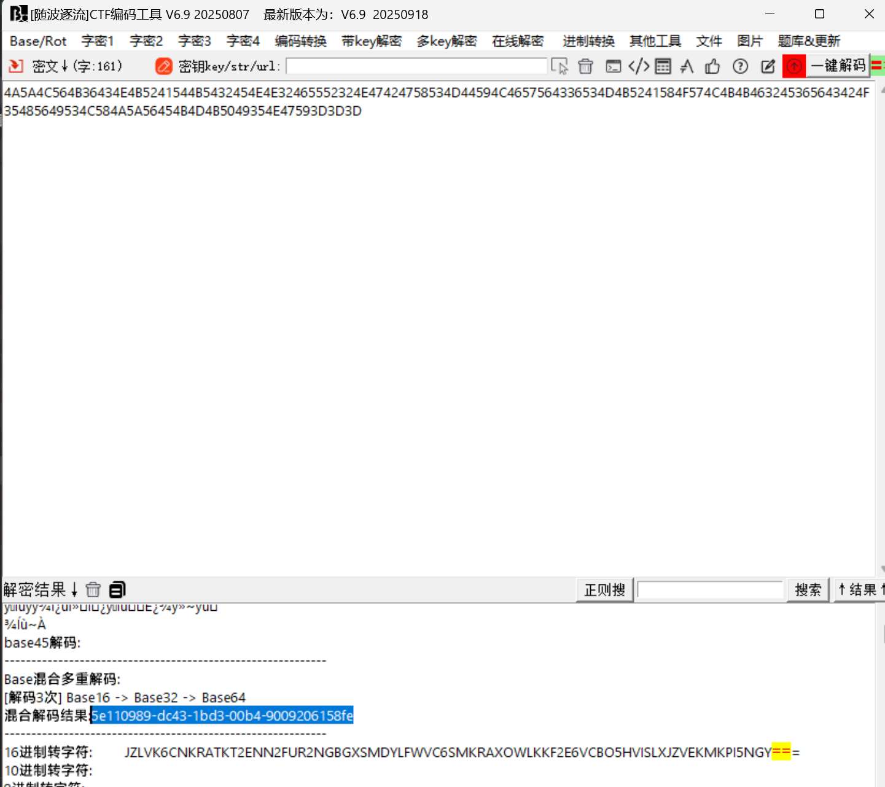

# crypto6

# 题目

```python
var="************************************"
flag='NSSCTF{' + base64.b16encode(base64.b32encode(base64.b64encode(var.encode()))) + '}'
print(flag)

小明不小心泄露了源码，输出结果为：4A5A4C564B36434E4B5241544B5432454E4E32465552324E47424758534D44594C4657564336534D4B5241584F574C4B4B463245365643424F35485649534C584A5A56454B4D4B5049354E47593D3D3D，你能还原出var的正确结果吗？
```

# 分析



# Flag

NSSCTF{5e110989-dc43-1bd3-00b4-9009206158fe}

# 参考


