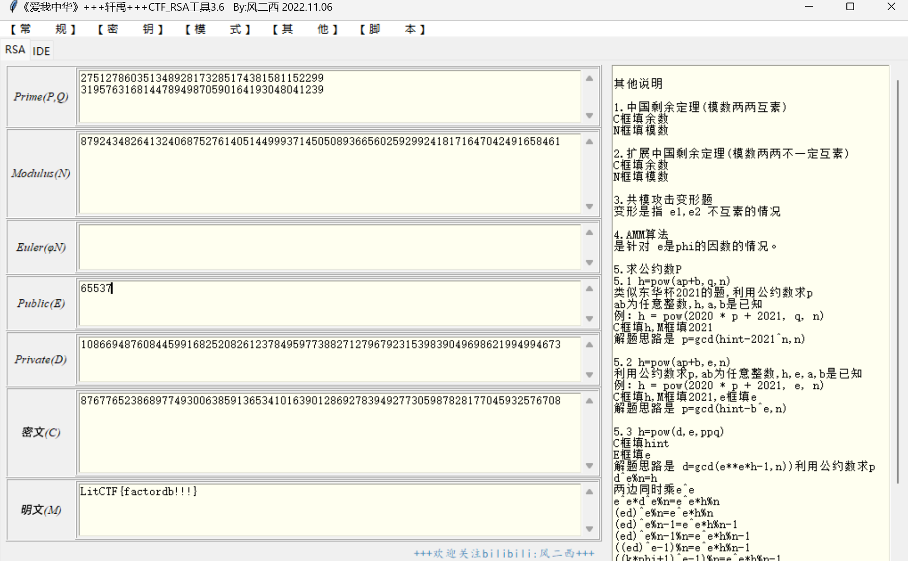

# factordb (中级)

# 题目

```python
e = 65537
n = 87924348264132406875276140514499937145050893665602592992418171647042491658461
c = 87677652386897749300638591365341016390128692783949277305987828177045932576708
```

# 分析

用factordb分解就行了



# Flag

NSSCTF{factordb!!!}

# 参考


