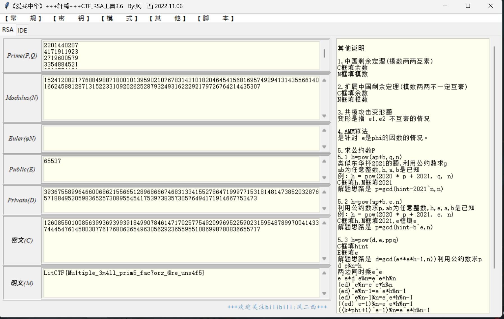

# yafu (中级)

# 题目

```python
from Crypto.Util.number import *
from secret import flag

m = bytes_to_long(flag)
n  = 1
for i in range(15):
    n *=getPrime(32)
e = 65537
c = pow(m,e,n)
print(f'n = {n}')
print(f'c = {c}')
'''
n = 15241208217768849887180010139590210767831431018204645415681695749294131435566140166245881287131522331092026252879324931622292179726764214435307
c = 12608550100856399369399391849907846147170257754920996952259023159548789970041433744454761458030776176806265496305629236559551086998780836655717
'''
```

# 分析

多因子加密+yafu分解，yafu分解出来就能做了。



# Flag

NSSCTF{Mu1tiple_3m4ll_prim5_fac7ors_@re_uns4f5}

# 参考


