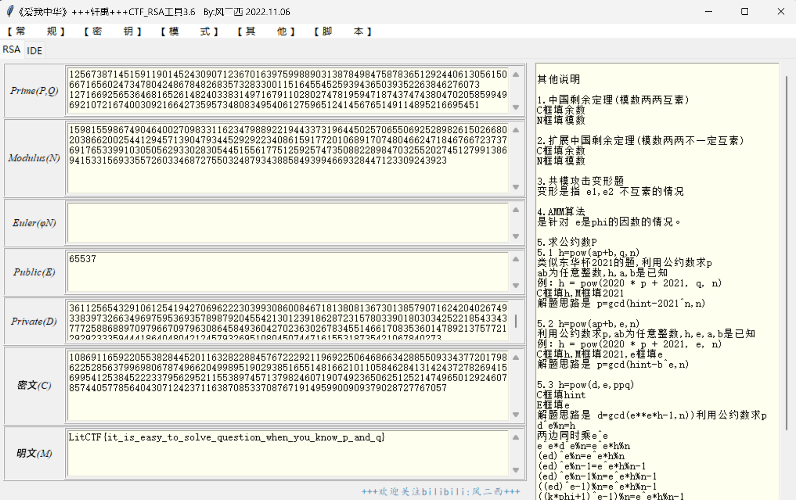

# 家人们！谁懂啊，RSA签到都不会 (初级)

# 题目

```python
from Crypto.Util.number import *
from secret import flag

m = bytes_to_long(flag)
p = getPrime(512)
q = getPrime(512)
e = 65537
n = p*q
c = pow(m,e,n)
print(f'p = {p}')
print(f'q = {q}')
print(f'c = {c}')
'''
p = 12567387145159119014524309071236701639759988903138784984758783651292440613056150667165602473478042486784826835732833001151645545259394365039352263846276073
q = 12716692565364681652614824033831497167911028027478195947187437474380470205859949692107216740030921664273595734808349540612759651241456765149114895216695451
c = 108691165922055382844520116328228845767222921196922506468663428855093343772017986225285637996980678749662049989519029385165514816621011058462841314243727826941569954125384522233795629521155389745713798246071907492365062512521474965012924607857440577856404307124237116387085337087671914959900909379028727767057
'''

```

# 分析

```python
p = 12567387145159119014524309071236701639759988903138784984758783651292440613056150667165602473478042486784826835732833001151645545259394365039352263846276073
q = 12716692565364681652614824033831497167911028027478195947187437474380470205859949692107216740030921664273595734808349540612759651241456765149114895216695451
c = 108691165922055382844520116328228845767222921196922506468663428855093343772017986225285637996980678749662049989519029385165514816621011058462841314243727826941569954125384522233795629521155389745713798246071907492365062512521474965012924607857440577856404307124237116387085337087671914959900909379028727767057
n=p*q
print(n)
```



# Flag

LitCTF{it_is_easy_to_solve_question_when_you_know_p_and_q}

# 参考


