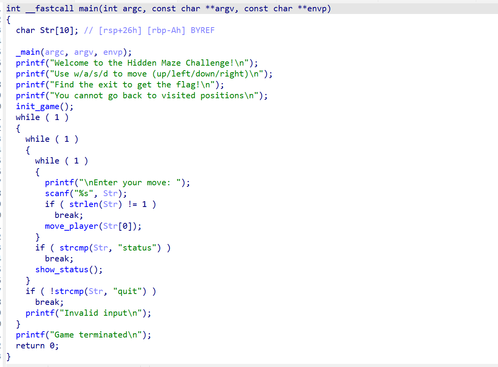
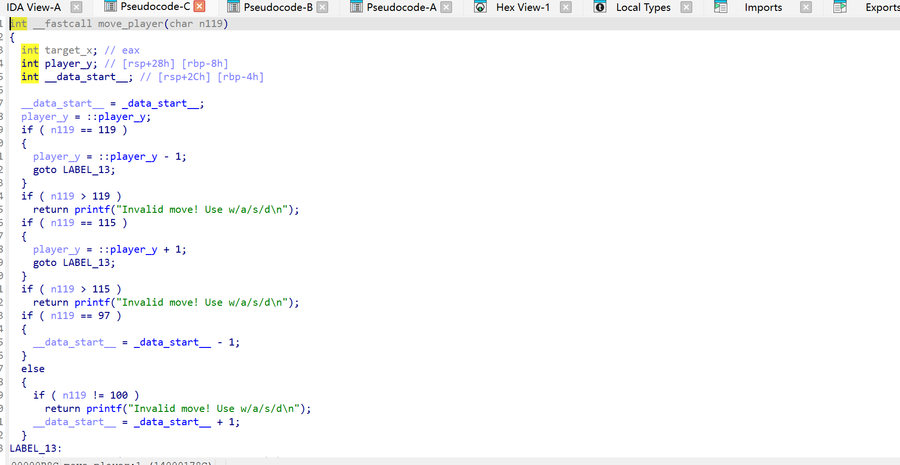
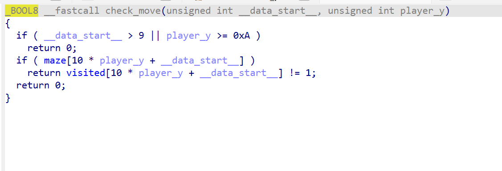
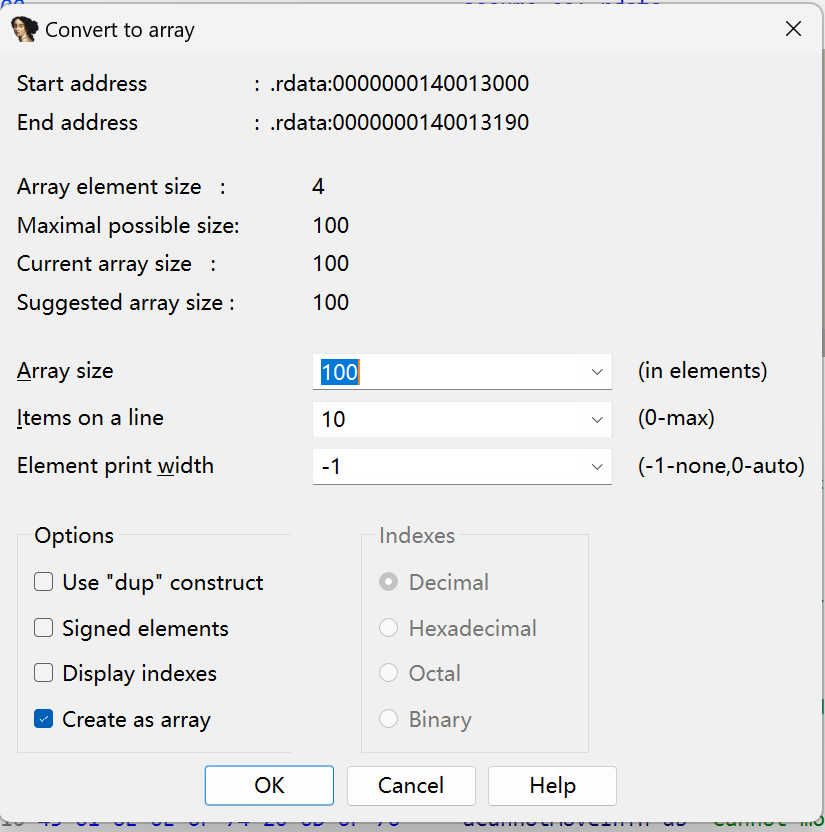
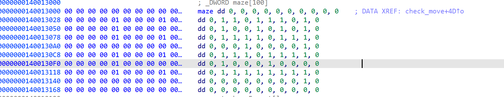
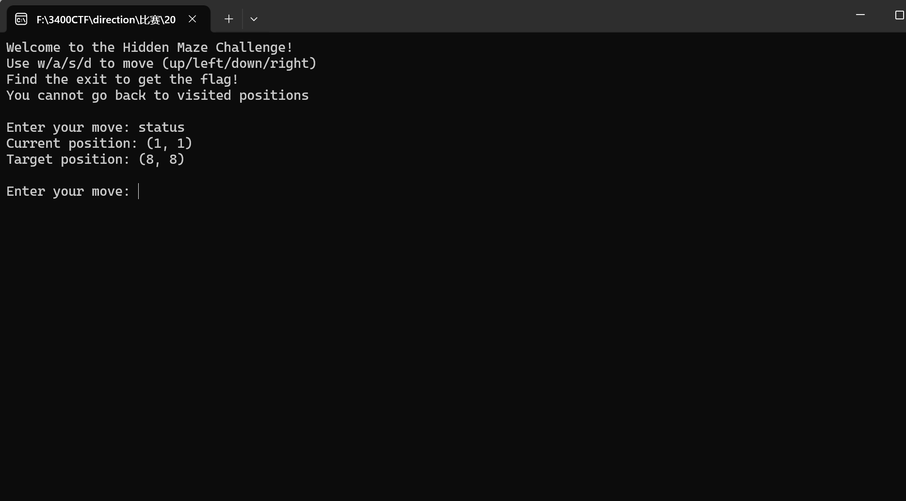
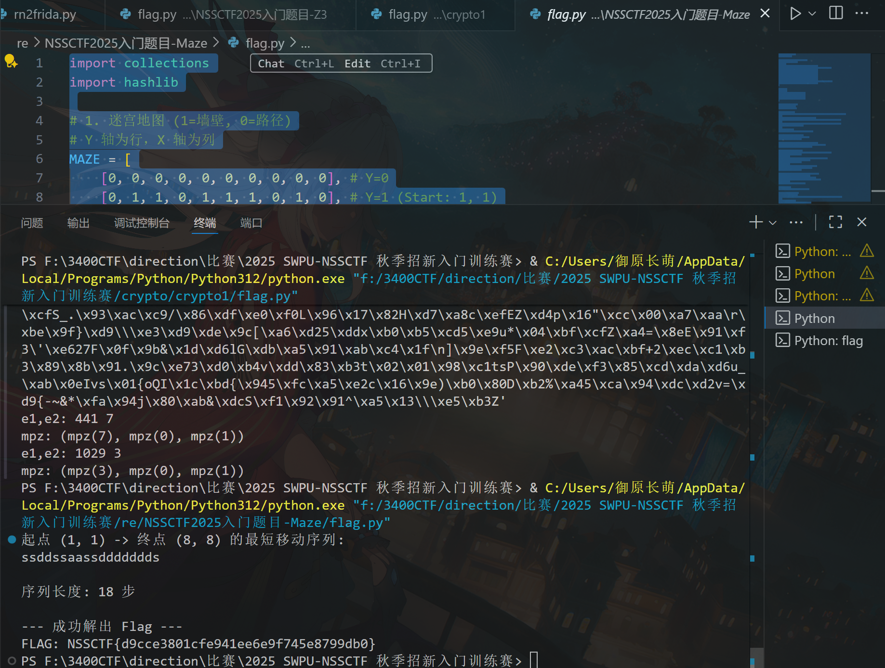

# NSSCTF2025入门题目-Maze

# 题目


# 分析

一般看到走迷宫，我们就知道要用bfs算法了。在这类题中，flag一般是操作方向的md5，我们需要找到起始点与终点，然后还有地图。

用idapro打开：



没什么有用的，点开move_player看看：



这是一个控制玩家移动的算法，在这里我们知道Flag is NSSCTF{md5(your input!)}，点开check_move：



这里maze应该就是地图了，点开看看：

选中maze这些数据，然后点array：



就可以把它拼成这样了：



随后我们打开程序，输入status，就可以知道起点和终点了：



有了这些，我们直接利用bfs算法，就可以算出路径从而得出flag了。

```python
import collections
import hashlib

# 1. 迷宫地图 (1=墙壁, 0=路径)
# Y 轴为行，X 轴为列
MAZE = [
    [0, 0, 0, 0, 0, 0, 0, 0, 0, 0], # Y=0
    [0, 1, 1, 0, 1, 1, 1, 0, 1, 0], # Y=1 (Start: 1, 1)
    [0, 1, 0, 0, 1, 0, 1, 0, 1, 0], # Y=2
    [0, 1, 1, 1, 1, 0, 1, 1, 1, 0], # Y=3
    [0, 0, 0, 1, 0, 0, 0, 0, 1, 0], # Y=4
    [0, 1, 1, 1, 0, 1, 1, 1, 1, 0], # Y=5
    [0, 1, 0, 0, 0, 1, 0, 0, 0, 0], # Y=6
    [0, 1, 1, 1, 1, 1, 1, 1, 1, 0], # Y=7
    [0, 0, 0, 0, 0, 0, 0, 0, 1, 0], # Y=8 (Target: 8, 8)
    [0, 0, 0, 0, 0, 0, 0, 0, 0, 0]  # Y=9
]

SIZE = 10
MOVES = {
    'w': (-1, 0), # 上 (Y-1)
    'a': (0, -1), # 左 (X-1)
    's': (1, 0),  # 下 (Y+1)
    'd': (0, 1)   # 右 (X+1)
}

# 坐标为 (Y, X) 格式
START_POS = (1, 1)
TARGET_POS = (8, 8)

def solve_maze():
    """使用 BFS 算法寻找从 START_POS 到 TARGET_POS 的最短移动序列。"""
    
    # 队列存储状态：(y, x, path_string)
    queue = collections.deque([(START_POS[0], START_POS[1], "")])
    
    # 记录已访问的坐标 (y, x)，用于满足“不能去已访问位置”的规则。
    visited = {START_POS} 
    
    while queue:
        y, x, path = queue.popleft()

        # 检查是否到达终点
        if (y, x) == TARGET_POS:
            return path 

        # 尝试所有可能的移动 (w, a, s, d)
        for move_char, (dy, dx) in MOVES.items():
            ny, nx = y + dy, x + dx

            # 1. 边界检查
            if not (0 <= nx < SIZE and 0 <= ny < SIZE):
                continue
            
            # 2. 墙壁检查 (MAZE[ny][nx] 必须是 '1')
            if MAZE[ny][nx] == 0:
                continue
            
            # 3. 访问检查 (必须未被访问)
            if (ny, nx) in visited:
                continue

            # 移动有效：标记访问并加入队列
            visited.add((ny, nx))
            new_path = path + move_char
            queue.append((ny, nx, new_path))
            
    return None # 未找到路径

# 1. 执行搜索
movement_sequence = solve_maze()

if movement_sequence:
    # 2. 计算 MD5 值
    md5_hash = hashlib.md5(movement_sequence.encode()).hexdigest()
    
    # 3. 构建 Flag
    FLAG = f"NSSCTF{{{md5_hash}}}"
    
    print(f"起点 (1, 1) -> 终点 (8, 8) 的最短移动序列: \n{movement_sequence}")
    print(f"\n序列长度: {len(movement_sequence)} 步")
    print("\n--- 成功解出 Flag ---")
    print(f"FLAG: {FLAG}")
else:
    print("未能找到从起点到终点的有效路径，请检查迷宫数据。")
```



# Flag

NSSCTF{d9cce3801cfe941ee6e9f745e8799db0}

# 参考


