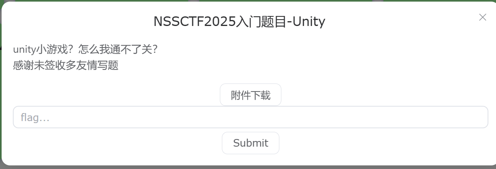
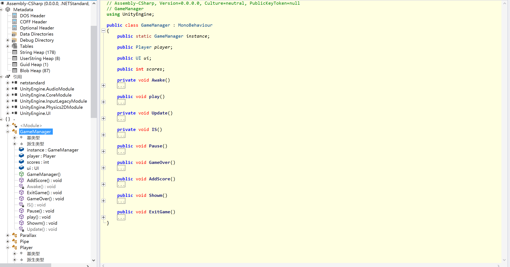
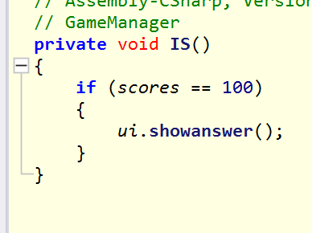
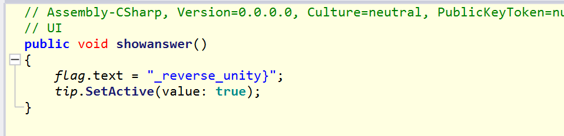
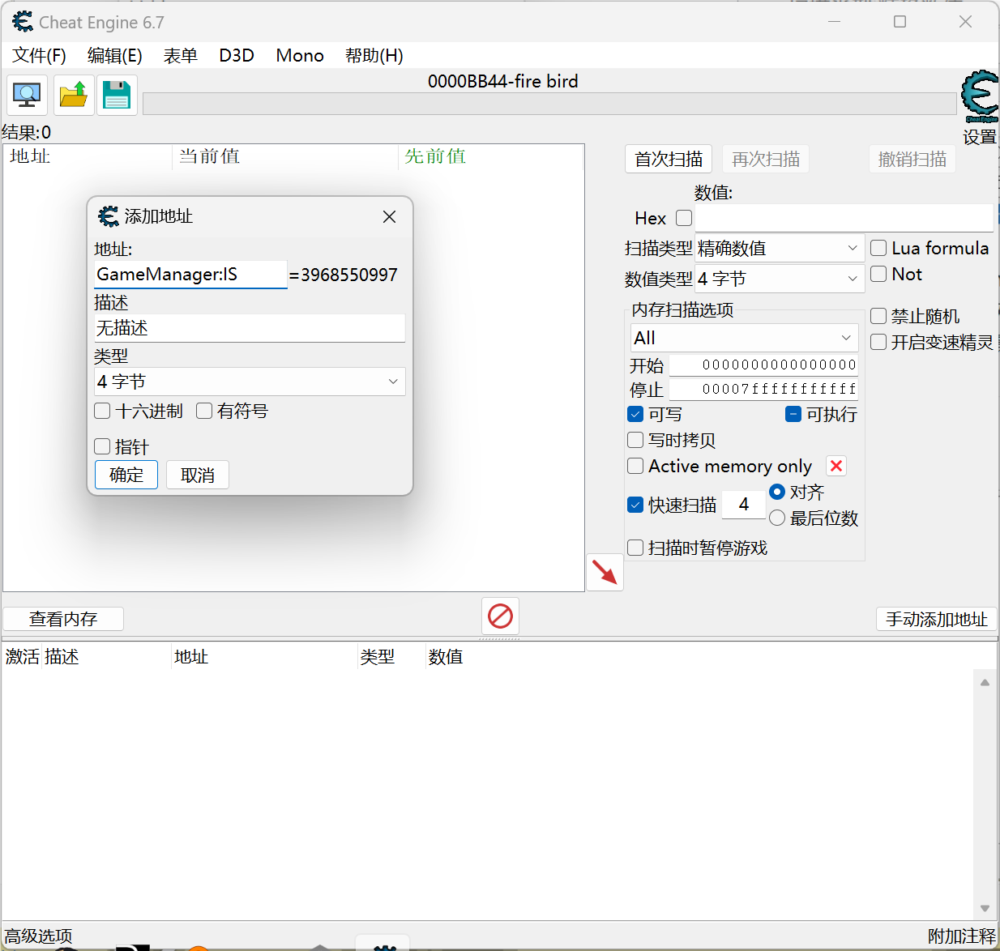
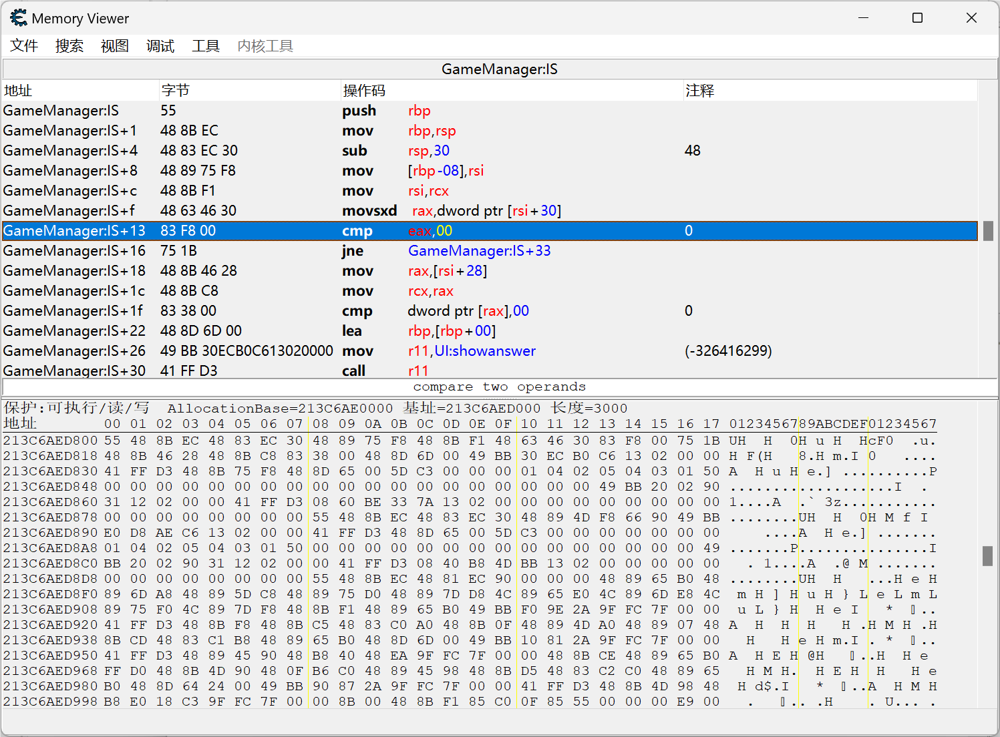
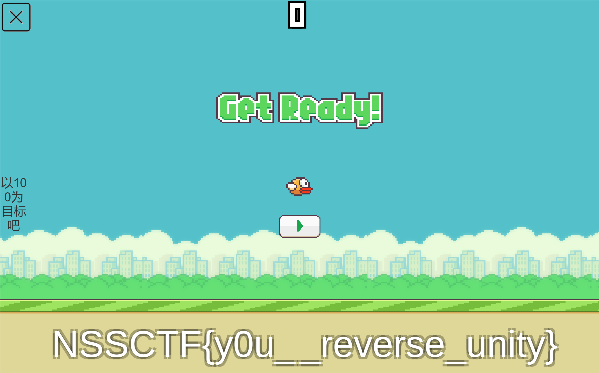
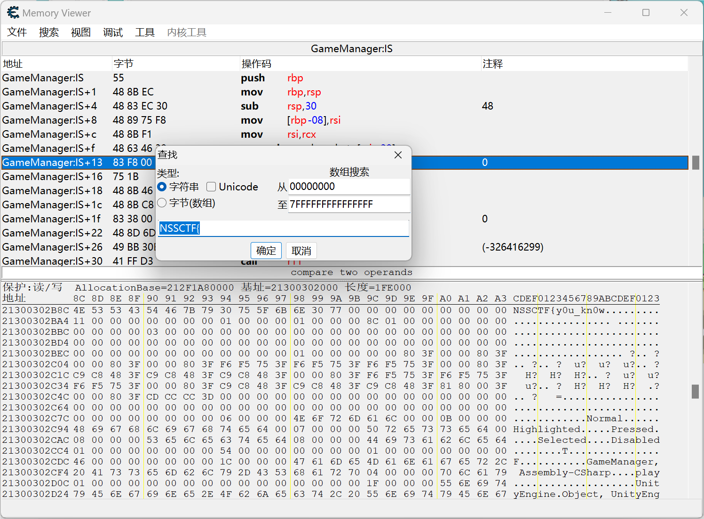

# NSSCTF2025入门题目-Unity

# 题目

# 分析

Unity逆向，第一次接触，借鉴一下其他师傅的wp。

首先用ILSpy打开：

找到GameManager，可以看到Is函数，点开看看：

这里是判断分数到了100，就执行showanswer，点开看看：

在这里就找到了flag的前半部分，这题的坑才刚刚开始。我们知道它是用IS函数判断分数是否是100后，就可以用ce修改判断条件，直接得到flag。

打开ce，选定这个程序，然后开启Mono，点开下面的手动添加地址，注意冒号:

修改后浏览内存：

把100改成0，我这里已经改过了。返回游戏就可以看到flag显示在下面了：

但这并不是真flag，交上去是错的。

我们返回ce，在查看内存中利用搜索，搜索NSSCF{：

可以看到真flag的前半段就在前面了，这个题坑还是挺多的。

# Flag

NSSCTF{y0u_kn0w_reverse_unity}

# 参考

