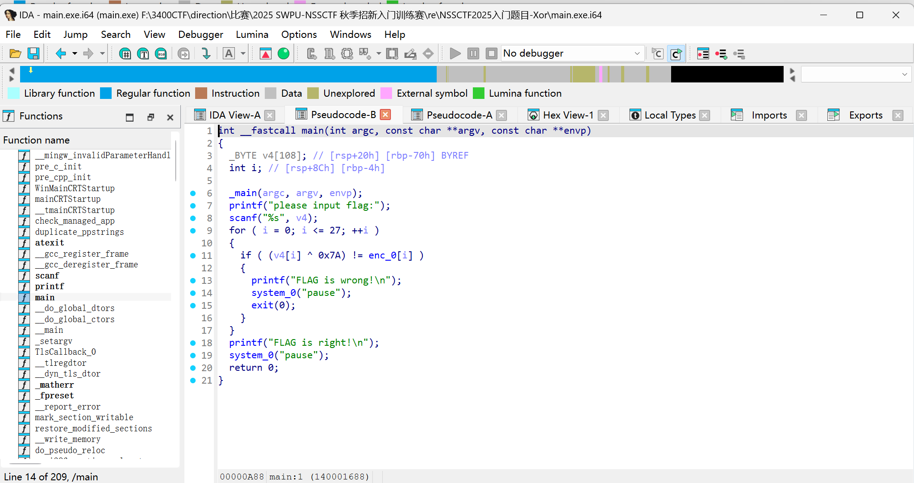
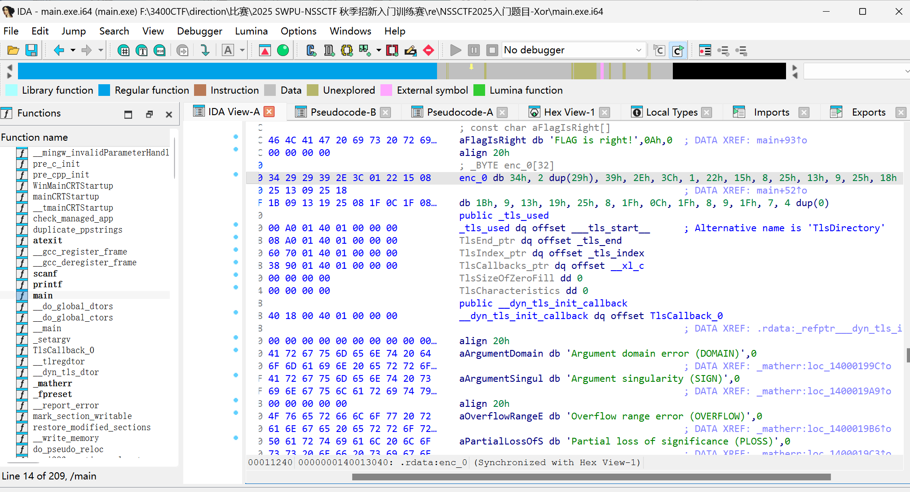

# NSSCTF2025入门题目-Xor

# 题目



# 分析

最常见的位运算，文本加密的基础。

我们只需要找到enc的值，然后写脚本逆向就可以的得出答案。

enc：



脚本如下：

```python
encrypted_data = [
    0x34, 0x29, 0x29, 0x39, 0x2E, 0x3C, 0x01, 0x22, 0x15,
    0x08, 0x25, 0x13, 0x09, 0x25, 0x18,
    0x1B, 0x09, 0x13, 0x19, 0x25, 0x08, 0x1F, 0x0C,
    0x1F, 0x08, 0x09, 0x1F, 0x07, 0x00, 0x00, 0x00, 0x00
]
xor_key = 0x7A

def decrypt(data, key):
    return ''.join(chr(byte ^ key) for byte in data if byte != 0x00)
flag = decrypt(encrypted_data, xor_key)
print(f"Decrypted flag: {flag}")
```

# Flag

NSSCTF{Xor_is_basic_reverse}

# 参考


