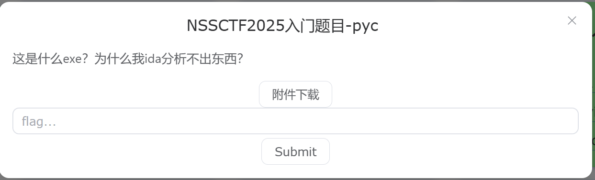
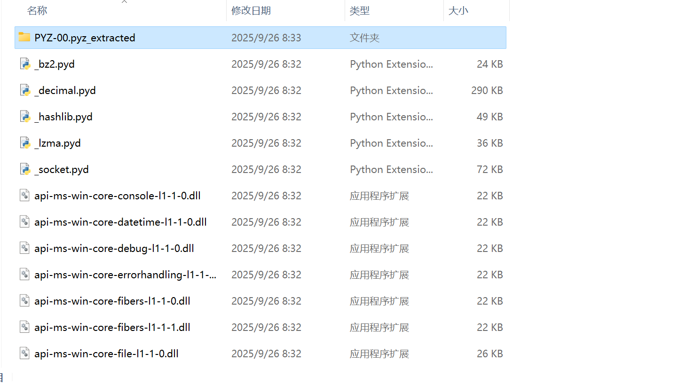
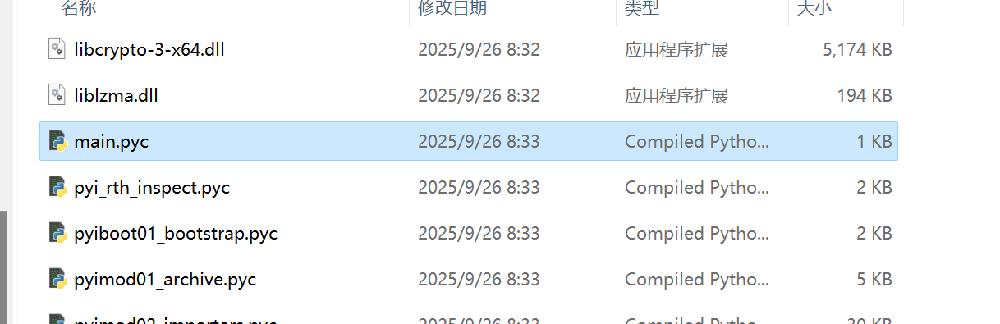
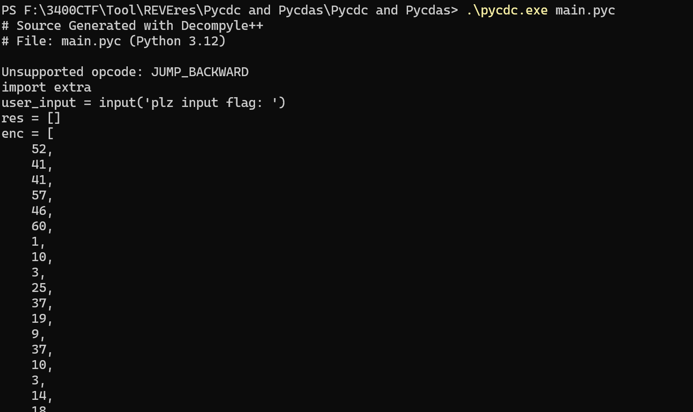
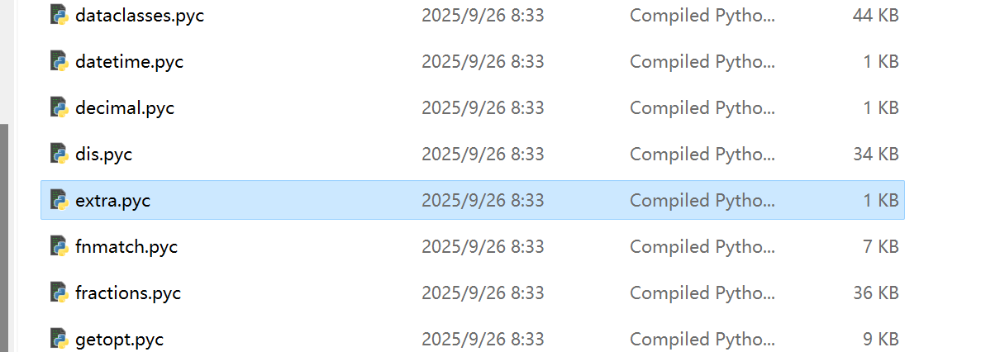
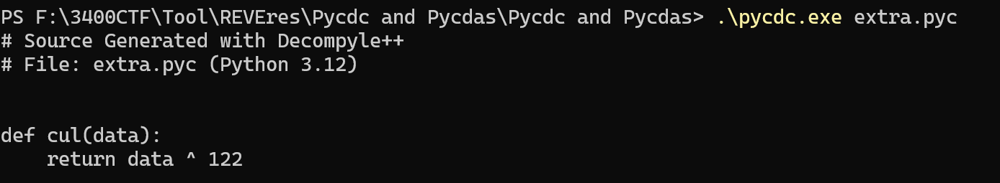
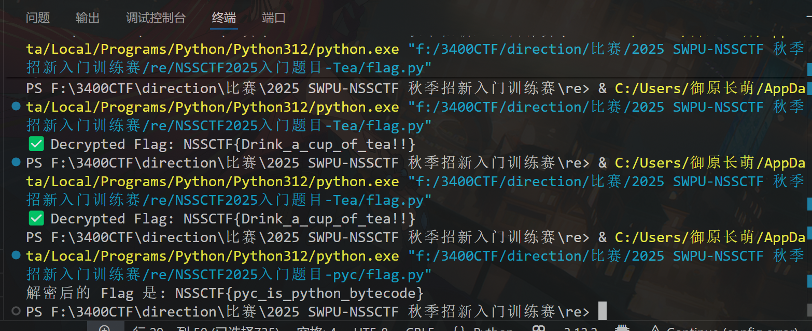

# NSSCTF2025入门题目-pyc

# 题目



# 分析

题目已经明示是pyc逆向了，原理可以见：[pyc反编译](原理学习笔记/逆向/pyc反编译.md)

由于题目给的是一个exe文件，所以我们需要用工具把它先反编译成pyc文件，这里用[PyInstaller Extractor WE](https://pyinstxtractor-web.netlify.app/)进行反编译：



可以看到反编译成了这么一堆，最上面的文件夹可以不用理会，它是python文件的引用库反编译出来的。

我们向下找找到main文件：



找到后用pycdc命令进行反编译：



反编译出main函数：

```python
# Decompiled with PyLingual (https://pylingual.io)

# Internal filename: main.py

# Bytecode version: 3.12.0rc2 (3531)

# Source timestamp: 1970-01-01 00:00:00 UTC (0)


import extra

user_input = input('plz input flag: ')

res = []

enc = [52, 41, 41, 57, 46, 60, 1, 10, 3, 25, 37, 19, 9, 37, 10, 3, 14, 18, 21, 20, 37, 24, 3, 14, 31, 25, 21, 30, 31, 7]

for i in user_input:

    res.append(extra.cul(ord(i)))

for j in range(len(res)):

    if res[j] != enc[j]:

        print('Wrong flag!')

        exit()

print('You get flag!')

```

密文已经给出，可以看到它引用的extra函数，我们要到文件夹里去找：



找到后再用pycdc命令反编译：



异或122

编写出解题代码：

```python
# 加密列表 (来自原始代码片段)
enc = [52, 41, 41, 57, 46, 60, 1, 10, 3, 25, 37, 19, 9, 37, 10, 3, 14, 18, 21, 20, 37, 24, 3, 14, 31, 25, 21, 30, 31, 7]

# 加密函数 cul(data) 的密钥
KEY = 122

# 存储解密后的字符列表
decrypted_chars = []

# 遍历加密列表，执行逆向 XOR 运算
for encoded_value in enc:
    # 逆运算：原始 ASCII 值 = 加密值 XOR 密钥
    original_ascii = encoded_value ^ KEY
    
    # 将 ASCII 值转换回字符
    character = chr(original_ascii)
    
    # 添加到结果列表
    decrypted_chars.append(character)

# 将字符列表连接成最终的 Flag 字符串
flag = "".join(decrypted_chars)

print(f"解密后的 Flag 是: {flag}")

# 验证（可选）：将解密后的 Flag 重新加密，检查是否匹配 enc 列表
# re_encrypted = [ord(c) ^ KEY for c in flag]
# print(f"重新加密后的列表: {re_encrypted}")
# print(f"与原始 enc 列表是否匹配: {re_encrypted == enc}")
```



# Flag

NSSCTF{pyc_is_python_bytecode}

# 参考


