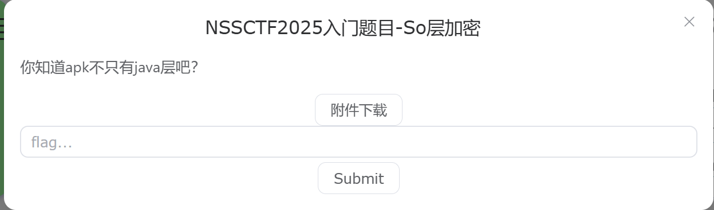
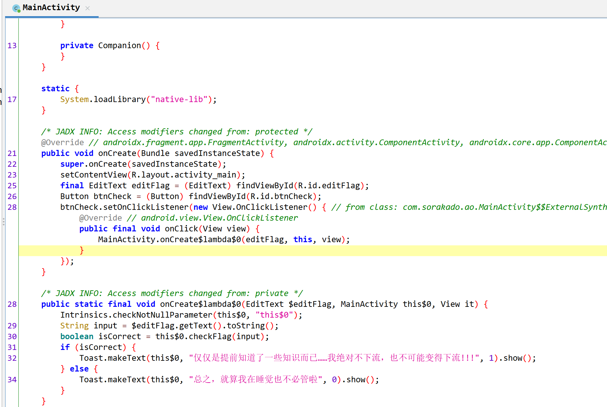
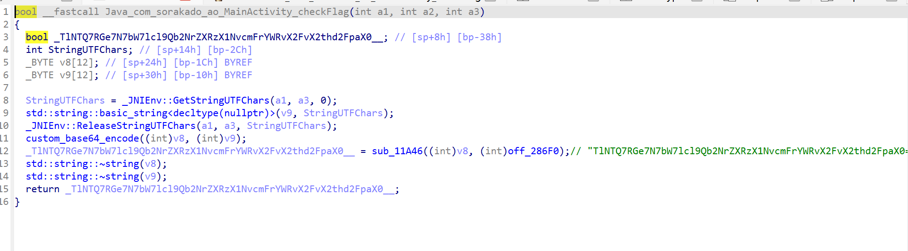
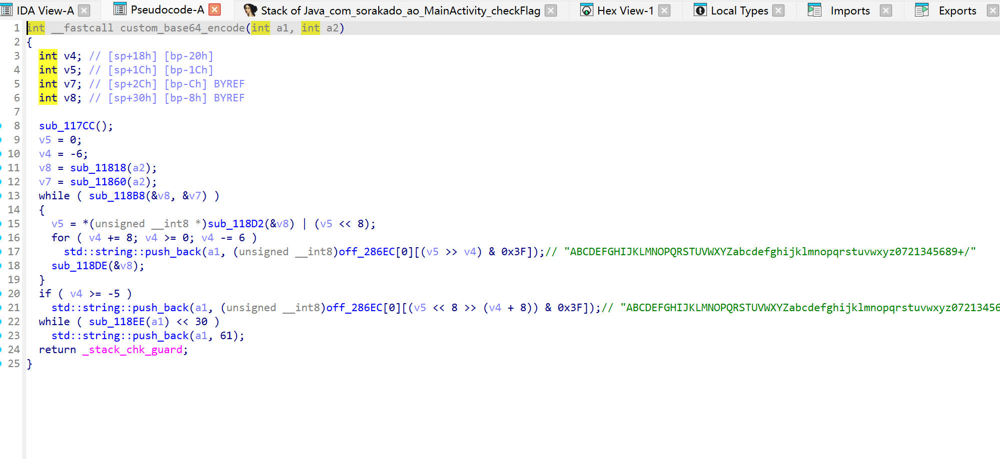
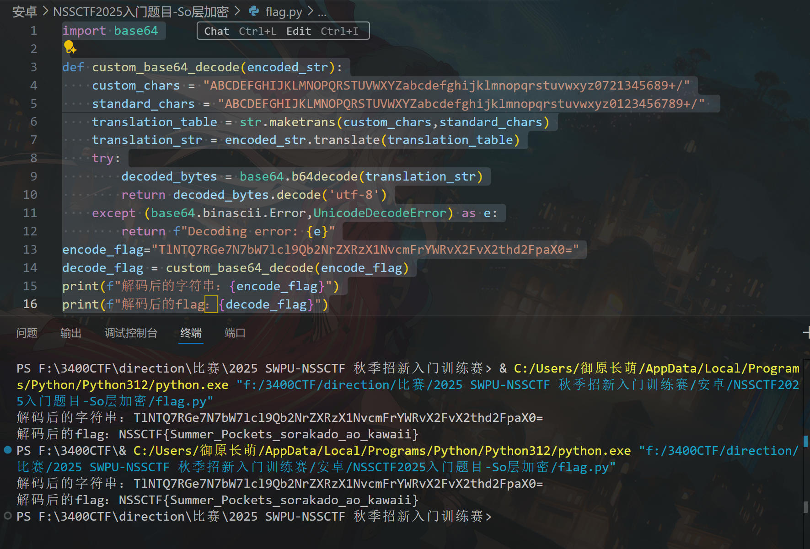

# NSSCTF2025入门题目-So层加密

# 题目



# 分析

先jdax打开看一下：



发现 `checkFlag(String)`​ 方法被标记为 **​`native`​**​。

用idapro打开so文件看一下：



找到checkflag函数：

* **定位编码函数**：发现它调用了一个名为 `custom_base64_encode`​ 的函数，将用户输入进行编码。
* **定位比较函数**：发现它调用了另一个函数 `sub_11A46`​，并将编码后的用户输入与一个**硬编码的字符串**进行比较。这个硬编码字符串就是被编码的正确Flag。
* **定位编码后的Flag**：在 `sub_11A46`​ 的调用中，找到作为参数传入的硬编码字符串 `TlNTQ7RGe7N7bW7lcl9Qb2NrZXRzX1NvcmFrYWRvX2FvX2thd2FpaX0=`​

通过sub_11a46跳转找到custom_base64_encode函数，发现是一个自定义字典的base64加密，前面给出了加密后的编码。所以可以b编写一段代码，解出答案：



代码如下：

```python
import base64

def custom_base64_decode(encoded_str):
    custom_chars = "ABCDEFGHIJKLMNOPQRSTUVWXYZabcdefghijklmnopqrstuvwxyz0721345689+/"
    standard_chars = "ABCDEFGHIJKLMNOPQRSTUVWXYZabcdefghijklmnopqrstuvwxyz0123456789+/" 
    translation_table = str.maketrans(custom_chars,standard_chars)
    translation_str = encoded_str.translate(translation_table)
    try:
        decoded_bytes = base64.b64decode(translation_str)
        return decoded_bytes.decode('utf-8')
    except (base64.binascii.Error,UnicodeDecodeError) as e:
        return f"Decoding error: {e}"
encode_flag="TlNTQ7RGe7N7bW7lcl9Qb2NrZXRzX1NvcmFrYWRvX2FvX2thd2FpaX0="
decode_flag = custom_base64_decode(encode_flag)
print(f"解码后的字符串：{encode_flag}")
print(f"解码后的flag：{decode_flag}")
```

结果为：



# Flag

NSSCTF{Summer_Pockets_sorakado_ao_kawaii}

# 参考


