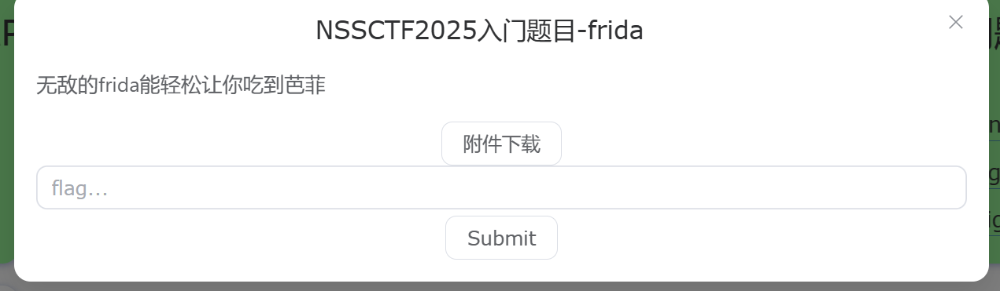
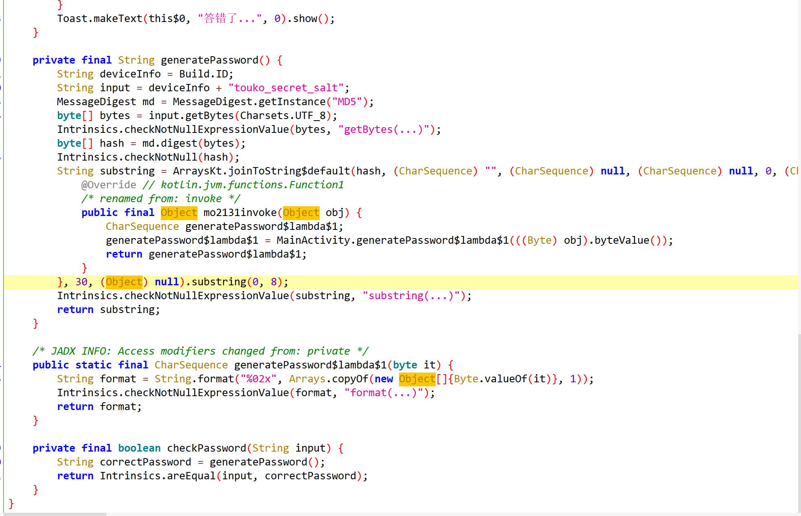
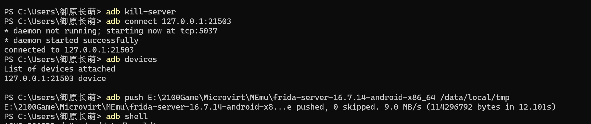
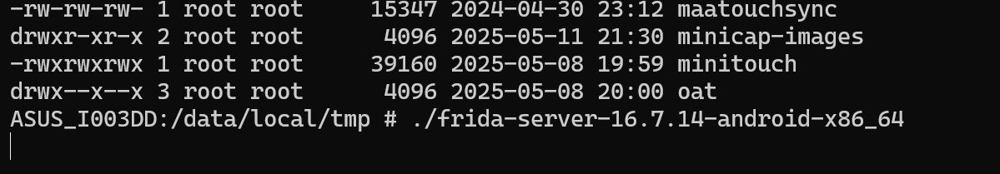
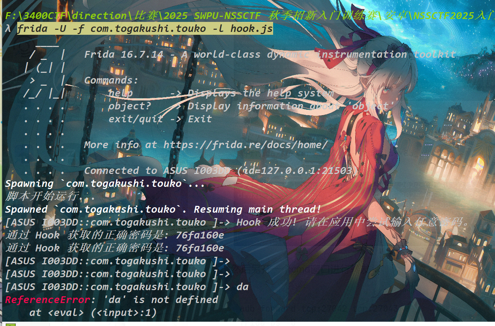
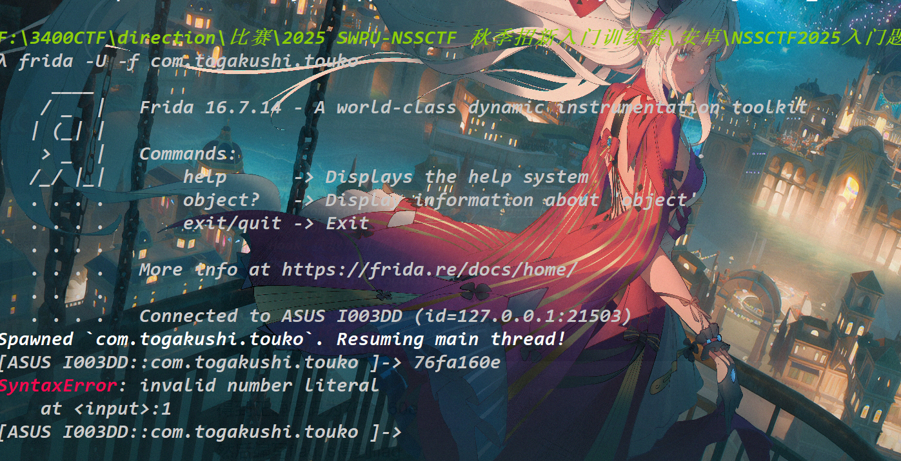
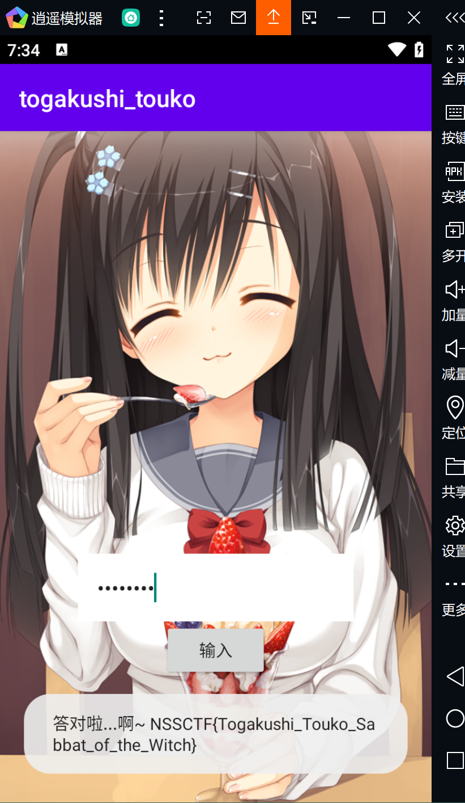

# NSSCTF2025入门题目-frida

# 题目





# 分析

知道密码才能解出flag，可以Hook `generatePassword()`​ 函数得知程序正在运行的密码，然后解出flag。

首先启动frida服务：



```python
cd /data/local/tmp 
./frida-server-16.7.14-android-x86_64
```



然后另开一个cmd窗口进行转发：

```shell
adb forward tcp:27042 tcp:27043
frida-ps -U
```

然后进行hook

```shell
frida -U -f com.togakushi.touko -l hook.js
```



得到正确密码为76fa160e

然后编写flag.js得到flag



在程序中输入密码即可得到flag



```python
#hook.js
setTimeout(function() {
    // 脚本启动后，等待0毫秒执行，确保Java环境已加载
    console.log("脚本开始运行...");

    // 使用 Java.perform 来确保我们是在应用的 Java VM 中执行代码
    Java.perform(function() {
        // 使用 Java.use() 获取 com.togakushi.touko.MainActivity 的实例
        // 这让我们可以访问和修改它的方法
        var MainActivity = Java.use("com.togakushi.touko.MainActivity");

        // --- Hook generatePassword() 方法 ---
        // 替换 generatePassword() 的实际实现
        // 我们可以通过 this.generatePassword() 调用原始方法来获取真实的密码
        MainActivity.generatePassword.implementation = function() {
            // 调用原始方法，获得正确的密码字符串
            var password = this.generatePassword();
            // 在控制台打印出获取到的密码，这是我们的目的之一
            console.log("通过 Hook 获取的正确密码是: " + password);
            // 返回原始密码，确保程序的正常运行
            return password;
        };

        // --- Hook decryptFlag() 方法 ---
        // decryptFlag 是一个 native（原生）方法，Frida 需要知道它的参数类型才能正确 Hook
        // '[B' 表示该方法接受一个字节数组作为参数
        var decryptFlag = MainActivity.decryptFlag.overload('[B');
        
        // 替换 decryptFlag() 的实际实现
        decryptFlag.implementation = function(ciphertext) {
            // 调用原始的 native 方法来解密密文，获得最终的 Flag
            var flag = this.decryptFlag(ciphertext);
            // 在控制台打印出最终的 Flag
            console.log("通过 Hook 获取的最终 Flag 是: " + flag);
            // 返回 Flag，确保程序的正常流程
            return flag;
        };

        console.log("Hook 成功! 请在应用中尝试输入任意密码。");
    });
}, 0);
```

```python
#flag.js
/*
 * 这是一个 Frida 脚本，用于获取 Flag
 */

// 使用 setTimeout 确保脚本在 Java VM 完全加载后才执行
// 0 毫秒的延迟意味着脚本会在当前事件循环结束时运行
setTimeout(function() {
    console.log("脚本开始运行...");

    // Java.perform 是 Frida 的核心 API，它确保我们在应用的主 Java 线程上执行操作
    // 这是访问和修改 Java 类的必要步骤
    Java.perform(function() {
        // 使用 Java.use() 获取 com.togakushi.touko.MainActivity 类的实例
        // 这让我们可以在 JavaScript 中像操作普通 Java 对象一样操作这个类
        var MainActivity = Java.use("com.togakushi.touko.MainActivity");

        // --- Hook decryptFlag() 方法 ---
        // 这是一个 native 方法，Frida 需要知道其参数类型才能正确 Hook
        // .overload('[B') 指定了该方法接受一个字节数组作为参数
        var decryptFlag = MainActivity.decryptFlag.overload('[B');
        
        // 使用 .implementation 来替换原始方法的实现
        // 我们可以编写自己的逻辑，同时也可以选择调用原始方法
        decryptFlag.implementation = function(ciphertext) {
            // 调用原始的 native 方法来执行解密操作
            // 'this' 指向当前 MainActivity 的实例
            var flag = this.decryptFlag(ciphertext);
            
            // 在控制台打印出最终解密得到的 Flag
            console.log("恭喜你，最终的 Flag 是: " + flag);
            
            // 返回解密后的 Flag，确保原始程序逻辑不受影响
            return flag;
        };

        console.log("Hook 成功! 请在应用中输入之前获取的正确密码 '76fa160e'，然后点击提交。");
    });
}, 0);
```

# Flag

NSSCTF{Togakushi_Touko_Sabbat_of_the_Witch}

# 参考

‍


