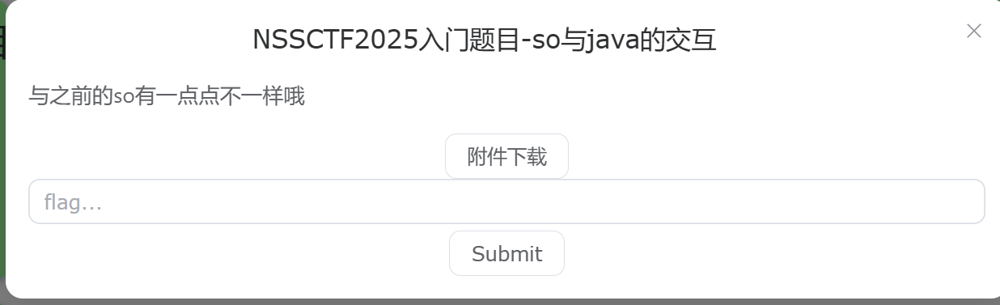
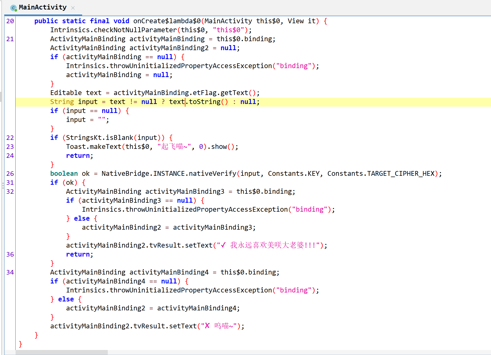
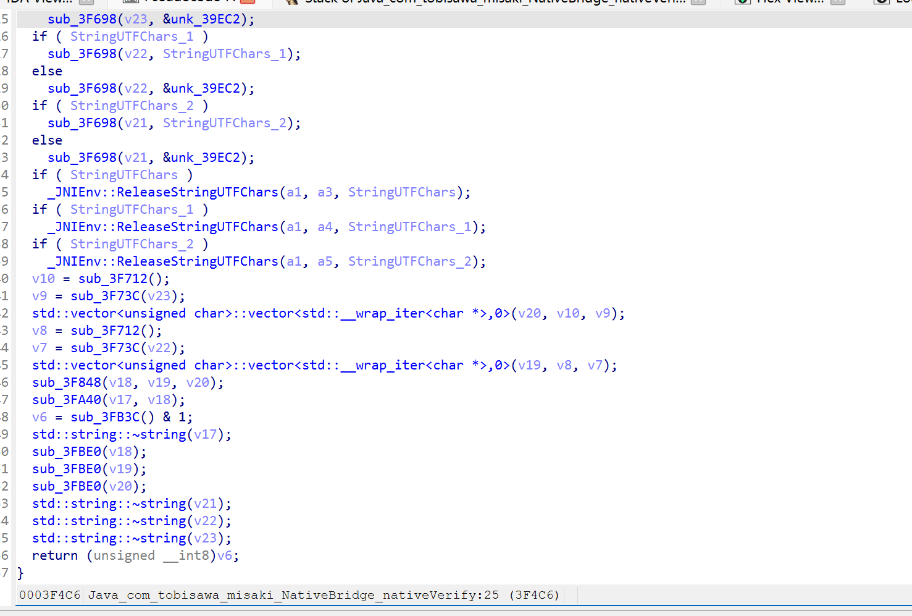
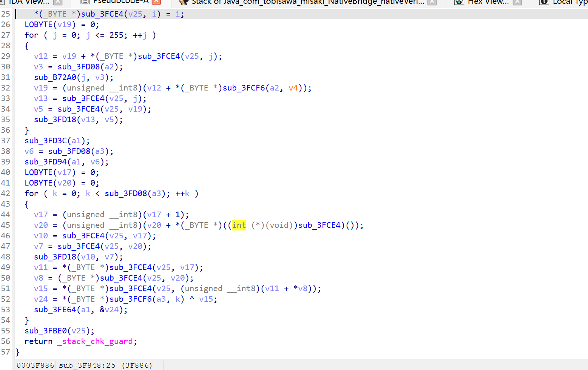
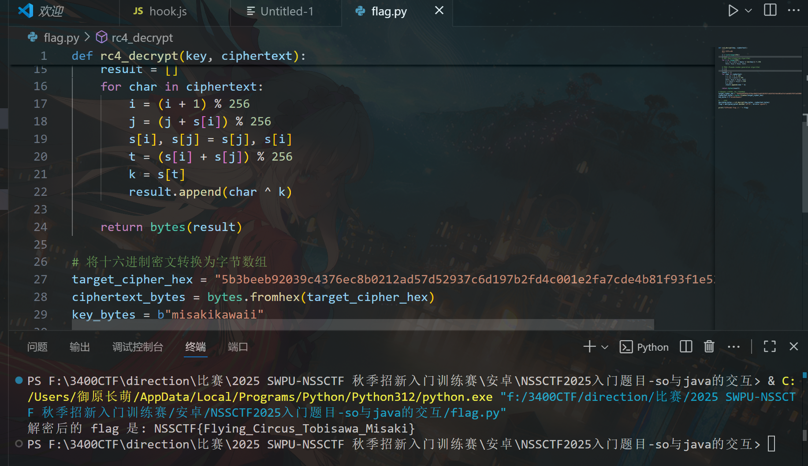

# NSSCTF2025入门题目-so与java的交互

# 题目



‍

# 分析



看到nativeVereify被设作native，用idapro逆向一下看看：



观察其伪代码，发现它调用了 `sub_3F848`​ 和 `sub_3FA40`​ 等函数。

打开看看：



* 深入分析 `sub_3F848`​ 的伪代码，识别出其包含 **KSA** (Key-scheduling algorithm) 和 **PRGA** (Pseudo-random generation algorithm) 的 RC4 算法特征。
* 确定 `sub_3F848`​ 的作用是使用一个密钥对用户输入的 `flag`​ 进行 RC4 加密。

由于密钥和目标密文是硬编码在本地代码中的，最快捷的方式是使用 **Frida** 进行动态调试来获取它们。

* **确定正确的包名**：使用 `frida-ps -Uai`​ 命令找到应用的正确包名，即 `com.tobisawa.misaki`​。
* **编写 Frida 脚本**：编写一个 Frida 脚本来 Hook `nativeVerify`​ 函数，并打印出传入的密钥和目标密文参数。

  * 使用 `Module.findExportByName`​ 找到 `libmisaki.so`​ 中的 `Java_com_tobisawa_misaki_NativeBridge_nativeVerify`​ 函数。
  * 使用 `Interceptor.attach`​ 在函数执行时，利用 `args[3]`​ 和 `args[4]`​ 来访问 `jstring`​ 类型的密钥和密文，并通过 `env.getStringUtfChars`​ 将它们转换为可读的字符串。
* **运行脚本**：使用 `frida -U -f com.tobisawa.misaki -l script.js --no-pause`​ 启动应用，在应用界面中输入任意内容并点击“验证”，Frida 就会输出所需的常量。


找到后进行rc4解密代码编写，得出flag



```python
#flag.py
def rc4_decrypt(key, ciphertext):
    """
    RC4 解密函数
    """
    s = list(range(256))
    j = 0
    # KSA (Key-scheduling algorithm)
    for i in range(256):
        j = (j + s[i] + key[i % len(key)]) % 256
        s[i], s[j] = s[j], s[i]
    
    # PRGA (Pseudo-random generation algorithm)
    i = 0
    j = 0
    result = []
    for char in ciphertext:
        i = (i + 1) % 256
        j = (j + s[i]) % 256
        s[i], s[j] = s[j], s[i]
        t = (s[i] + s[j]) % 256
        k = s[t]
        result.append(char ^ k)
        
    return bytes(result)

# 将十六进制密文转换为字节数组
target_cipher_hex = "5b3beeb92039c4376ec8b0212ad57d52937c6d197b2fd4c001e2fa7cde4b81f93f1e520808"
ciphertext_bytes = bytes.fromhex(target_cipher_hex)
key_bytes = b"misakikawaii"

# 执行解密
decrypted_bytes = rc4_decrypt(key_bytes, ciphertext_bytes)
flag = decrypted_bytes.decode('utf-8', errors='ignore')

print("解密后的 flag 是: " + flag)
```

hook.js

```javascript
var libname = "libmisaki.so";
var nativeVerifyAddr = Module.findExportByName(libname, "Java_com_tobisawa_misaki_NativeBridge_nativeVerify");

// 确保找到了函数地址
if (nativeVerifyAddr) {
    console.log("成功找到 nativeVerify 函数地址！"); // 调试信息
    Interceptor.attach(nativeVerifyAddr, {
        onEnter: function(args) {
            console.log("成功 Hook nativeVerify 函数！"); // 调试信息
            
            var env = Java.vm.getEnv();
            var key_jstring = args[3];
            var key = env.getStringUtfChars(key_jstring, null).readCString();
            
            var target_jstring = args[4];
            var target = env.getStringUtfChars(target_jstring, null).readCString();
            
            console.log("Constants.KEY: " + key);
            console.log("Constants.TARGET_CIPHER_HEX: " + target);
        },
        onLeave: function(retval) {
            console.log("nativeVerify 函数执行完毕！"); // 调试信息
        }
    });
} else {
    console.log("未能找到 nativeVerify 函数地址，请检查函数名和库名！"); // 调试信息
}
```

# Flag

NSSCTF{Flying_Circus_Tobisawa_Misaki}

‍


