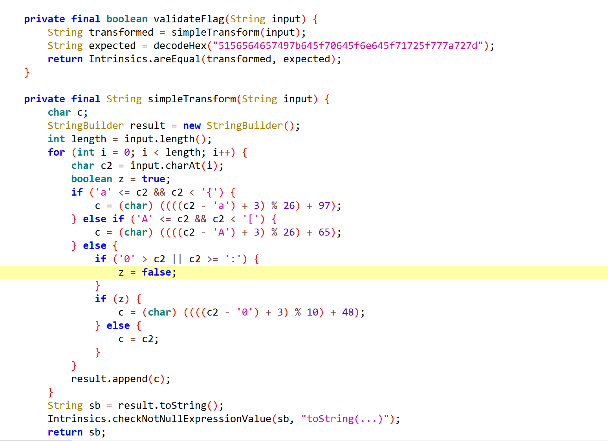
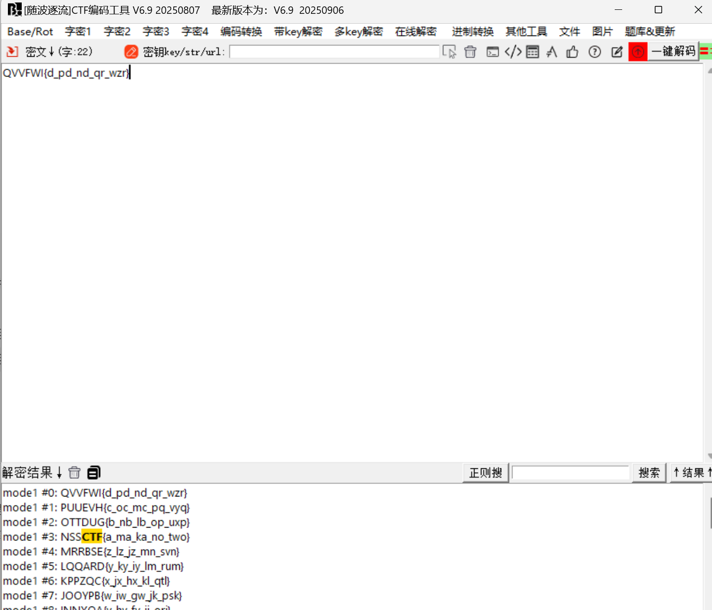

# NSSCTF2025入门题目-凯撒加密

# 题目



# 分析

叽里咕噜一大堆，也就这部分有用。

​**​`validateFlag`​**​ **方法：**

* 这是解密的关键。它将用户输入进行一次转换，然后将结果与一个预期的字符串进行比较。
* ​`String transformed = simpleTransform(input);`​

  * 这行代码调用 `simpleTransform`​ 方法，它是一个加密/编码函数。
* ​`String expected = decodeHex("5156564657497b645f70645f6e645f71725f777a727d");`​

  * 这行代码将一个十六进制字符串解码，得到一个目标字符串。
* ​`return Intrinsics.areEqual(transformed, expected);`​

  * 这行代码判断转换后的输入是否与目标字符串相等。

剩下的是凯撒加密，所以我们只需要写一段代码对十六进制字符串进行转换得到经过凯撒加密后的密码，然后随波逐流即可解出flag。

进制转换：

```python
hex_string = "5156564657497b645f70645f6e645f71725f777a727d"

# 使用列表推导式和字节转换
bytes_object = bytes.fromhex(hex_string)
ascii_string = bytes_object.decode("utf-8")

print(f"原始十六进制字符串: {hex_string}")
print(f"转换后的ASCII字符串: {ascii_string}")
 QVVFWI{d_pd_nd_qr_wzr}
```

随波逐流：



# Flag

NSSCTF{a_ma_ka_no_two}

# 参考


