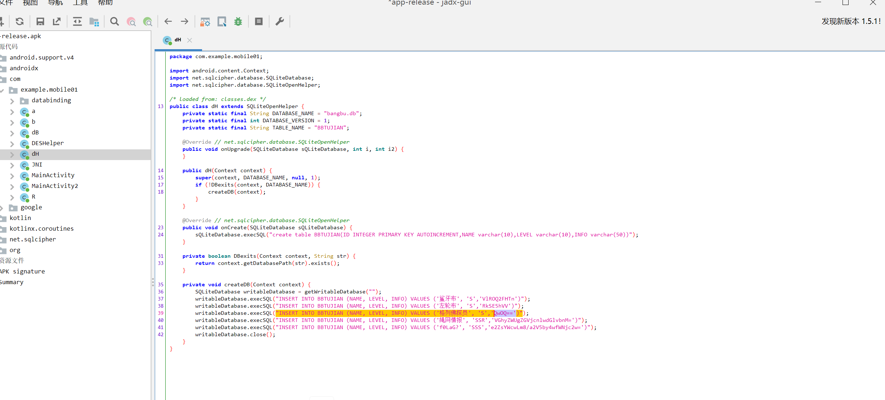
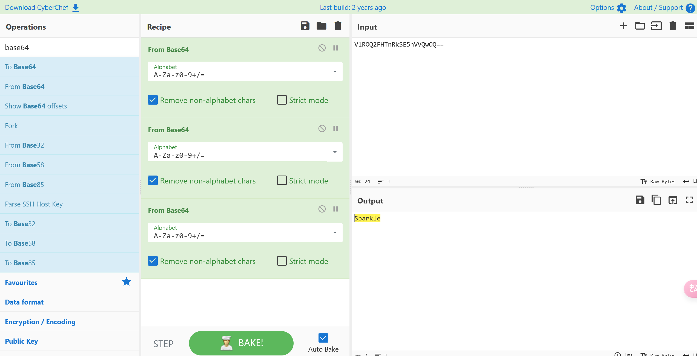
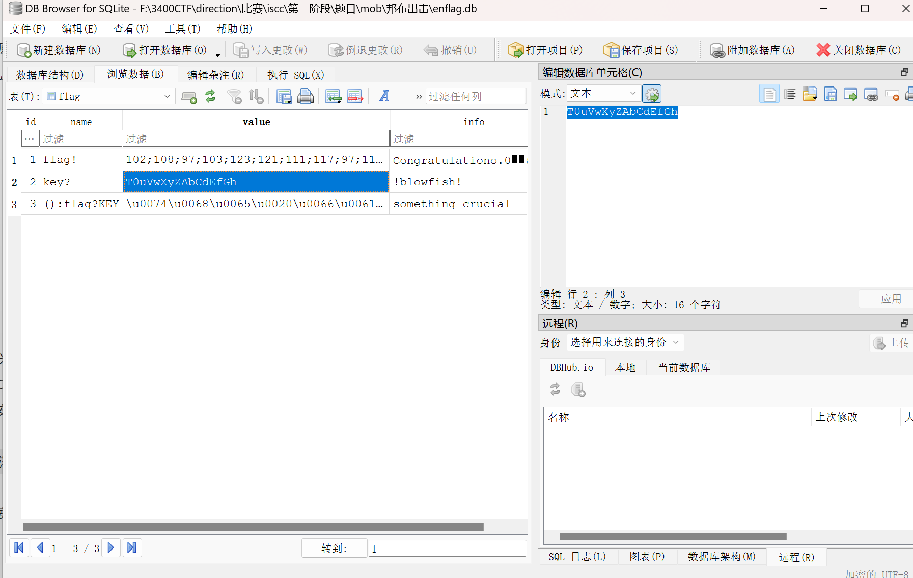
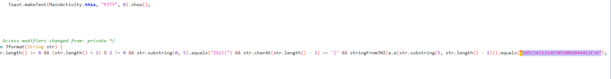
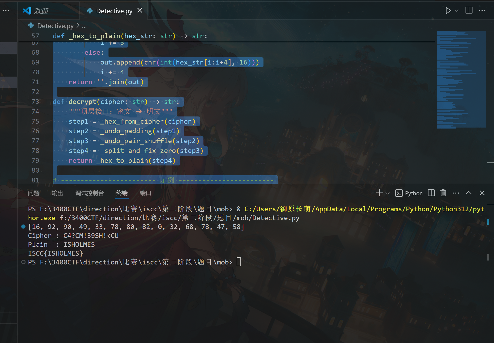

# ISCC

# mob

## 邦布出击

把加密的数据库解密即可得到key



三个base64解密：



使用sqlcipher解密,得到key



hook脚本

```python
Java.perform(function() {

    let b = Java.use("com.example.mobile01.b");
    b["c"].implementation = function () {
        return "T0uVwXyZAbCdEfGh"; 
    };

    try {
        var cls1 = Java.use("com.example.mobile01.DESHelper");
        cls1.encrypt.implementation = function(data, key, iv) {
            console.log("[*] DESHelper.encrypt() called!");
            console.log("      Plaintext (from a.a()): " + data);
            console.log("      Key: " + key);
            console.log("      IV (from getiv()): " + iv);
            var enc_data = this.encrypt(data, key, iv);
            console.log("      Encrypted Result (Ciphertext): " + enc_data);
            console.log("      >>> Potential Flag Middle Part: " + enc_data);
            console.log("      >>> Likely Full Flag: ISCC{" + enc_data + "}");
            return enc_data;
        };
        console.log("[+] Hooked com.example.mobile01.DESHelper.encrypt()");
    } catch (err) {
        console.error("[-] Failed to hook DESHelper.encrypt: " + err);
    }

    // hook掉有问题的process函数
    function processString(str) {
        var bytes = Java.use("java.lang.String").$new(str).getBytes();
        
        var result = Java.array('byte', new Array(str.length).fill(0));
        
        console.log("str len:"+str.length)
        for (var i = 0; i < str.length; i++) {
            if (i < bytes.length) {
                result[i] = bytes[i];
            } else {
                result[i] = 0;
            }
        }
        
        return result;
    }

    try {
        var cls2 = Java.use("com.example.mobile01.a");

        cls2.process.implementation = function(str){
            var res = processString(str);
            console.log("[*] com.example.mobile01.a.process() called, returned: " + res);
            return res;
        }
        console.log("[+] Hooked com.example.mobile01.a.a()");
    } catch (err) {
            console.error("[-] Failed to hook com.example.mobile01.a.a(): " + err);
    }

    

    try {
        var cls3 = Java.use("com.example.mobile01.MainActivity");
        cls3.getiv.implementation = function() {
            var iv_val = this.getiv();
            console.log("[*] MainActivity.getiv() called, returned: " + iv_val);
            return iv_val;
        };
        console.log("[+] Hooked com.example.mobile01.MainActivity.getiv()");
    } catch (err) {
        console.error("[-] Failed to hook MainActivity.getiv: " + err);
    }

    try {
        var cls4 = Java.use("com.example.mobile01.MainActivity");
        cls4.Jformat.implementation = function(inp) {
            console.log("[*] MainActivity.Jformat() called with input: " + inp);
            var res = this.Jformat(inp);
            console.log("    Jformat result (boolean): " + res);
            return res;
        }
        console.log("[+] Hooked com.example.mobile01.MainActivity.Jformat()");
    } catch (err) {
        console.error("[-] Failed to hook MainActivity.Jformat(): " + err);
    }
});
```

‍

### Detective

Jadx反编译，分析 `MainActivity.Jformat`​ 校验逻辑



1. flag 大括号内内容会先经过 `a.a()`​ 编码（即 `c(b.a(b(str)))`​）
2. 编码结果传入 native 层 `stringFromJNI`​，其输出需等于指定密文 `"xxxxx"`​

根据逆向分析，写python脚本解密该密文，得到flag：

```python
def _hex_from_cipher(cipher: str) -> str:
    """A.c 的逆操作：字符 ➜ 4 位十六进制，去掉前导 '00'"""
    hex_str = ''.join(f'{ord(ch):04x}' for ch in cipher)
    return hex_str[2:] if hex_str.startswith('00') else hex_str

def _undo_padding(hex_str: str) -> str:
    """
    逆操作：去掉每 2 位后强插的 '00'（若剩余长度 %4 == 2 说明末尾少一个 '00'），
    得到插针/交换前的串 replaced
    """
    if len(hex_str) % 4 == 2:
        hex_str += '00'              # 还原被截掉的最后两个 0
    return ''.join(hex_str[i:i+2] for i in range(0, len(hex_str), 4))

def _undo_pair_shuffle(replaced: str) -> str:
    """
    逆操作：解析 2-字节或 4-字节(…'21') 片段，复原 sb2+sb 的顺序
    """
    out, i = [], 0
    while i < len(replaced):
        # 4 字节模式：c2 c1 2 1
        if i + 3 < len(replaced) and replaced[i+2:i+4] == '21':
            c2, c1 = replaced[i], replaced[i+1]
            out.extend([c1, c2])
            i += 4
        else:                       # 2 字节保持原序
            out.extend(replaced[i:i+2])
            i += 2
    return ''.join(out)

def _split_and_fix_zero(concat: str) -> str:
    """
    按 sb2 | sb 切分，再把被替换成 '3' 的零位改回 '0'。
    sb 负责偶数索引（0,2,4…），替换条件  idx==0 或 idx%3==0
    sb2 负责奇数索引（1,3,5…），替换条件  idx==1 或 (idx-1)%3==0
    """
    half = len(concat) // 2
    sb2, sb = concat[:half], concat[half:]

    # sb 复原 0 → 3
    sb = ''.join('0' if ch == '3' and (idx == 0 or idx % 3 == 0) else ch
                 for idx, ch in enumerate(sb))
    # sb2 复原 0 → 3
    sb2 = ''.join('0' if ch == '3' and (idx == 1 or (idx - 1) % 3 == 0) else ch
                  for idx, ch in enumerate(sb2))

    # 交叉还原到原 16 进制序列
    res = []
    even = odd = 0
    for idx in range(len(concat)):
        if idx % 2 == 0:            # 偶数位来自 sb
            res.append(sb[even]);  even += 1
        else:                       # 奇数位来自 sb2
            res.append(sb2[odd]);  odd += 1
    return ''.join(res)

def _hex_to_plain(hex_str: str) -> str:
    """
    根据 A.b 的编码规则：
    - 如果以 '0' 开头则为 3 位组 (0xx) ➜ ASCII/单字节
    - 否则为 4 位组 ➜ Unicode (xxxx)
    """
    out, i = [], 0
    while i < len(hex_str):
        if hex_str[i] == '0' and i + 2 < len(hex_str):
            out.append(chr(int(hex_str[i+1:i+3], 16)))
            i += 3
        else:
            out.append(chr(int(hex_str[i:i+4], 16)))
            i += 4
    return ''.join(out)

def decrypt(cipher: str) -> str:
    """顶层接口：密文 ➜ 明文"""
    step1 = _hex_from_cipher(cipher)
    step2 = _undo_padding(step1)
    step3 = _undo_pair_shuffle(step2)
    step4 = _split_and_fix_zero(step3)
    return _hex_to_plain(step4)

# ------------------------ 示例 ------------------------
if __name__ == "__main__":

    xor_key = [0x53, 0x68, 0x65, 0x72, 0x6C, 0x6F, 0x63, 0x6B] 
    res = "105C5A31214E50520020444E2F3A"       # 填

    res_chr=[]
    for i in range(0,len(res),2):
        res_chr.append((int(res[i:i+2],16)))
    print(res_chr)

    flag = []
    for i in range(len(res_chr)):
        flag.append((res_chr[i]^xor_key[i%(len(xor_key))]))

    sample =bytes(flag).decode()
    print("Cipher :", sample)
    print("Plain  :", decrypt(sample))
    print("ISCC{"+decrypt(sample)+"}")
```



‍

# re

##


