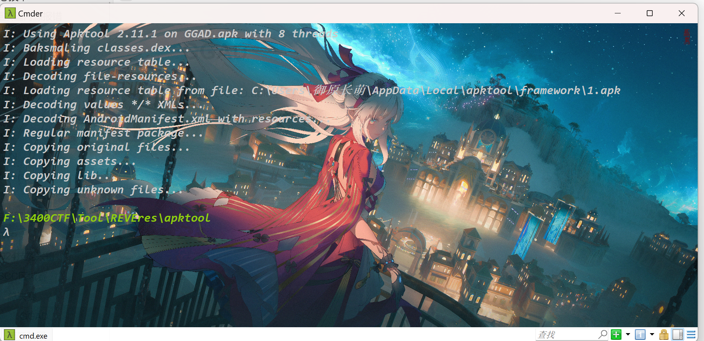
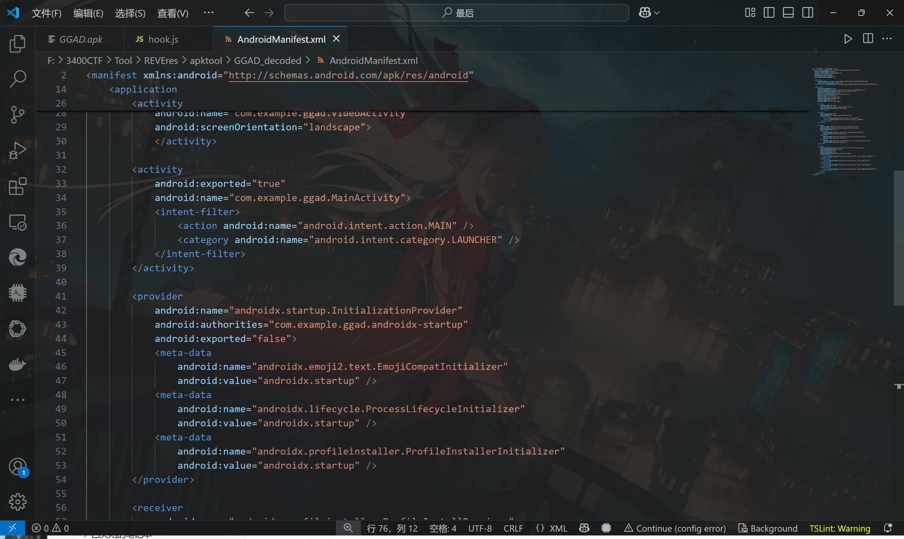
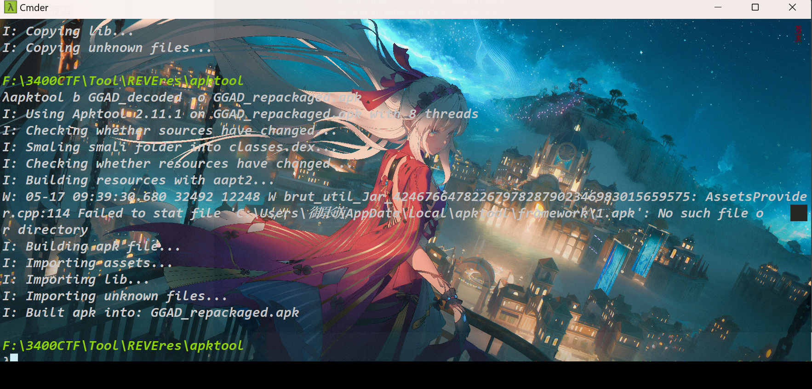
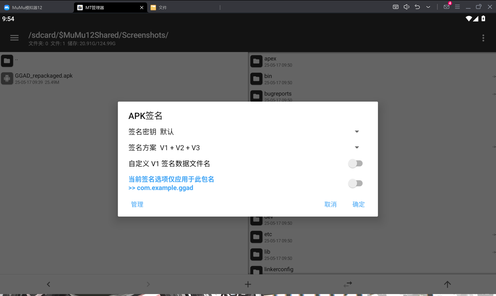
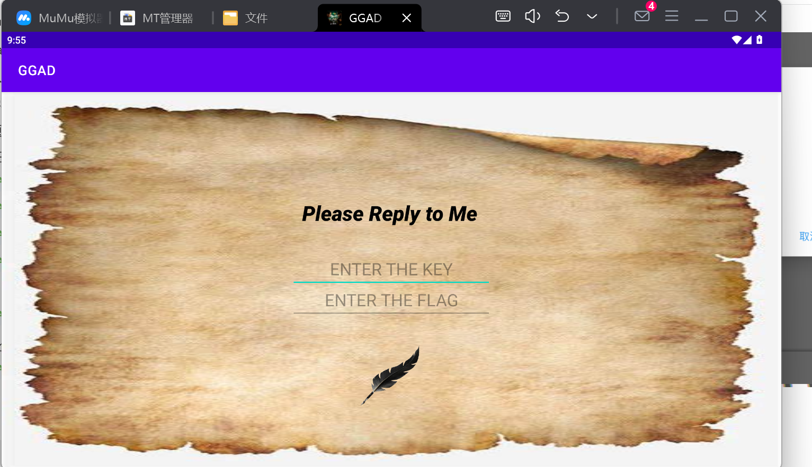
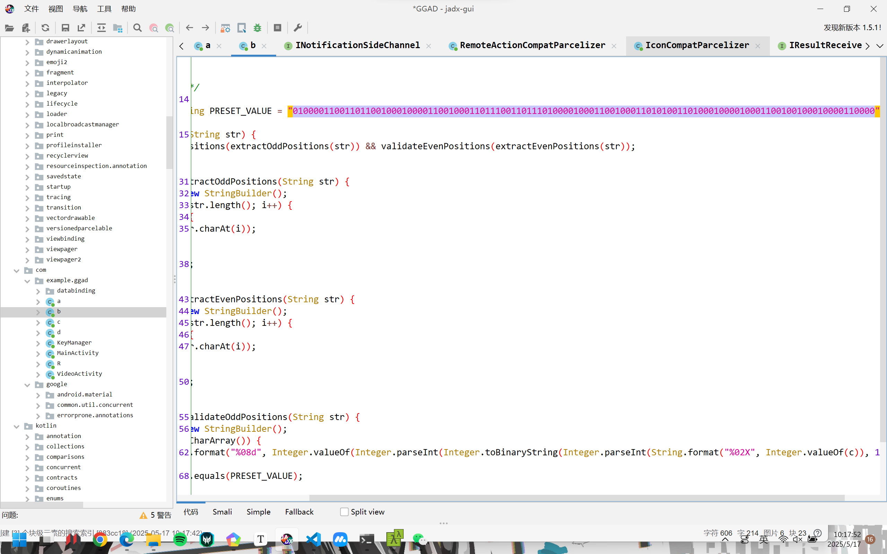
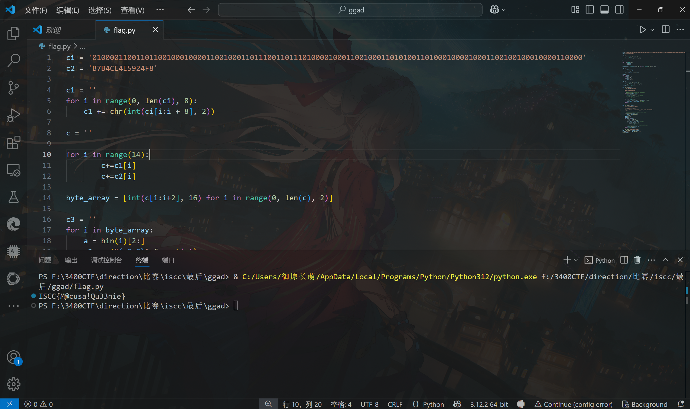

# 安卓-GGAD

WK-[已脱敏]-[email已脱敏]
### **题目类型+题目名称**

mob-GGAD

### **解题思路（必须包含文字说明+截图）**

首先将GGAD.apk程序入口改为MainActivity重新打包

apk执行命令：

```javascript
apktool d GGAD.apk -o GGAD_decoded
```



进入 `GGAD_decoded`​ 文件夹，找到 `AndroidManifest.xml`​ 文件并用文本编辑器打开它。

将 `<intent-filter>...</intent-filter>`​ 代码块从当前的 Activity 标签内剪切出来。

将剪切的 `<intent-filter>...</intent-filter>`​ 代码块粘贴到 `MainActivity`​ 的 `<activity ... >`​ 标签内部。确保一个应用中只有一个 Activity 含有 `android.intent.action.MAIN`​ 和 `android.intent.category.LAUNCHER`​ 的组合。  
修改后如下所示：



然后返回cmd，执行命令进行打包：

```javascript
apktool b GGAD_decoded -o GGAD_repackaged.apk
```



上传到MT模拟器内进行签名：



签名后进行安装



cmd5查出key为ExpectoPatronum

带入后输入ISCC{ABCDEFGHIJKLMNOPQRST}


得到：

```javascript
B7B4CE4E5924F8
```

找到PRESET_VALUE



```javascript
0100001100110110010001000011001000110111001101110100001000110010001101010011010001000010001100100100010000110000
```

带入脚本得出答案：

ISCC{M@cusa!Qu33nie}



```python

```

### **Exp（如有，请粘贴完整代码，不允许截图！）**

hook.js

```javascript
Java.perform(function() {
    var C = Java.use('com.example.ggad.c');
    C.a.implementation = function() {
        var ret = this.a();
        console.log('[*] c.a() decrypted result:', ret);
        return ret;
    };
});
```

py

```py
ci = '0100001100110110010001000011001000110111001101110100001000110010001101010011010001000010001100100100010000110000'
c2 = 'B7B4CE4E5924F8'

c1 = ''
for i in range(0, len(ci), 8):
    c1 += chr(int(ci[i:i + 8], 2))

c = ''

for i in range(14):
        c+=c1[i]
        c+=c2[i]

byte_array = [int(c[i:i+2], 16) for i in range(0, len(c), 2)]

c3 = ''
for i in byte_array:
    a = bin(i)[2:]
    c3 += ("{:0>8}".format(a))

str1 = ''
for i in c3:
    if(i == '1'):
        str1 += '0'
    if(i == '0'):
        str1 += '1'

c4 = []
for i in range(0, len(str1), 8):
    c4.append(int(str1[i:i + 8], 2))
final_cipher = bytes(c4)

def rc4_ksa(key):
    """密钥调度算法 (KSA)

    得到初始置换后的S表
    """
    # 种子密钥key若为字符串，则转成字节串
    if isinstance(key, str):  
        key = key.encode()
    S = list(range(256))  # 初始化S表
    # 利用K表，对S表进行置换
    j = 0
    for i in range(256):
        j = (j + S[i] + key[i % len(key)]) % 256
        S[i], S[j] = S[j], S[i]  # 置换
    return S  


def rc4_prga(S, text):
    """伪随机生成算法 (PRGA)

    利用S产生伪随机字节流,
    将伪随机字节流与明文或密文进行异或,完成加密或解密操作
    """
    # 待处理文本text若为字符串，则转成字节串
    if isinstance(text, str):  
        text = text.encode()
    i = j = 0 
    result = []  
    count=0
    for byte in text:
        i = (i + 1) % 256
        j = (j + S[i]) % 256
        S[i], S[j] = S[j], S[i]  # 置换
        t = (S[i] + S[j]) % 256
        k = S[t]  # 得到密钥字k
        # 将明文或密文与k进行异或,得到处理结果
        result.append(byte ^ k)  
    return bytes(result)

S = rc4_ksa('ExpectoPatronum')
res = rc4_prga(S, final_cipher)
flag = "ISCC{" + res.decode() +"}"
print(flag)

```


