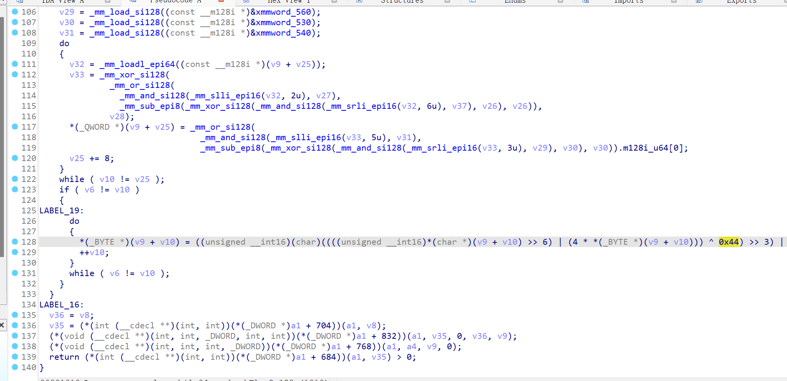
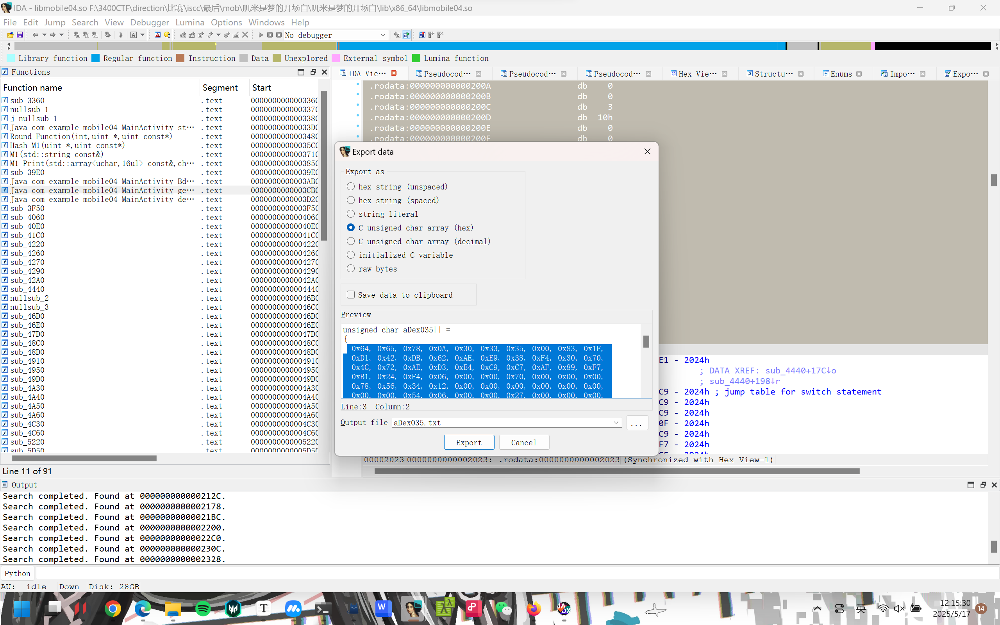
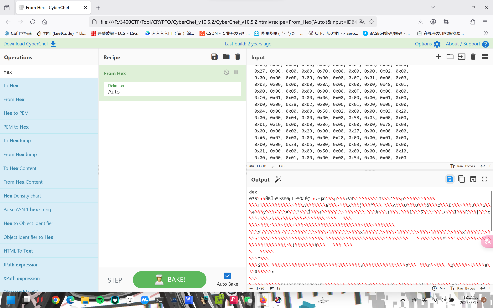
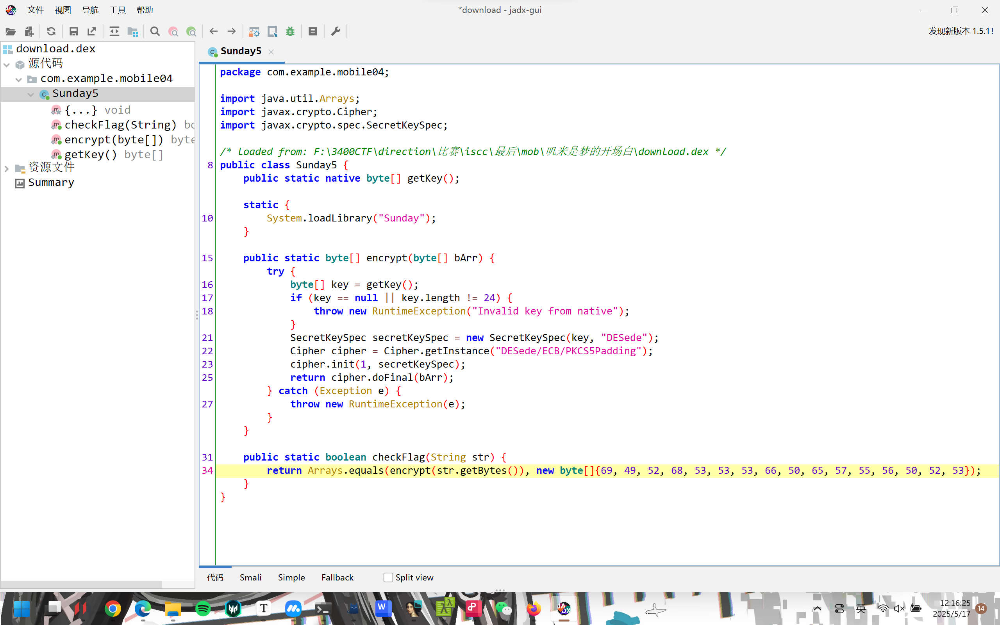
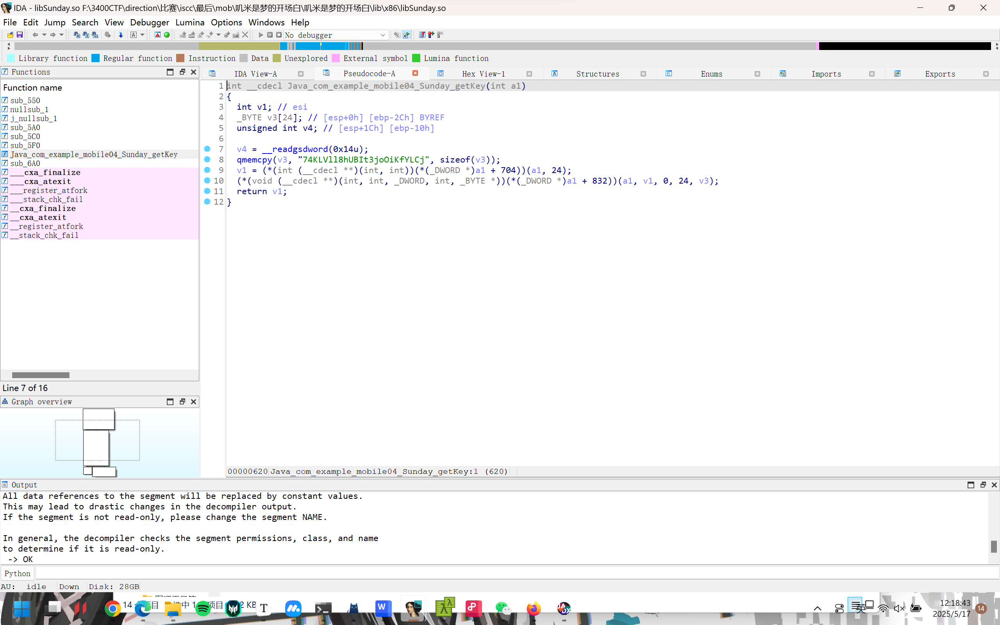
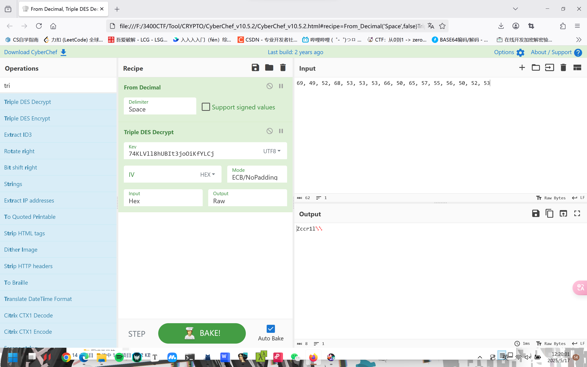
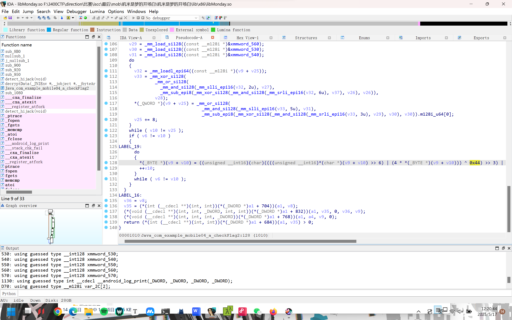
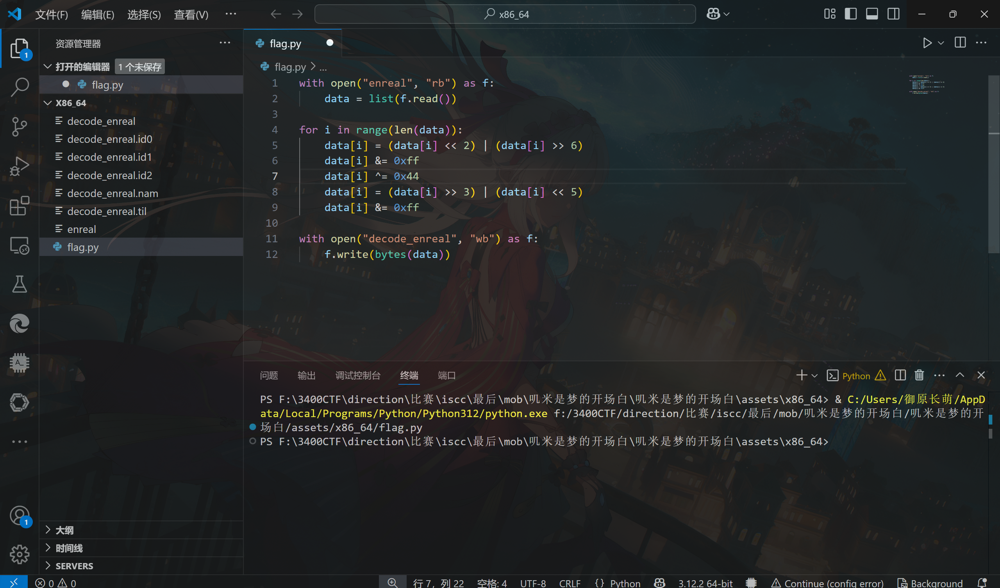
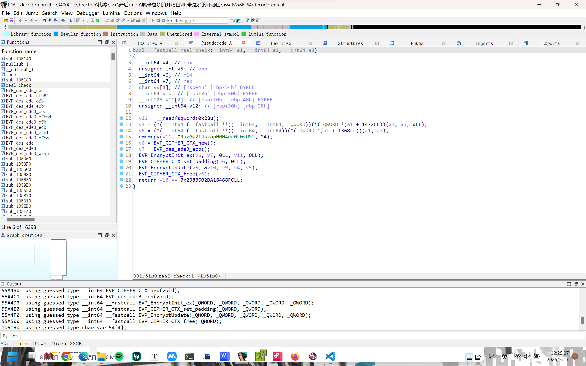
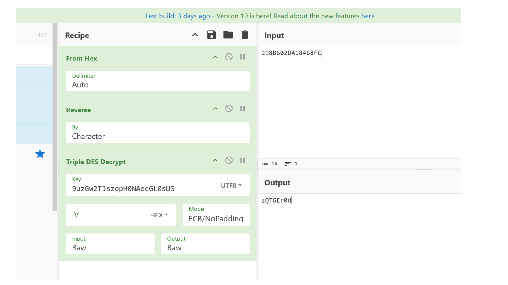

# 安卓-叽米是梦的开场白

WK-[已脱敏]-[email已脱敏]
### **题目类型+题目名称**

安卓-叽米是梦的开场白

### **解题思路（必须包含文字说明+截图）**

先dump下来dex文件 直接用dexdump就可以获取到checkflag1，在java层，一个des解密，密钥在Sunday.so

checkflag2在assets目录下，加密的so层，这个so的加密逻辑在Monday这so里，就是简单的位移和异或，每个用户的异或值不一样

也是一个des解密，解出两部分flag拼一起

libmobile04.so

Java_com_example_mobile04_MainActivity_getEncryptedSegment里面最底下



导出数据：



用赛博厨子dex解密：



下载用jadx打开，找到数据：



libsunday.so找Java_com_example_mobile04_Sunday_getKey



这是第一部分的key，然后厨子解：



libMonday.so找到Java_com_example_mobile04_a_checkFlag2里面的位移异或这一段



注意到xor了0x44

然后去/assets/x86_64解密里面的enreal



ida打开decode的enreal，real_check得到第二部分的key，密文是最底下的那串十六进制



解出第二部分：



### **Exp（如有，请粘贴完整代码，不允许截图！）**

```python
with open("enreal", "rb") as f:
    data = list(f.read())

for i in range(len(data)):
    data[i] = (data[i] << 2) | (data[i] >> 6)
    data[i] &= 0xff
    data[i] ^= 0x44  
    data[i] = (data[i] >> 3) | (data[i] << 5)
    data[i] &= 0xff

with open("decode_enreal", "wb") as f:
    f.write(bytes(data))
```


