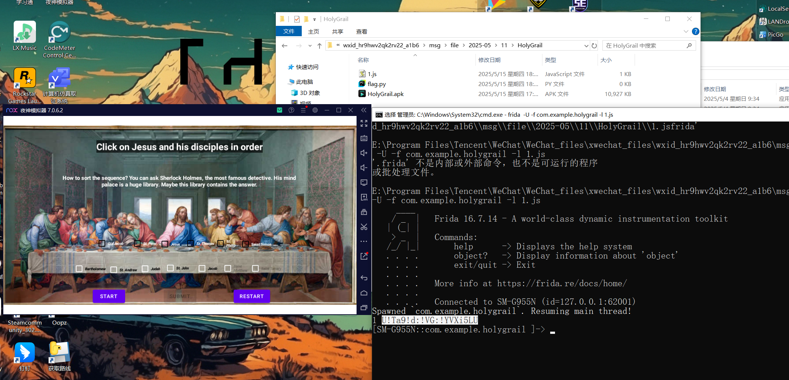
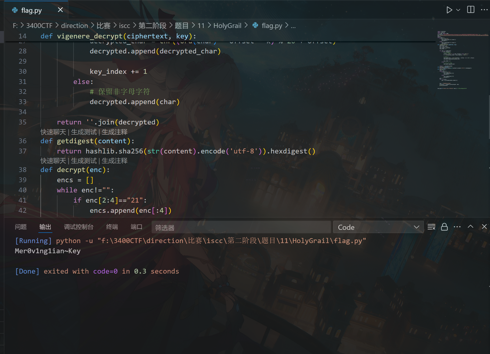

# HolyGrail

WK-[已脱敏]-[email已脱敏]
### **题目类型+题目名称**

mob-HolyGrail

### **解题思路（必须包含文字说明+截图）**

公式化题目

frida -U -f "com.example.holygrail" -l .\Android3.js



U!Ta9!d:!VG:!YVXi5LU



### **Exp（如有，请粘贴完整代码，不允许截图！）**

```python
import itertools
import hashlib
from tqdm import tqdm
printable=r"0123456789abcdefghijklmnopqrstuvwxyzABCDEFGHIJKLMNOPQRSTUVWXYZ!#$%&'()*+,-./:;<=>?@[\]^_`{|}~"
get="39213A213B213C21402141214221432144214521464748494A4B4C505152535455565758595A5B5C60616263646550215121522153215421552156215721582159215A215B215C21303132333435363738393A3B3C272129212A212B212C2130213121322133213421352136213721382146214721482149214A214B214C2140414243444566676869"
data=[]
while get!="":
    if get[2:4]=="21":
        data.append(get[:4].lower())
        get=get[4:]
    else:
        data.append(get[:2].lower())
        get=get[2:]
def vigenere_decrypt(ciphertext, key):
    decrypted = []
    key = key.lower()
    key_length = len(key)
    key_index = 0

    for char in ciphertext:
        if char.isalpha():
            # 确定字符偏移
            offset = ord('a') if char.islower() else ord('A')
            k = ord(key[key_index % key_length]) - ord('a')

            # 解密公式
            decrypted_char = chr((ord(char) - offset - k) % 26 + offset)
            decrypted.append(decrypted_char)

            key_index += 1
        else:
            # 保留非字母字符
            decrypted.append(char)

    return ''.join(decrypted)
def getdigest(content):
    return hashlib.sha256(str(content).encode('utf-8')).hexdigest()
def decrypt(enc):
    encs = []
    while enc!="":
        if enc[2:4]=="21":
            encs.append(enc[:4])
            enc=enc[4:]
        else:
            encs.append(enc[:2])
            enc=enc[2:]
    get = ""
    for i in encs:
        get += printable[data.index(i)]


    key = "TheDaVinciCode"
    plaintext = vigenere_decrypt(get, key)
    print(plaintext)


decrypt(b"U!Ta9!d:!VG:!YVXi5LU".hex()) 
```

hook脚本：

```javascript
function hook() {
  Java.perform(function () {
    let a = Java.use("com.example.holygrail.a");

    var targetClass = Java.use("com.example.holygrail.CipherDataHandler");
    var args = Java.array("java.lang.String", [
    "checkBox8",
	"checkBox6",
	"checkBox7",
	"checkBox5",
	"checkBox12",
	"checkBox3",
	"checkBox10",
	"checkBox13",
	"checkBox11",
	"checkBox",
	"checkBox9",
	"checkBox4",
	"checkBox14"
    ]);
    console.log("1",targetClass.generateCipherText(args));
  

  a["vigenereEncrypt"].implementation = function (str, str2) {
      console.log(`a.vigenereEncrypt is called: str=${str}, str2=${str2}`);
      let result = this["vigenereEncrypt"](str, str2);
      console.log(`a.vigenereEncrypt result=${result}`);
      return result;
  };

  });
}

setImmediate(hook);
```

‍


