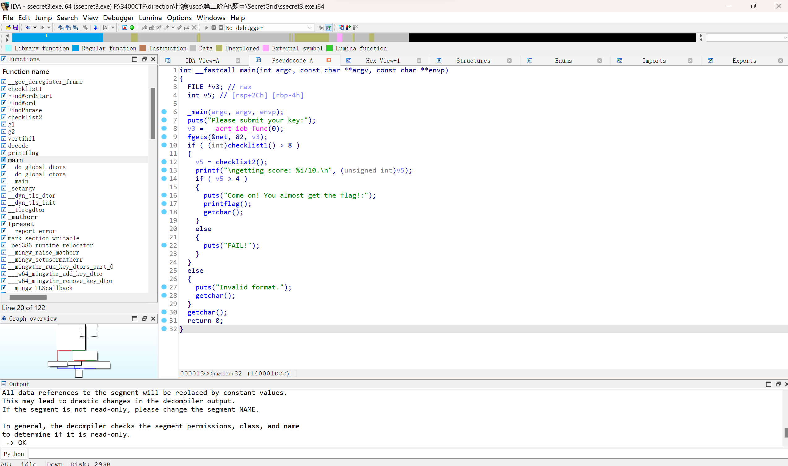
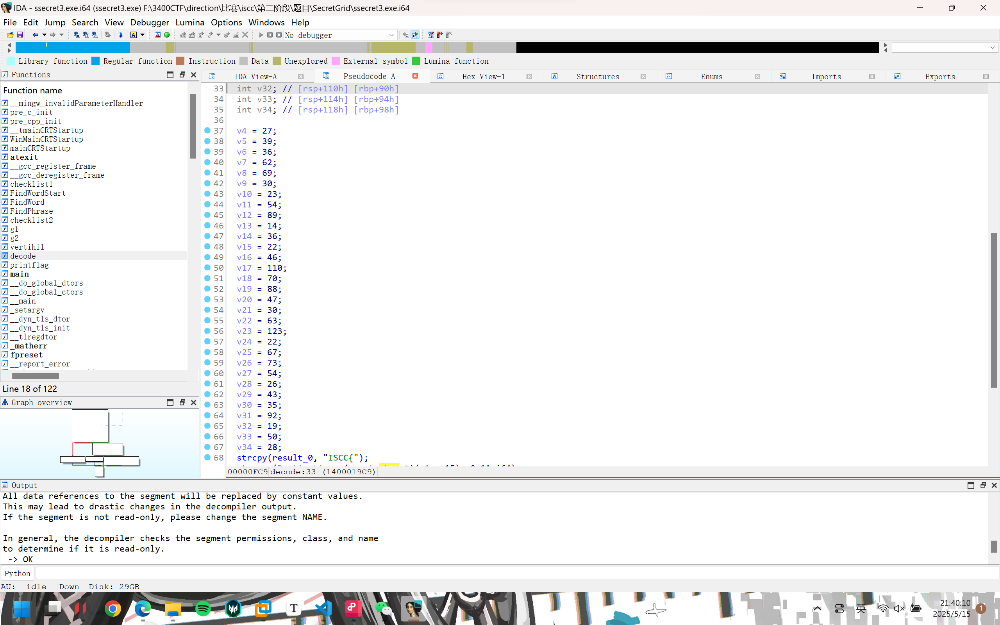

# SecretGrid

WK-[已脱敏]-[email已脱敏]
### **题目类型+题目名称**

RE-SecretGrid

### **解题思路（必须包含文字说明+截图）**

实现了一个简单的验证逻辑，用户需要提交一个“key”，然后程序会根据checklist1和checklist2函数的返回值来判断是否满足条件并输出相应的结果。



点开decode函数，获取加密列表：



编写脚本得到flag：

ISCC{Ptav8mvW7dEdY11-LjH$d4=Zy^M-gW}

### **Exp（如有，请粘贴完整代码，不允许截图！）**

```python
def encrypt(input_data, output_data):
    key = "ISCC{s_ale_ru_upatu_prrlaullre_}"

    for i in range(30):
        if (i & 1) == 0:  # 偶数索引
            output_data[i] = input_data[i] ^ (ord(key[i]) + 2)
        elif i % 3 == 0:  # 可被3整除
            output_data[i] = input_data[i] ^ (ord(key[i]) + 5)
        else:  # 其他情况
            output_data[i] = input_data[i] ^ ord(key[i])

    return output_data


def main():
    v = [27, 39, 36, 62, 69, 30, 23, 54, 89, 14, 36, 22, 46, 110, 70, 88, 47, 30, 63, 123, 22, 67, 73, 54, 26, 43, 35, 92, 19, 50]
    t = [0] * 30

    encrypt(v, t)

    result = ''.join(chr(t[i]) for i in range(30))
    print(f"ISCC{{{result}}}")


if __name__ == "__main__":
    main()
```


