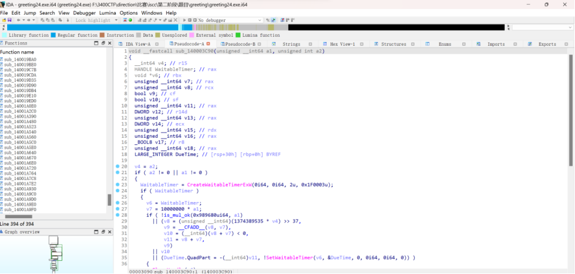
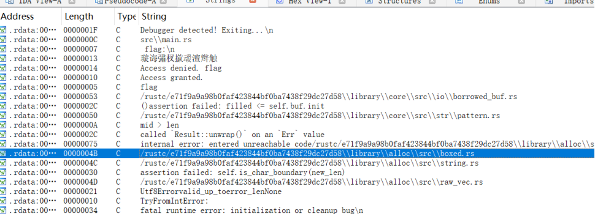
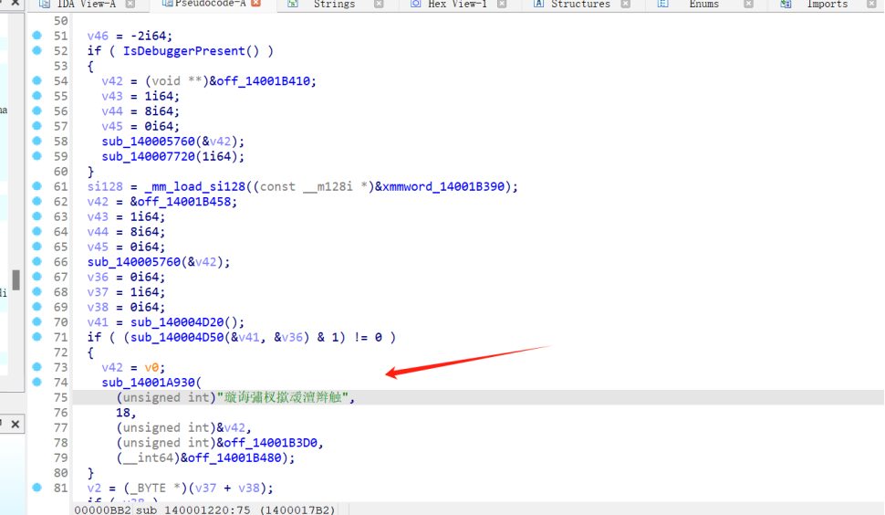
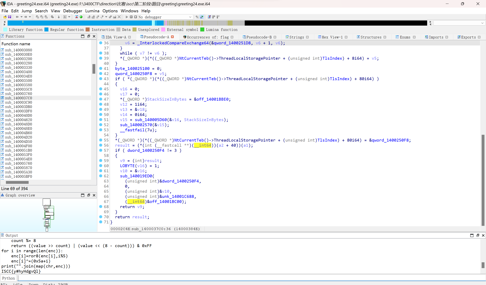

# greeting

WK-[已脱敏]-[email已脱敏]
### **题目类型+题目名称**

RE-greeting

### **解题思路（必须包含文字说明+截图）**

Ida打开看看main：



啥也没有，直接搜索flag字符



进行交叉找到加密的地方



进行异或解密编写脚本从IDA Pro中获取地址0x014001B390处的16个字节数据，用0x5a + i的值与字节进行异或



ISCC{y#hyHdgvQl}

### **Exp（如有，请粘贴完整代码，不允许截图！）**

```python
from ida_bytes import *
enc=list(get_bytes(0x014001B390,16))
def ror8(value, count):
    value &= 0xFF  
    count %= 8     
    return ((value >> count) | (value << (8 - count))) & 0xFF
for i in range(len(enc)):
    enc[i]=ror8(enc[i],i%5)
    enc[i]^=(0x5a+i)
print("".join(map(chr,enc)))

```

‍


