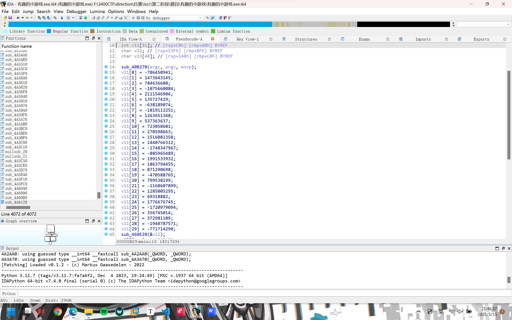
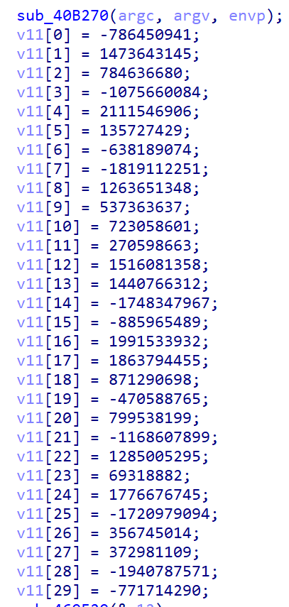
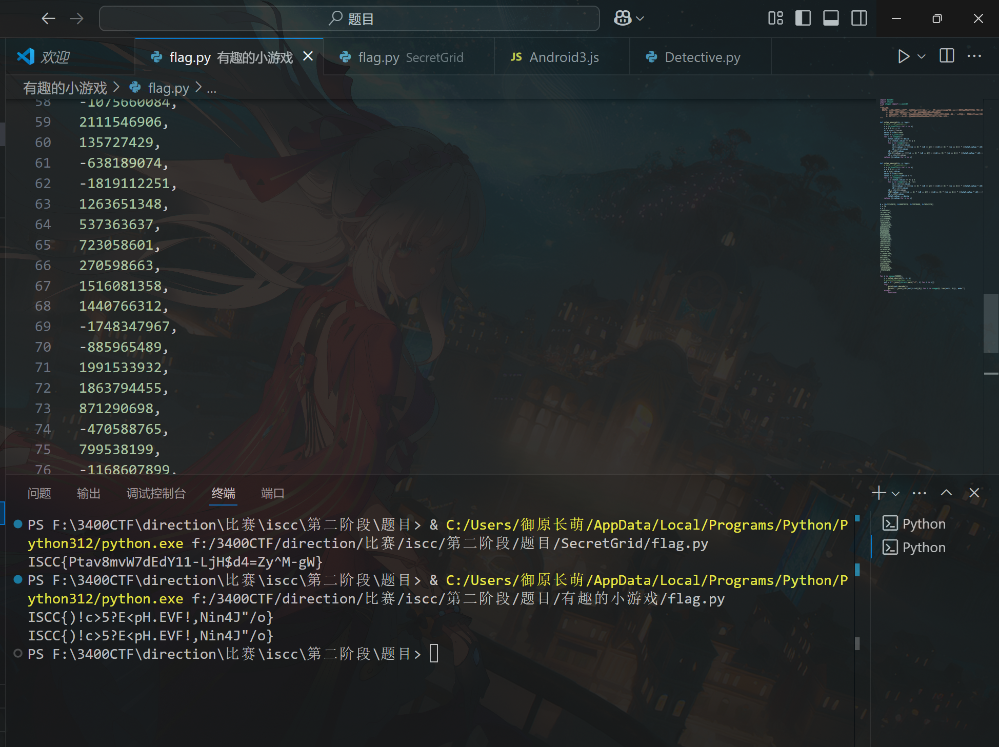

# 有趣的小游戏

WK-[已脱敏]-[email已脱敏]
### **题目类型+题目名称**

RE-有趣的小游戏

### **解题思路（必须包含文字说明+截图）**

Ida打开，直接看main函数



在main函数中，有一个循环，持续检查输入是否正确，直到满足条件为止。提示信息提到“吃完所有金币C后到达出口E即可通关”，这可能是一个游戏逻辑，用户需要通过输入方向（w/s/a/d）来移动，收集金币并到达出口。

v2中的每个字符串以"S123"开头，后面跟着十六进制字符，需要提取这些十六进制值，然后进行异或或其他操作，结合v11中的key来解密

使用XXTEA算法解密密循环次数设置为10000次，这是因为原始数据可能被多次加密，需要多次解密才能得到明文。XXTEA只需要解密一次，所以这里需要确认是否需要多次解密。

需要解密的字符



直接编写脚本：



ISCC{)!c>5?E<pH.EVF!,Nin4J"/o}

### **Exp（如有，请粘贴完整代码，不允许截图！）**

```python
import base64
import struct
from ctypes import c_uint32
"""
参数描述:
  DELTA: 神秘常数δ，它来源于黄金比率，以保证每一轮加密都不相同。但δ的精确值似乎并不重要，这里 TEA 把它定义为 δ=「(√5 - 1)231」
      v: 需要加解密的数据，格式为32位的无符号整数组成的数组
      n: n表示需要加密的32位无符号整数的个数（例：n为1时，只有v数组中的第一个元素被加密了），n不能大于v的长度
      k: 密钥，格式为4个32位无符号整数组成的数组，即密钥长度为128位
"""

def xxtea_encrypt(n, v, key):
    # 全部转为c_unit32格式
    v = [c_uint32(i) for i in v]
    r = 6 + 52 // n
    v1 = v[n-1].value
    delta = 0x9e3779b9
    total = c_uint32(0)
    for i in range(r):
        total.value += delta
        e = (total.value >> 2) & 3
        for j in range(n-1):
            v0 = v[j+1].value
            v[j].value += ((((v1 >> 5) ^ (v0 << 2)) + ((v0 >> 3) ^ (v1 << 4))) ^ ((total.value ^ v0) + (key[(j & 3) ^ e] ^ v1)))
            v1 = v[j].value
        v0 = v[0].value
        v[n-1].value += ((((v1 >> 5) ^ (v0 << 2)) + ((v0 >> 3) ^ (v1 << 4))) ^ ((total.value ^ v0) + (key[((n-1) & 3) ^ e] ^ v1)))
        v1 = v[n-1].value
    return [i.value for i in v]


def xxtea_decrypt(n, v, key):
    # 全部转为c_unit32格式
    v = [c_uint32(i) for i in v]
    r = 6 + 52 // n
    v0 = v[0].value
    delta = 0x9e3779b9
    total = c_uint32(delta * r)
    for i in range(r):
        e = (total.value >> 2) & 3
        for j in range(n-1, 0, -1):
            v1 = v[j-1].value
            v[j].value -= ((((v1 >> 5) ^ (v0 << 2)) + ((v0 >> 3) ^ (v1 << 4))) ^ ((total.value ^ v0) + (key[(j & 3) ^ e] ^ v1)))
            v0 = v[j].value
        v1 = v[n-1].value
        v[0].value -= ((((v1 >> 5) ^ (v0 << 2)) + ((v0 >> 3) ^ (v1 << 4))) ^ ((total.value ^ v0) + (key[(0 & 3) ^ e] ^ v1)))
        v0 = v[0].value
        total.value -= delta
    return [i.value for i in v]


k = [0x12345678, 0x9ABCDEF0, 0xFEDCBA98, 0x76543210]
l = 30
v = [
-786450941,
1473643145,
784636680,
-1075660084,
2111546906,
135727429,
-638189074,
-1819112251,
1263651348,
537363637,
723058601,
270598663,
1516081358,
1440766312,
-1748347967,
-885965489,
1991533932,
1863794455,
871290698,
-470588765,
799538199,
-1168607899,
1285005295,
69318882,
1776676745,
-1720979094,
356745014,
372981109,
-1940787571,
-771714290
]

for i in range(10000):
    v = xxtea_decrypt(l, v, k)
    # print(list(map(hex, v)))
    out = b"".join([struct.pack("<I", i) for i in v])
    try:
        print(out.decode())
        print("".join([chr(out[i:i+4][0]) for i in range(0, len(out), 4)]), end="")
    except:
        continue
```


