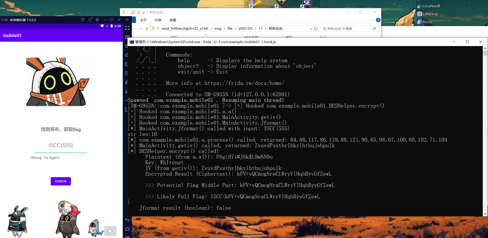

# 邦布出击

WK-[已脱敏]-[email已脱敏]
### **题目类型+题目名称**

mob-邦布出击

### **解题思路（必须包含文字说明+截图）**

把加密的数据库解密即可得到key


三个base64解密：


使用sqlcipher解密,得到key


用脚本hook一下：



ISCC{kFV+vQCmogNraCLWryVlHqbByvGfZewL}

### **Exp（如有，请粘贴完整代码，不允许截图！）**

```javascript
Java.perform(function() {

    let b = Java.use("com.example.mobile01.b");
    b["c"].implementation = function () {
        return "T0uVwXyZAbCdEfGh"; 
    };

    try {
        var cls1 = Java.use("com.example.mobile01.DESHelper");
        cls1.encrypt.implementation = function(data, key, iv) {
            console.log("[*] DESHelper.encrypt() called!");
            console.log("      Plaintext (from a.a()): " + data);
            console.log("      Key: " + key);
            console.log("      IV (from getiv()): " + iv);
            var enc_data = this.encrypt(data, key, iv);
            console.log("      Encrypted Result (Ciphertext): " + enc_data);
            console.log("      >>> Potential Flag Middle Part: " + enc_data);
            console.log("      >>> Likely Full Flag: ISCC{" + enc_data + "}");
            return enc_data;
        };
        console.log("[+] Hooked com.example.mobile01.DESHelper.encrypt()");
    } catch (err) {
        console.error("[-] Failed to hook DESHelper.encrypt: " + err);
    }

    // hook掉有问题的process函数
    function processString(str) {
        var bytes = Java.use("java.lang.String").$new(str).getBytes();
        
        var result = Java.array('byte', new Array(str.length).fill(0));
        
        console.log("str len:"+str.length)
        for (var i = 0; i < str.length; i++) {
            if (i < bytes.length) {
                result[i] = bytes[i];
            } else {
                result[i] = 0;
            }
        }
        
        return result;
    }

    try {
        var cls2 = Java.use("com.example.mobile01.a");

        cls2.process.implementation = function(str){
            var res = processString(str);
            console.log("[*] com.example.mobile01.a.process() called, returned: " + res);
            return res;
        }
        console.log("[+] Hooked com.example.mobile01.a.a()");
    } catch (err) {
            console.error("[-] Failed to hook com.example.mobile01.a.a(): " + err);
    }

    

    try {
        var cls3 = Java.use("com.example.mobile01.MainActivity");
        cls3.getiv.implementation = function() {
            var iv_val = this.getiv();
            console.log("[*] MainActivity.getiv() called, returned: " + iv_val);
            return iv_val;
        };
        console.log("[+] Hooked com.example.mobile01.MainActivity.getiv()");
    } catch (err) {
        console.error("[-] Failed to hook MainActivity.getiv: " + err);
    }

    try {
        var cls4 = Java.use("com.example.mobile01.MainActivity");
        cls4.Jformat.implementation = function(inp) {
            console.log("[*] MainActivity.Jformat() called with input: " + inp);
            var res = this.Jformat(inp);
            console.log("    Jformat result (boolean): " + res);
            return res;
        }
        console.log("[+] Hooked com.example.mobile01.MainActivity.Jformat()");
    } catch (err) {
        console.error("[-] Failed to hook MainActivity.Jformat(): " + err);
    }
});
```


