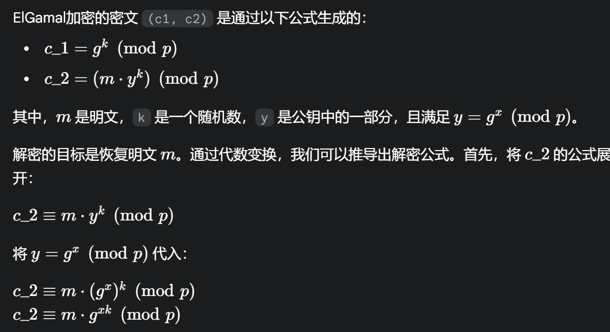
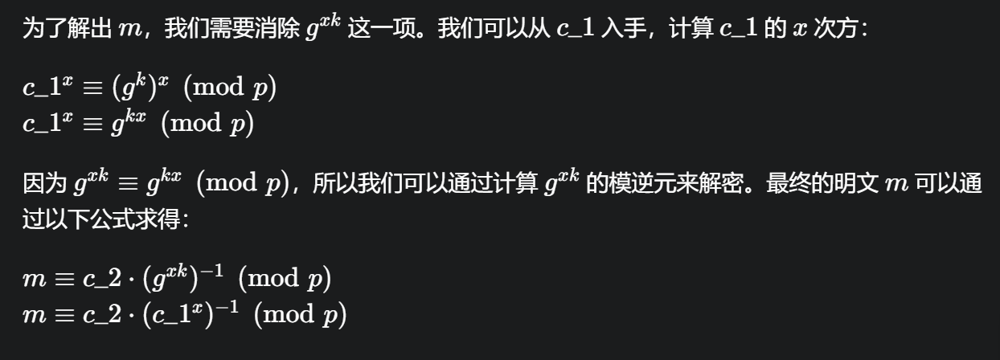

# 入门

# 题目

```python
from Crypto.PublicKey import ElGamal
from Crypto.Random import get_random_bytes, random
from Crypto.Util.number import *
from random import *
from secret import flag
def generate_elgamal_keypair(bits=512):
    p = getPrime(bits)
    
    for _ in range(1000):
        g = getRandomRange(2, 5)
        if pow(g, (p - 1) // 2, p) != 1:
            break
    x = randrange(2, p - 1)
    y = pow(g, x, p)
    
    return p, g, y, x
key=generate_elgamal_keypair(bits=512)
p, g, y ,x= key
print("=== 公钥 (p, g, y) ===")
print("p =", p)
print("g =", g)
print("y =", y)
print()
k = randrange(1, p - 2)
m = bytes_to_long(flag)
c1 = pow(g, k, p)
c2 = (m * pow(y, k, p)) % p
print("=== 密文 (c1, c2) ===")
print("c1 =", c1)
print("c2 =", c2)
#不小心把x输出了()
print("x =", x)
"""
=== 公钥 (p, g, y) ===
p = 
115409637159621449517635782553574175289667159048490149855475976576983048910448410
99894993117258279094910424033273299863589407477091830213468539451196239863
g = 2
y = 
831342478336601128701462358277352159533328529138054068946707321221293164841558006
5207081449784135835711205324186662482526357834042013400765421925274271853
=== 密文 (c1, c2) ===
c1 = 
665205355305564535827536225955485652597693184131825115294046454317510856013294961
0916012490837970851191204144757409335011811874896056430105292534244732863
c2 = 
231491356808152642824798171910095233144493885239903182663547597194748466341836253
3363591441216570597417789120470703548843342170567039399830377459228297983
x = 
801095707808655428402095966412478447961091359656003501195114326955976122911402773
8791440961864150225798049120582540951874956255115884539333966429021004214
'''
```

# 分析

直接给了x的.

本题提供了基于 **ElGamal** 加密算法的密文 `(c1, c2)`​ 和公钥 `(p, g, y)`​。然而，题目在输出时意外地泄露了私钥 `x`​。ElGamal 算法的安全性依赖于离散对数难题，但一旦私钥 `x`​ 泄露，密文就可以被直接解密。

### **解密原理**





按照原理编写出代码：

```python
from Crypto.Util.number import *

# 题目提供的参数
p = 11540963715962144951763578255357417528966715904849014985547597657698304891044841099894993117258279094910424033273299863589407477091830213468539451196239863
c1 = 6652053553055645358275362259554856525976931841318251152940464543175108560132949610916012490837970851191204144757409335011811874896056430105292534244732863
c2 = 2314913568081526428247981719100952331444938852399031826635475971947484663418362533363591441216570597417789120470703548843342170567039399830377459228297983
x = 8010957078086554284020959664124784479610913596560035011951143269559761229114027738791440961864150225798049120582540951874956255115884539333966429021004214

# 计算 s = c1^x mod p
s = pow(c1, x, p)

# 计算 s 的模逆元 s_inv
s_inv = pow(s, -1, p)

# 计算明文 m = c2 * s_inv mod p
m = (c2 * s_inv) % p

# 将整数 m 转换回字节串得到 flag
flag = long_to_bytes(m)

print(f"解密得到的明文整数: {m}")
print(f"解密得到的flag: {flag.decode()}")
```

# Flag

moectf{th1s_1s_y0ur_f1rst_ElG@m@l}

# 参考


