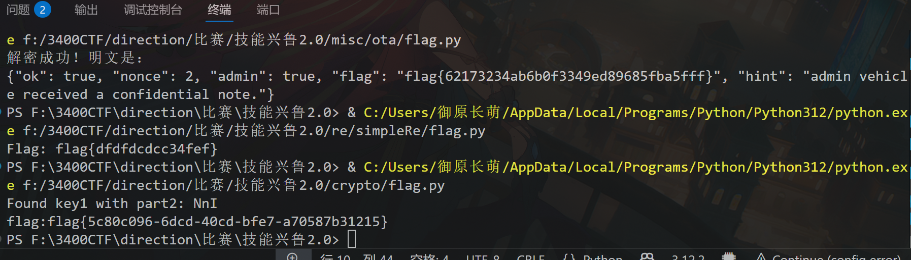
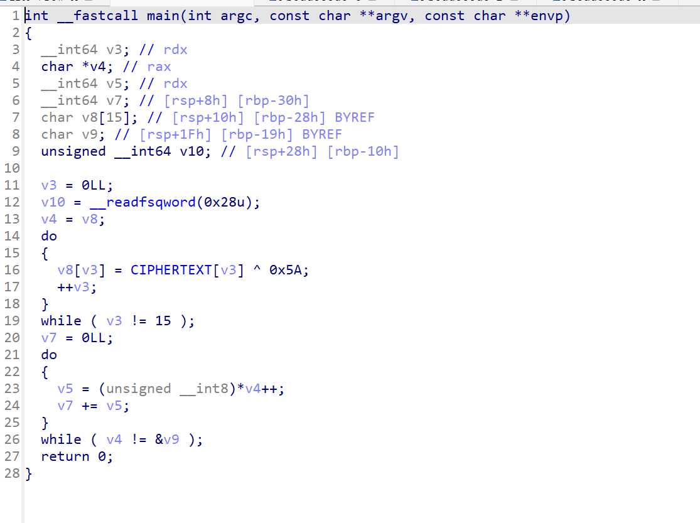
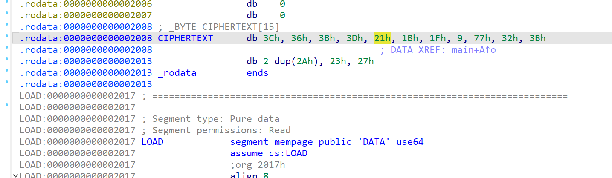
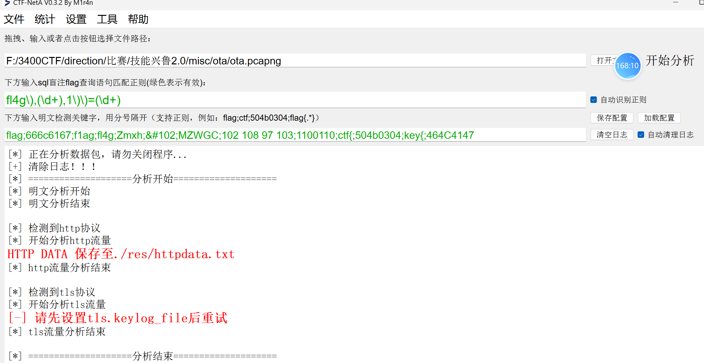
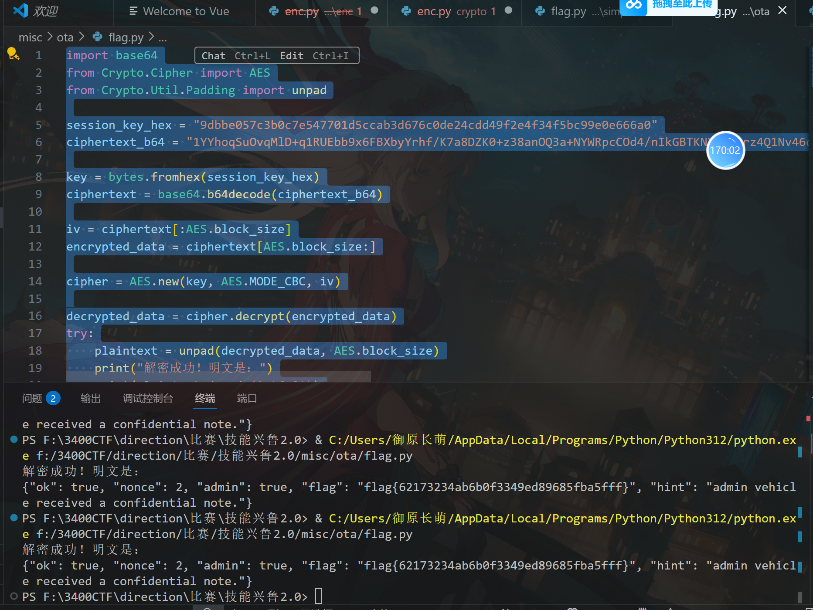
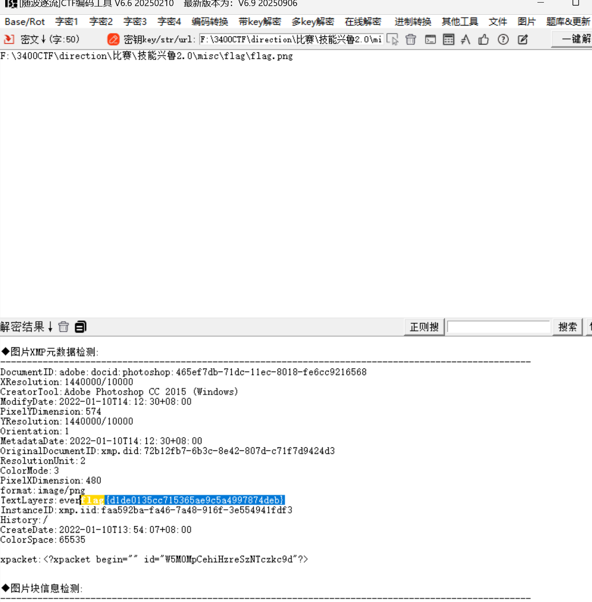
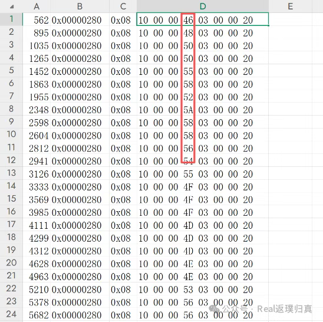
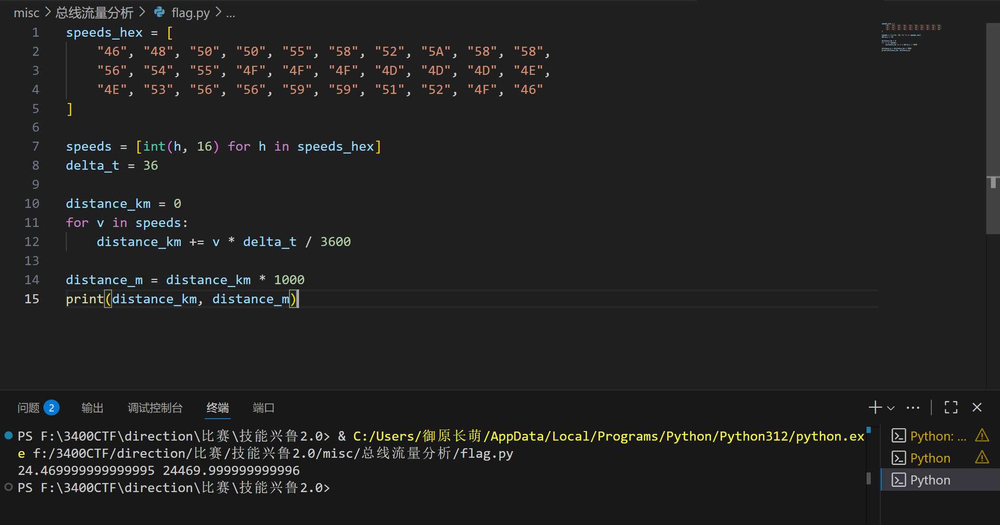
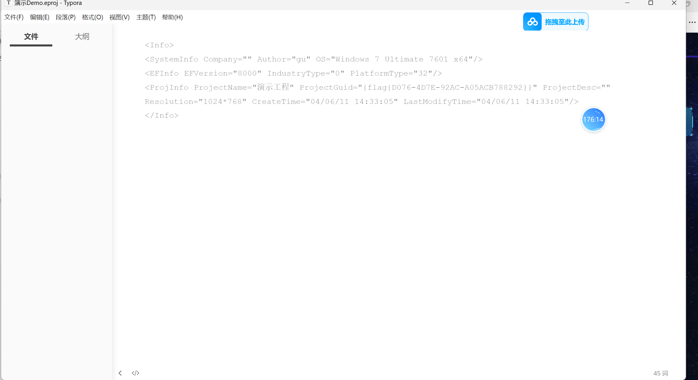
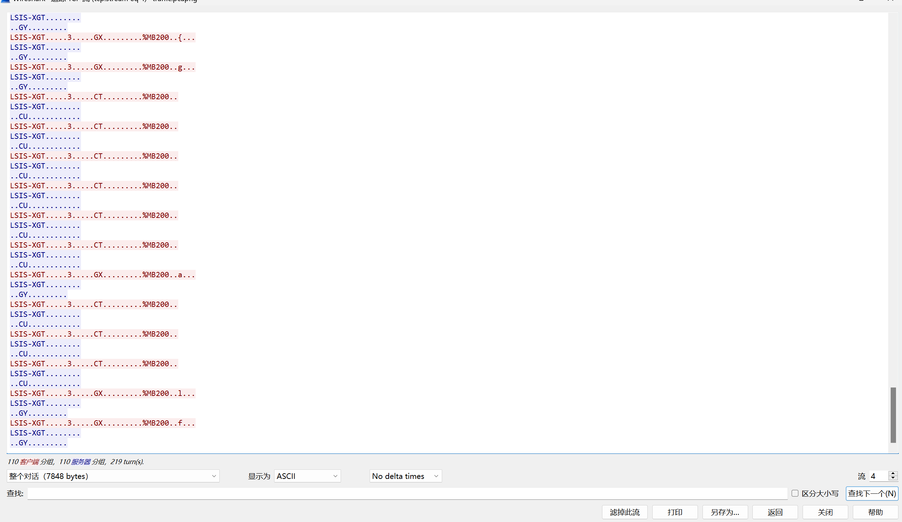

# 技能兴鲁

# Crypto

## EazyAES

题目给出的加密流程是：先用 3 字符的 k0 对 flag 进行 AES-CBC 加密得到 c0，然后连续用同样长度的 k1 对 c0 连续加密三次得到 c3。密钥是通过 `sha256`​ 从 3 字符明文生成的，因此可以通过穷举实现。

解题思路如下：

1. 爆 k1 段：

    * 对 c3 做三次 AES-CBC 解密，并对每次解密结果进行 PKCS7 补位校验。
    * 当三次解密都成功且补位合法时，说明该 k1 值正确，对应的解密结果即为 c0。
2. 爆 k0 段：

    * 对 c0 做一次 AES-CBC 解密并校验 PKCS7 补位，同时验证明文是否符合 flag 的 UUID 格式。
    * 找到匹配的 k0 后，即可得到最终 flag。
3. 优化思路：

    * k1 的搜索空间和 k0 相比较大，可利用多进程或批量处理加速暴力搜索。
    * PKCS7 补位校验和 UUID 格式校验可以作为快速剪枝条件，大幅减少无效解尝试。

```py
from Crypto.Cipher import AES
from hashlib import sha256
import itertools
import string

# 去除 PKCS#7 填充
def remove_padding(data):
    pad_len = data[-1]
    if pad_len < 1 or pad_len > len(data):
        raise ValueError("Invalid padding")
    for i in range(1, pad_len + 1):
        if data[-i] != pad_len:
            raise ValueError("Invalid padding")
    return data[:-pad_len]

# 最终加密的十六进制字符串
final_cipher_hex = "62343dfc3e978a1d580b54f345e1ed719c85ab15781acfe8ba3bcef1560c9cf54f187bc204c302a5ed4ebb5b5454151ba9b8b73841e17dc391c30a637ef8cfa14a25d01765231ef93a6faede2d66bad5d124201a2d278522bfd416de294677046d47f2827580cdcb9c0d3b18e4c0c68c8948aaefe4e684c7386b426db7898b5c2090047ff433bb6a75b38beaf81b7ad9404d2f09c642179697e9d3721eefc0eb12ba8c780a8d07672f70b00b9cadef74"
final_cipher = bytes.fromhex(final_cipher_hex)

# 可选字符集
charset = string.ascii_letters + string.digits

# 用于存储找到的 key1、c0
found_key1 = None
found_c0 = None
found_key1_part = None

# 暴力穷举 key1（prikey[3:6]）
for key1_candidate in itertools.product(charset, repeat=3):
    key1_part = ''.join(key1_candidate)
    key1_bytes = sha256(key1_part.encode()).digest()
    try:
        iv_layer3 = final_cipher[:16]
        ct_layer3 = final_cipher[16:]
        cipher_layer3 = AES.new(key1_bytes, AES.MODE_CBC, iv_layer3)
        padded_layer2 = cipher_layer3.decrypt(ct_layer3)
        layer2 = remove_padding(padded_layer2)
        if len(layer2) != 144:
            continue

        iv_layer2 = layer2[:16]
        ct_layer2 = layer2[16:]
        cipher_layer2 = AES.new(key1_bytes, AES.MODE_CBC, iv_layer2)
        padded_layer1 = cipher_layer2.decrypt(ct_layer2)
        layer1 = remove_padding(padded_layer1)
        if len(layer1) != 112:
            continue

        iv_layer1 = layer1[:16]
        ct_layer1 = layer1[16:]
        cipher_layer1 = AES.new(key1_bytes, AES.MODE_CBC, iv_layer1)
        padded_layer0 = cipher_layer1.decrypt(ct_layer1)
        layer0 = remove_padding(padded_layer0)
        if len(layer0) != 80:
            continue

        found_key1 = key1_bytes
        found_c0 = layer0
        found_key1_part = key1_part
        print("Found key1 part:", key1_part)
        break
    except ValueError:
        continue

if found_key1 is None:
    print("No key1 found")
    exit()

# 暴力穷举 key0（prikey[0:3]）
for key0_candidate in itertools.product(charset, repeat=3):
    key0_part = ''.join(key0_candidate)
    key0_bytes = sha256(key0_part.encode()).digest()
    try:
        iv_layer0 = found_c0[:16]
        ct_layer0 = found_c0[16:]
        cipher_layer0 = AES.new(key0_bytes, AES.MODE_CBC, iv_layer0)
        padded_flag = cipher_layer0.decrypt(ct_layer0)
        flag_bytes = remove_padding(padded_flag)
        if len(flag_bytes) == 36:
            flag_str = flag_bytes.decode('utf-8')
            # 验证 flag 格式
            if flag_str[8] == '-' and flag_str[13] == '-' and flag_str[18] == '-' and flag_str[23] == '-':
                print(f"flag:flag{{{flag_str}}}")
                break
    except ValueError:
        continue

```



# RE

## 简单的逆向分析



程序把全局数组 `CIPHERTEXT`​ 的 15 字节逐字节与 `0x5A`​ 做异或，结果写入局部缓冲 `v8`​（15 字节）。随后程序把这 15 字节按无符号字节累加到 `v7`​（只做加和，没输出）。所以**真正的 flag 就是把 CIPHERTEXT 的每个字节 XOR 0x5A**。

点开ciphertext就找到了，然后逆向即可。



```py
def decrypt(cipher_bytes):
    return "".join(chr(b ^ 0x5A) for b in cipher_bytes)

if __name__ == "__main__":
    ciphertext = [
        0x3C, 0x36, 0x3B, 0x3D, 0x21, 0x1B, 0x1F, 0x09,
        0x77, 0x32, 0x3B, 0x2A, 0x2A, 0x23, 0x27
    ]
    flag = decrypt(ciphertext)
    print("解出的 flag:", flag)

```

## simpleVM

简单的虚拟机

这道题是一个简单的异或加密逆向题，给定了一个长度为 20 的加密字节数组 `encrypted_bytes`​，以及一个可由公式生成的密钥数组 `xor_keys`​（每个元素为 `0x5A + 2*i`​）。加密方式是逐字节异或，即每个加密字节等于原始 flag 字节与对应密钥字节异或。解题思路就是对每个字节再进行一次异或运算 `encrypted_bytes[i] ^ xor_keys[i]`​，即可还原出原始 flag 字节，然后将这些字节拼接成字符串就得到完整 flag。

```py
# 加密后的字节数组
encrypted_bytes = [
    0x3C, 0x30, 0x3F, 0x07, 0x19, 0x00, 0x00, 0x0C,
    0x0C, 0x08, 0x0D, 0x14, 0x11, 0x17, 0x45, 0x4C,
    0x1C, 0x19, 0x18, 0xFD
]

# 异或密钥数组
xor_keys = [0x5A + 2 * i for i in range(20)]

# 存储解密后的 flag 字节
decrypted_flag_bytes = []

for i in range(20):
    decrypted_byte = encrypted_bytes[i] ^ xor_keys[i]
    decrypted_flag_bytes.append(decrypted_byte)

# 拼接成字符串
flag = ''.join(chr(b) for b in decrypted_flag_bytes)
print("Flag:", flag)
# 输出: flag{dfdfdcdcc34fef}

```

# Misc

## OTA流量分析

用工具解析出httpdata数据：



```py
{"vin": "VIN11111111Normal", "status": {"battery": 0.8}, "timestamp": 1754653915}
{"message":"handshake ok","ok":true,"session_key":"b908232bfa70d5c3060dd2f96b36a7fc8199e18ef1b3c509efe4a86bf9339d90","vehicle_type":"normal"}\n
AIgjkRAmDXBaF426edAopRAjJR0gw/HLpAMAFs/4GUI=
ALTaXk84WULvUwvHHoKpDlmW8PKnKIhyCZVl3kiI4Kca1NgiZDbUt6O6H1OAsZvUX7FyZsgjRJLolAEBnp0Lpg==
{"vin": "VIN22222222Normal", "status": {"battery": 0.8}, "timestamp": 1754653915}
{"message":"handshake ok","ok":true,"session_key":"bc27b70ea1b27768c1ad58314005ee2ee0a09977b150e570465d6247675e1eab","vehicle_type":"normal"}\n
n1LlmdlATu+7OdQ/zPTs67KYSBT1jQ5ZNk6QTMbEgSs=
UCe5sie4oBVahQj/YU1QGyhKSdVynasbFpqmcRICsxoIRjql/hkVNUkm3GLTRFF0EheiFE5exhB/HORycvhvrg==
{"vin": "VIN33333333Normal", "status": {"battery": 0.8}, "timestamp": 1754653915}
{"message":"handshake ok","ok":true,"session_key":"0d53164fe1c89a4f09512492f2236d86d52c4fdd8b9018195b791b634bfe9e83","vehicle_type":"normal"}\n
XrJkEgv5wyAdWQ+IOjTXJlRijCotOKmcvbdJ0dW9KUk=
KDM92dom8cmnniH6MmTrg8uEP/AZOZyO922N709fxbCC5MJ1nHlcMzxm+D2EjtxzoMLIi8bFj7YUph3Gz1Waog==
{"vin": "VINADMIN12345VSEC", "status": {"battery": 0.8}, "timestamp": 1754653916}
{"message":"handshake ok","ok":true,"session_key":"9dbbe057c3b0c7e547701d5ccab3d676c0de24cdd49f2e4f34f5bc99e0e666a0","vehicle_type":"admin"}\n
RQMKMQ4Tkpt5SoO+wucvyCSlKGjPGETBz1ibveR2DmQ=
1YYhoqSuOvqMlD+q1RUEbb9x6FBXbyYrhf/K7a8DZK0+z38anOQ3a+NYWRpcCOd4/nIkGBTKNXHLjJrz4Q1Nv46dpXm1UrAg5Kwnq5aNm8yin0OET5h9gWfq9/Fk/zs42KiitKOPxHu17Xo/xnLG35yiJoOYmQ+EIfLE1wS4Xwfv+iX+w92ioJ4liAQkG9T5W35C/bSYQFW/1Jiic1YxJN3XcNM07863oanCvoXum/k=

```

分析出是车联网加密数据，采用aes加密

写出脚本解密即可得出答案：

```py
import base64
from Crypto.Cipher import AES
from Crypto.Util.Padding import unpad

session_key_hex = "9dbbe057c3b0c7e547701d5ccab3d676c0de24cdd49f2e4f34f5bc99e0e666a0"
ciphertext_b64 = "1YYhoqSuOvqMlD+q1RUEbb9x6FBXbyYrhf/K7a8DZK0+z38anOQ3a+NYWRpcCOd4/nIkGBTKNXHLjJrz4Q1Nv46dpXm1UrAg5Kwnq5aNm8yin0OET5h9gWfq9/Fk/zs42KiitKOPxHu17Xo/xnLG35yiJoOYmQ+EIfLE1wS4Xwfv+iX+w92ioJ4liAQkG9T5W35C/bSYQFW/1Jiic1YxJN3XcNM07863oanCvoXum/k="

key = bytes.fromhex(session_key_hex)
ciphertext = base64.b64decode(ciphertext_b64)

iv = ciphertext[:AES.block_size]
encrypted_data = ciphertext[AES.block_size:]

cipher = AES.new(key, AES.MODE_CBC, iv)

decrypted_data = cipher.decrypt(encrypted_data)
try:
    plaintext = unpad(decrypted_data, AES.block_size)
    print("解密成功！明文是：")
    print(plaintext.decode('utf-8'))
except ValueError:
    print("解密失败：填充无效，可能是密钥、IV或模式不正确。")
    print("原始解密数据：", decrypted_data)
```



‍

## Easypicgame

拖进随波逐流就出答案：



## 总线流量分析

一辆汽车在试验道路上行驶，测试人员监控了一段时间的车内通信报文，报文抓取时间间隔为36s，尝试找出与仪表显示车速相关的CAN通信报文，估算车辆在这段时间的行驶路程（m）得到flag。已知车速在80千米每小时左右，车速信息只占用1字节长度，且具备较高优先级。flag{行驶路程距离}

打开后按ID分组观察，根据题目提示找只有1字节变化的can报文：



发现ID=0x0000280的can报文数据只有1字节在变化且在0x50左右浮动，说明速度为80km/h左右，编写脚本计算即可：

```py
speeds_hex = ["46","48","50","50","55","58","52","5A","58","58",
              "56","54","55","4F","4F","4F","4D","4D","4D","4E",
              "4E","53","56","56","59","59","51","52","4F","46"]

speeds = [int(h,16) for h in speeds_hex]
delta_t = 36

distance_km = 0
for v in speeds:
    distance_km += v * delta_t / 3600

distance_m = distance_km * 1000
print(distance_km, distance_m)

```



# ics

## 失窃的工艺：

把后缀改成zip，点开压缩包中的演示demo即可得出答案：



## 工控流量分析

WireShark打开分析，追踪TCP流，flag被逐字符藏在流量中：




