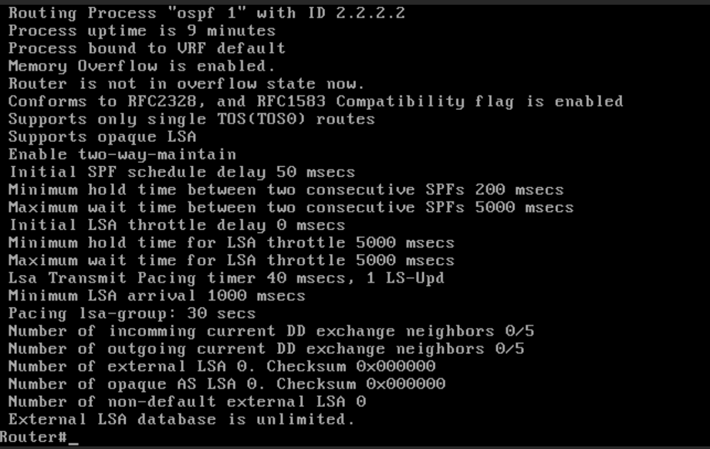
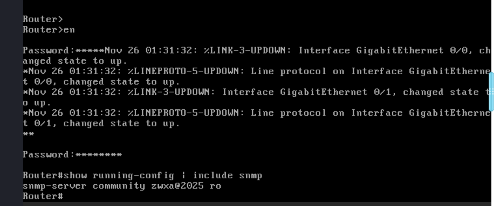
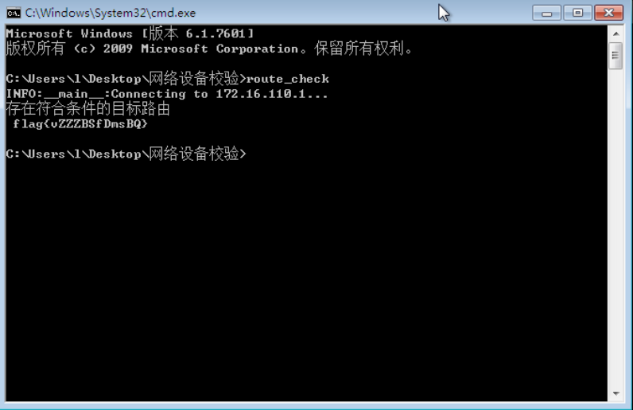
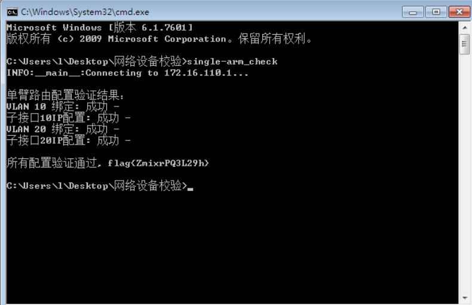
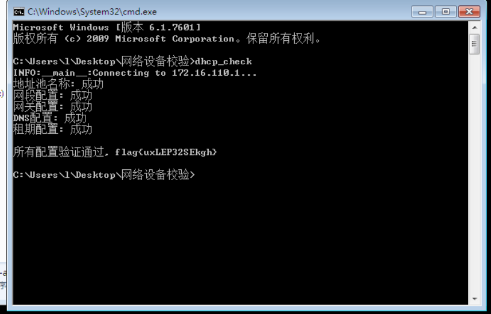

# 金砖

## 2.路由器身份标识


```bash
en
```

输入密码

```bash
show ip ospf
```



## 3.OSPFk开销

```bash
IP OSPF COST10
```

flag{a641c343cbd6f9973ae8f525b0f72233}

‍

## 4.SNMP权限管理

进入权限模式输入：

```bash
show running config | include snmp
```



flag{c14eac023e203a47216fb2ac5e26e6d9}

‍

## 5.静态路由

```bash
configure terminal
```

```bash
ip route 10.10.0.0 255.255.254.0 192.168.100.254 10
```



## 6.单臂路由配置

```bash
configure terminal
interface GigabitEthernet 0/1
 no ip address
 no shutdown
 exit
interface GigabitEthernet 0/1.10
 encapsulation dot1Q 10
 ip address 192.168.10.1 255.255.255.0
 exit
interface GigabitEthernet 0/1.20
 encapsulation dot1Q 20
 ip address 192.168.20.1 255.255.255.0
 exit
end
```



## 7.dhcp服务器配置

```bash
configure terminal
ip dhcp pool zwxa
network 192.168.10.0 255.255.255.0
default-router 192.168.10.1
dns-server 8.8.8.8
lease 0 8 0
exit
end
```




