# 逆向工程核心原理

# 第一部分：代码逆向技术基础

## 第一章：引言

## 第二章 逆向分析Hello World！程序

### 2.1：HelloWorld程序

源代码：

```cpp
#include <windows.h>
#include <tchar.h> // 需要包含tchar.h

int _tmain(int argc, TCHAR *argv[]) {
    MessageBox(NULL, _T("Hello, World!"), _T("Hello, World!"), MB_OK);
    return 0;
}
```

运行界面：

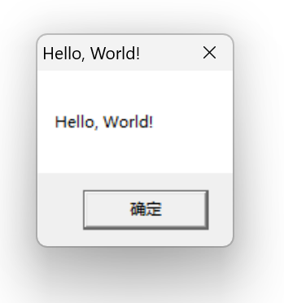

### 2.2调试程序

olldbg已经停止更新了，以后我们都用x64dbg来逆向，打开界面如下：

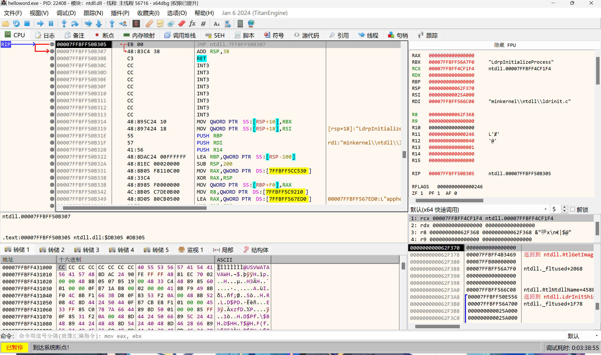

在这有个小办法，如果你知道字符串内容的话，可以直接右键代码窗口，搜索该字符串

如图：

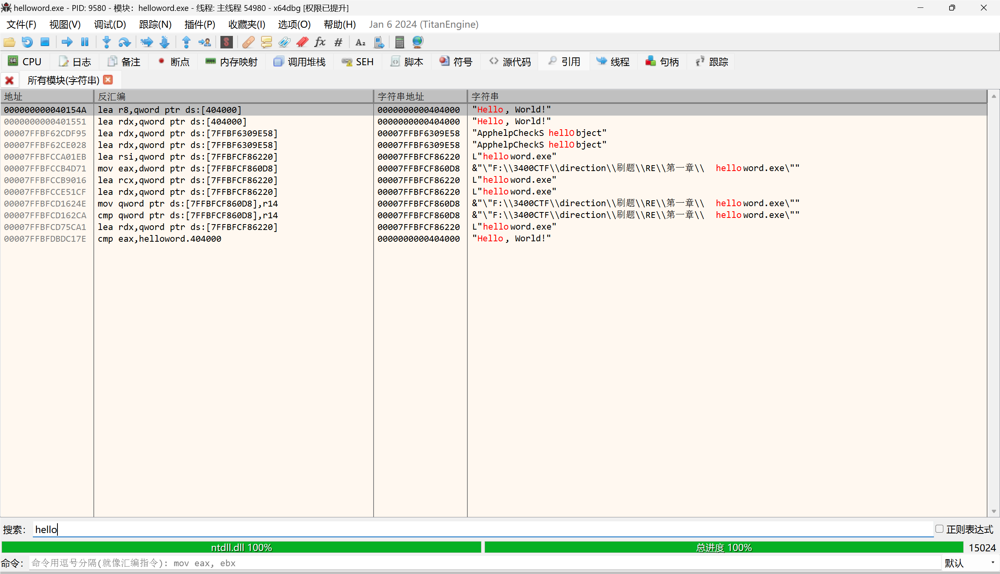

单击点开就找到该地址了：

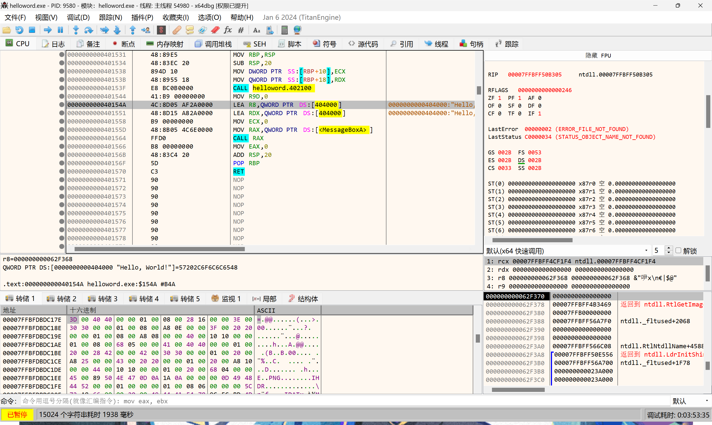

找到0000000000404000地址，就可以看到旁边ASCII值中显示的helloworld了：

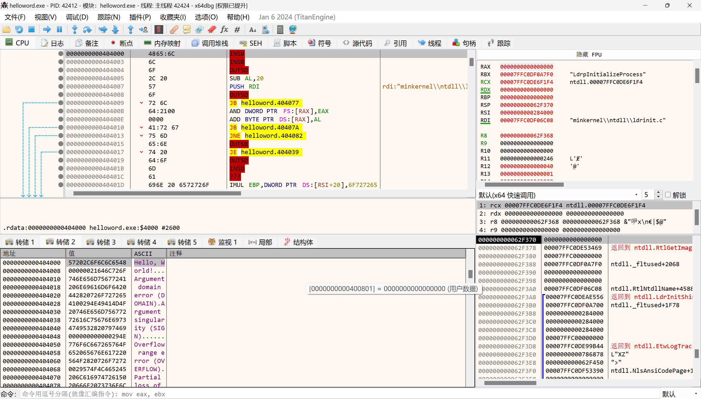

选中你要修改的字符串，按快捷键CTRL+E：

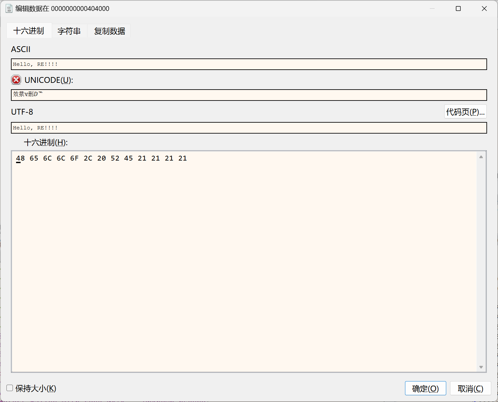

修改为你想要的字符串即可。

然后按CTRL+P唤出打补丁界面，也可单击状态栏上面的创可贴：

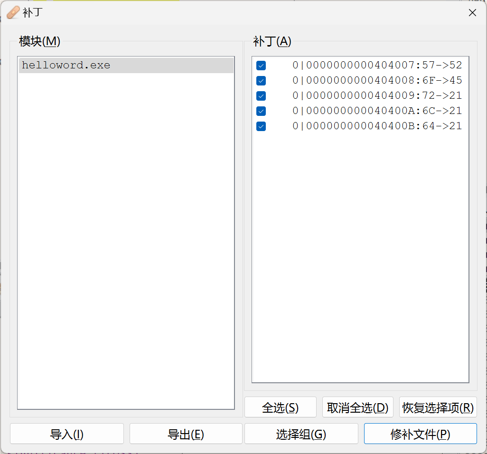

单击修补文件然后保存即可：

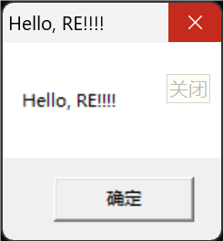

‍

## 第三章：小端序标记法

### 3.1：字节序

在几乎所有的机器上，多字节对象都被存储为连续的字节序列。例如：如果C/C++中的一个int型变量 a 的起始地址是&a = 0x100，那么 a 的四个字节将被存储在存储器的0x100, 0x101,0x102, 0x103位置。

根据整数 a 在连续的 4 byte 内存中的存储顺序，字节序被分为**[大端序](https://zhida.zhihu.com/search?content_id=237697135&content_type=Article&match_order=1&q=%E5%A4%A7%E7%AB%AF%E5%BA%8F&zhida_source=entity)**​ **（Big Endian）**  与 **[小端序](https://zhida.zhihu.com/search?content_id=237697135&content_type=Article&match_order=1&q=%E5%B0%8F%E7%AB%AF%E5%BA%8F&zhida_source=entity)**​ **（Little Endian）** 两类。 然后就牵涉出两大CPU派系：

* [Motorola 6800](https://zhida.zhihu.com/search?content_id=237697135&content_type=Article&match_order=1&q=Motorola+6800&zhida_source=entity)，[PowerPC 970](https://zhida.zhihu.com/search?content_id=237697135&content_type=Article&match_order=1&q=PowerPC+970&zhida_source=entity)，[SPARC](https://zhida.zhihu.com/search?content_id=237697135&content_type=Article&match_order=1&q=SPARC&zhida_source=entity)（除V9外）等处理器采用 Big Endian方式存储数据；
* [x86系列](https://zhida.zhihu.com/search?content_id=237697135&content_type=Article&match_order=1&q=x86%E7%B3%BB%E5%88%97&zhida_source=entity)，[VAX](https://zhida.zhihu.com/search?content_id=237697135&content_type=Article&match_order=1&q=VAX&zhida_source=entity)，[PDP-11](https://zhida.zhihu.com/search?content_id=237697135&content_type=Article&match_order=1&q=PDP-11&zhida_source=entity)等处理器采用Little Endian方式存储数据。

那么，到底什么是大端，什么是小端？ 如下图

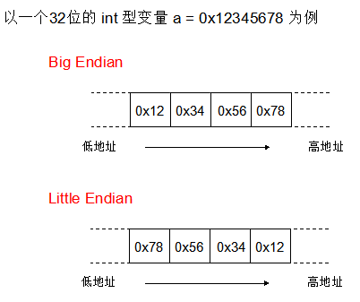

我相信上面的图已经够直观了。也就是说：

* Big Endian 是指低地址端 存放 高位字节。
* Little Endian 是指低地址端 存放 低位字节。

也正如文中所言：

> 采用大端序存储数据时，内存地址低位存储数据的高位，内存高位存储数据的低位，这是一种最直观的字节存储顺序；采用小端序存储数据时，地址高位存储数据的高位，地址低位存储数据的低位，这是一种逆序存储方式，保存的字节顺序被倒转，它是最符合人类思维的字节序。

**各自的优势：**

1. Big Endian：符号位的判定固定为第一个字节，容易判断正负。
2. Little Endian：长度为1，2，4字节的数，排列方式都是一样的，数据类型转换非常方便。

**而数据为单一字节时，无论大端序还是小端序，字节存储数据都一样，只有数据长度在两个字节以上时，即数据为多字节数据时，选用大端序和小端序会导致数据的存储顺序不一样。**

#### 3.1.1：大端序与小端序

在这里引用这位先生的博客，具体区别可以从这探究。总之在本书中，默认所有数据以小端序（逆序）存放，请知悉。

[字节序探析：大端与小端的比较 - 阮一峰的网络日志](https://www.ruanyifeng.com/blog/2022/06/endianness-analysis.html)

#### 3.1.2：在x64中查看小端序

首先编写一个简单的测试程序：

```cpp
#include"windows.h"

BYTE b = 0x12;
WORD w = 0x1234;
DWORD dw = 0x12345678;
char str[] = "abcde";

int main(int argc,char*argv[])
{
	BYTE lb = b;
	WORD lw = w;
	DWORD ldw = dw;
	char *lstr = str;
	
		return 0;
 } 
```

编写完代码后，生成LittleEndian.exe文件，用x64dbg打开，按CTRL+G命令跳转到401000地址处，如图所示：

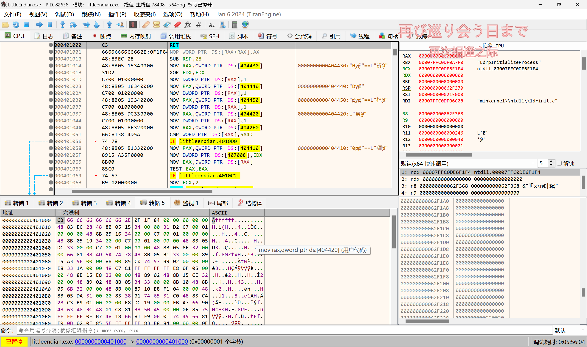

可以看到main函数地址为401000，全局变量b,w,dw,str的地址分别为404430，404440，404450，404420。点击下面的内存窗口，使用goto命令跳转到对应地址处：

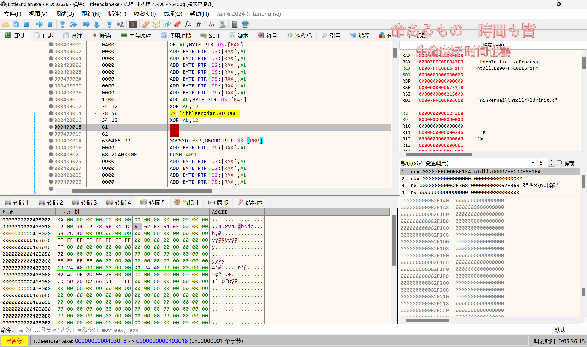

可以看到w和dw的值采用小端序存储。


