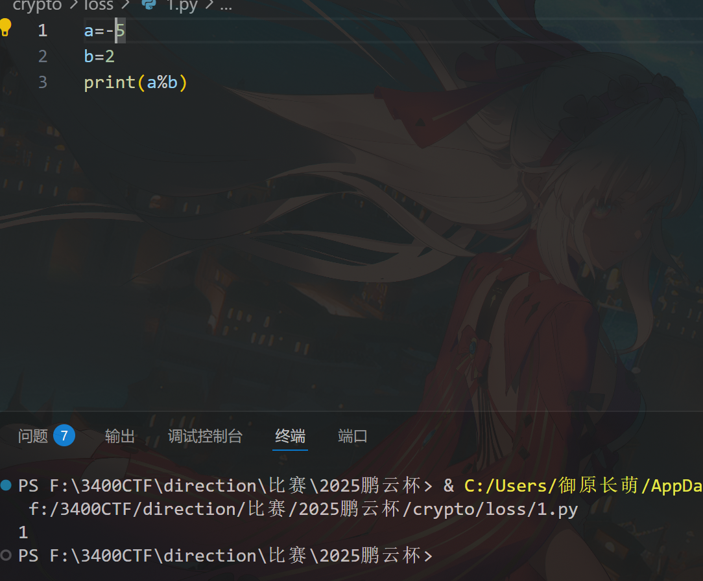
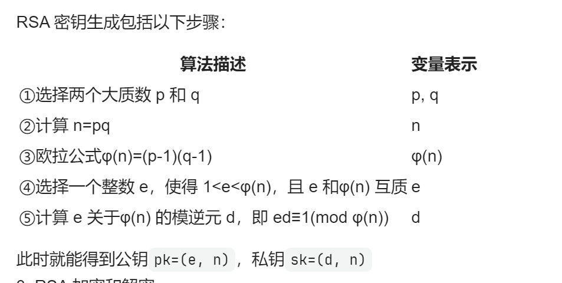
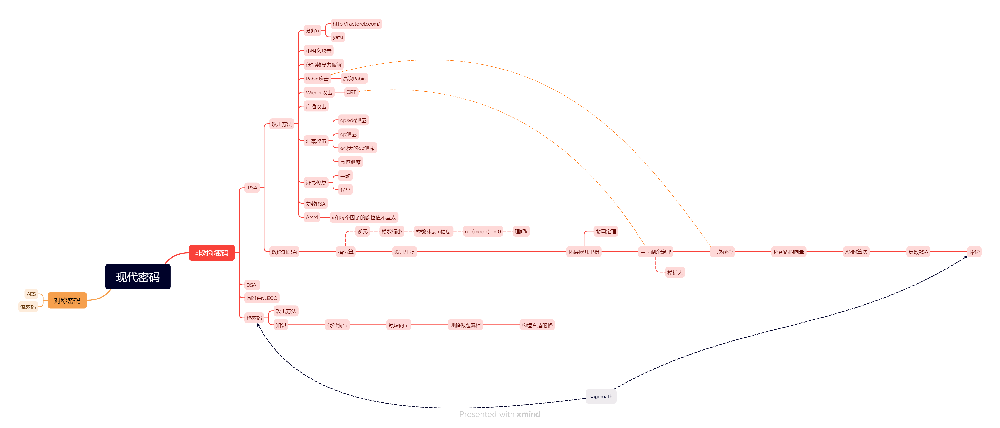

# RSA加密算法基础之基础简介

# 一：引入

如果不是密码学的发展，计算机的出现可能还要晚很多年。 计算机科学之父图灵，早年从事密码破解工作。二战期间，图灵对破解德军 Enigma 密码机做出了巨大贡献，从而加快了二战结束的步伐。由于破解密码需要大量计算工作，图灵参与了最早的电子计算机研发。最终图灵奠定了计算机科学的基础。

**某种意义上可以说是密码学的发展加快了了计算机的产生。**

## **为什么需要加密？**

密码学源于解决消息传递过程中的安全问题。

我们可以思考下面的一个场景。上大学的小明给爸爸写信，让爸爸汇款5000块钱交学费。在这个过程中接触到信件的人很多，如果被某个别有用心的人利用，就会产生严重的后果。比如下面几种情况：

**1、信件中涉及小明的敏感信息，如身份证号。如果被接触到信件的人看到，可能会被拿去做一些非法的事情。**

**2、信件投递员小白，看到信件内容后，伪造了信件，修改了收款的账户。于是小明的爸爸收到信件后给小白汇去了5000元钱。**

小明为了避免上面的问题，决定亲手将信交给自己父亲。

这样是否就高枕无忧了？此时出现了新问题。

**3、小白化妆成小明的父亲，骗过了小明，从而拿到了信件。**

一次简单的通信，就这样被搞成了谍战。其实这并不夸张。二战期间，每天都在上演同样的戏码。

以上三个问题是通信过程中所面临的安全挑战：

1. 信息保密问题
2. 信息篡改问题
3. 通信对象认证问题

密码学就是要解决以上三个问题。

### **简单替换密码**

简单替换密码系统中，我们为26个字母建立映射关系，例如s-\>a、c-\>d、h-\>n、o-\>x、l-\>y…… 26个字母被映射为另外的字母，那么一个明文的单词被加密后就无法认出了。例如school，按照上面的映射关系，就变成了adnxxy。

在这个密码系统中也存在密码算法和密钥。

**密码算法**：26个字母按照固定的映射关系做替换

**密钥**：26个字母的替换关系

如果想要破解密钥，也就是要找出26个字母的替换关系。a有26种替换可能，b有除a选择替换的字母之外的25种可能。以此类推，存在的替换关系有26x25x24……x1,约为2的88次方。如果计算机可以一秒尝试一亿个密码，运气差的话要尝试1200亿年。因此暴力破解是行不通的。

但是由于密码算法中，替换关系是稳定的，所以可以采用频率分析的方式破解密码。原理是明文中同一个字母出现的频率和密文中被替换的字母出现的频率一致。在英文中，字母出现的频率是相对稳定的。因此可以根据字母出现的频率推算出替换关系，也就是密钥。从而完成破解。

这种密码系统不安全的根源在于密码算法，该算法很容易让破解者推测出密钥，因此安全性极低。

二进制数字有一种运算叫做异或，运算符号 XOR。这种运算有一个特性，如果 A XOR B \= C ，那么C XOR B \=A。这个特性和加解密的过程十分相似，A 可以看作是明文，B 看作密钥，XOR 看作密码算法，C是加密后的密文。用密钥 B 可以将 C 还原为明文 A。

异或算法太简单，不能直接用作密码算法。但我们所熟知的对称密钥 DES 和 [AES](https://zhida.zhihu.com/search?content_id=186165014&content_type=Article&match_order=1&q=AES&zhida_source=entity) 都是以异或运算作为基础。

# 二：为何非对称加密比对称加密更安全

前文详细讲解了对称加密及算法原理。那么是不是对称加密就万无一失了呢？对称加密有一个天然的缺点，就是加密方和解密方都要持有同样的密钥。你可以能会提出疑问：既然要加、解密，当然双方都要持有密钥，这有什么问题呢？别急，我们继续往下看。

## 对称密钥的缺点

我们先看一个例子，小明和小红要进行通信，但是不想被其他人知道通信的内容，所以双方决定采用对称加密的方式。他们做了下面的事情：

1、双方商定了加密和解密的算法

2、双方确定密钥

3、通信过程中采用这个密钥进行加密和解密

这是不是一个看似完美的方案？但其中有一个步骤存在漏洞！

**问题出在步骤2：双方确定密钥！**

你肯定会问，双方不确定密钥，后面的加、解密怎么做？

问题在于确定下来的密钥如何让双方都知道。密钥在传递过程中也是可能被盗取的！这里引出了一个经典问题：**密钥配送问题。**

## 密钥配送问题

小明和小红在商定密钥的过程中肯定会多次沟通密钥是什么。即使单方一次确定下来，也要发给对方。加密是为了保证信息传输的安全，**但密钥本身也是信息**，密钥的传输安全又该如何保证呢？难不成还要为密钥的传输再做一次加密？这样不就陷入了死循环？

你是不是在想，密钥即使被盗取，不还有加密算法保证信息安全吗？如果你真的有这个想法，那么赶紧复习一下上一篇文章讲的**杜绝隐蔽式安全性**。任何算法最终都会被破译，所以不能依赖算法的复杂度来保证安全。

小明和小红现在左右为难，想加密就要给对方发密钥，但发密钥又不能保证密钥的安全。他们应该怎么办呢？

有如下几种解决密钥配送问题的方案：

1. 事先共享密钥
2. 密钥分配中心
3. [Diffie-Hellman密钥交换](https://zhida.zhihu.com/search?content_id=185119483&content_type=Article&match_order=1&q=Diffie-Hellman%E5%AF%86%E9%92%A5%E4%BA%A4%E6%8D%A2&zhida_source=entity)
4. [非对称加密](https://zhida.zhihu.com/search?content_id=185119483&content_type=Article&match_order=1&q=%E9%9D%9E%E5%AF%B9%E7%A7%B0%E5%8A%A0%E5%AF%86&zhida_source=entity)

本文就不展开讲每种方式，这里只是为了引出今天的主角——非对称加密。

# 三：一点点数学基础

在进入非对称加密之前，我们必须要掌握一点点数学基础，大家放心，这一部分是不会像高数一样困难，我力图用最浅显的方式给大家讲清楚在RSA加密算法中所应用的数学原理。

首先我们来科普几个数论上的概念：

 **（1）**​**[素数](https://zhida.zhihu.com/search?content_id=963479&content_type=Article&match_order=1&q=%E7%B4%A0%E6%95%B0&zhida_source=entity)**​ **：一个大于1的数字，如果只能被1和这个数字本身整除，那么我们就称这个数字为素数，**

例如7只能被1和7整除，所以7是素数，8能被1、2、4和8整除，所以8不是素数；

 **（2）**​**[互素](https://zhida.zhihu.com/search?content_id=963479&content_type=Article&match_order=1&q=%E4%BA%92%E7%B4%A0&zhida_source=entity)**​ **：如果两个数m，n的最大公约数是1，那么称m与n互素，记作：（m，n）=1；**

 **（3）模运算：模运算是指计算一个数除以另一个数的余数。**

例如，对于整数5除以2，余数为1。取模运算就可以表示为5%2，结果为1。

在python中，取模运算是通过%操作符来执行的，例如，x % y 表示将x 除以 y 后的余数。python中的取模运算，结果的符号与除数（模数）的符号相同。例如，-5%2的结果为-，如下图所示：



> 复习一下数学中的两个概念：
>
> 被除数：是除法运算中被另一个数所除的数。它代表了一个总量或者整体，是需要被分割的对象。例如，在"10 ÷ 2 \= 5"这个式子中，10就是被除数，它是整个要被处理的数量。
>
> 除数：是在除法运算中用来除被除数的数。它决定了将被除数分成多少份，或者说以怎样的规模去分割被除数。在上述例子中，2就是除数，它规定了把10分成两份。

# 四：RSA之产生

经过一些数学概念的补充，我们终于来到今天的主角：RSA加密算法，作为目前使用最广泛的非对称加密算法，本段我们来简单介绍RSA加解密的过程：

RSA 加解密算法其实很简单：

我们假设c代表密文，m代表明文：

$$
c=m^{e}  \bmod N
$$

$$
m=c^{d}  \bmod N
$$

RSA 算法并不会像对称加密一样，用玩魔方的方式来打乱原始信息。RSA 加、解密中使用了是同样的数 N。公钥是公开的，意味着 N 也是公开的。所以私钥也可以认为只是 D。

我们接下来看一看 N、E、D 是如何计算的。

1、求 N

首先需要准备两个很大质数 a 和 b。太小容易破解，太大计算成本太高。我们可以用 512 bit 的数字，安全性要求高的可以使用 1024，2048 bit。

N\=a\*b

2、求 L

L 只是生成密钥对过程中产生的数，并不参与加解密。L 是 (a-1) 和 (b-1) 的最小公倍数

3、求 E（公钥）

E 有两个限制：

1\<E\<L

E和L的最大公约数为1

第一个条件限制了 E 的取值范围，第二个条件是为了保证有与 E 对应的解密时用到的 D

4、求 D（私钥）

D 也有两个限制条件：

1\<D\<L

E\*D mod L \= 1

第二个条件确保密文解密时能够成功得到原来的明文。

由于原理涉及很多数学知识，这里就不展开细讲，我们只需要了解这个过程中用到这几个数字及公式。这是理解RSA 安全性的基础。



代码实现：

```python
from Crypto.Util.number import *
from secret import flag

m = bytes_to_long(flag)
p = getPrime(512)
q = getPrime(512)
e = 65537
n = p*q
c = pow(m,e,n)
print(f'p = {p}')
print(f'q = {q}')
print(f'c = {c}')
'''
p = 12567387145159119014524309071236701639759988903138784984758783651292440613056150667165602473478042486784826835732833001151645545259394365039352263846276073
q = 12716692565364681652614824033831497167911028027478195947187437474380470205859949692107216740030921664273595734808349540612759651241456765149114895216695451
c = 108691165922055382844520116328228845767222921196922506468663428855093343772017986225285637996980678749662049989519029385165514816621011058462841314243727826941569954125384522233795629521155389745713798246071907492365062512521474965012924607857440577856404307124237116387085337087671914959900909379028727767057
'''

```

这是一个签到题，大家可以做一做，看看能不能得出flag。

## RSA的安全性

### 暴力破解私钥（D）

由于 N 在公钥中是公开的，那么只需要破解 D，就可以解密得到明文。

在实际使用场景中，质数 a,b 一般至少1024 bit，那么 N 的长度在 2048 bit 以上。D 的长度和 N 接近。以现在计算机的算力，暴力破解 D 是非常困难的。

### 通过公钥（E、N）计算出私钥（D）

公钥是公开的，也就是说 E 和 N 是公开的，那么是否可以通过 E 和 N 推断出 D 呢？

E\*D mod L \= 1

想要推算出 D 就需要先推算出 L。L 是 (a-1) 和 (b-1) 的最小公倍数。想知道 L 就需要知道质数 a 和 b。破解者并不知道这两个质数，想要破解也只能通过暴力破解。这和直接破解 D 的难度是一样的。

等等，N 是公开的，而 N \= a\*b。那么是否可以对 N 进行质因数分解求得 a 和 b 呢？好在人类还未发现高效进行质因数分解的方法，因此可以认为做质因数分解非常困难。

**但是一旦某一天发现了快速做质因数分解的算法，那么 RSA 就不再安全**

# 五：尾声

我们可以看出大质数 a 和 b 在 RSA 算法中的重要性。保证 a 和 b 的安全也就确保了 RSA 算法的安全性。a 和 b 是通过伪随机生成器生成的。一旦伪随机数生成器的算法有问题，导致随机性很差或者可以被推断出来。那么 RSA 的安全性将被彻底破坏。

### [中间人攻击](https://zhida.zhihu.com/search?content_id=185119483&content_type=Article&match_order=1&q=%E4%B8%AD%E9%97%B4%E4%BA%BA%E6%94%BB%E5%87%BB&zhida_source=entity)

中间人攻击指的是在通信双方的通道上，混入攻击者。他对接收方伪装成发送者，对放送放伪装成接收者。

他监听到双方发送公钥时，偷偷将消息篡改，发送自己的公钥给双方。然后自己则保存下来双方的公钥。

如此操作后，双方加密使用的都是攻击者的公钥，那么后面所有的通信，攻击者都可以在拦截后进行解密，并且篡改信息内容再用接收方公钥加密。而接收方拿到的将会是篡改后的信息。实际上，发送和接收方都是在和中间人通信。

要防范中间人，我们需要使用[公钥证书](https://zhida.zhihu.com/search?content_id=185119483&content_type=Article&match_order=1&q=%E5%85%AC%E9%92%A5%E8%AF%81%E4%B9%A6&zhida_source=entity)，这就是以后的事了。

## 总结

和对称加密相比较，非对称加密有如下特点：

1、非对称加密解决了密码配送问题

2、非对称加密的处理速度只有对称加密的几百分之一。不适合对很长的消息做加密。

3、1024 bit 的 RSA不应该在被新的应用使用。至少要 2048 bit 的 RSA。

RSA 解决了密码配送问题，但是效率更低。所以有些时候，根据需求可能会配合使用对称和非对称加密，形成混合密码系统，各取所长。

在ctf比赛中，有关RSA的题目浩如烟海，以后有时间再和大家分享。



‍


