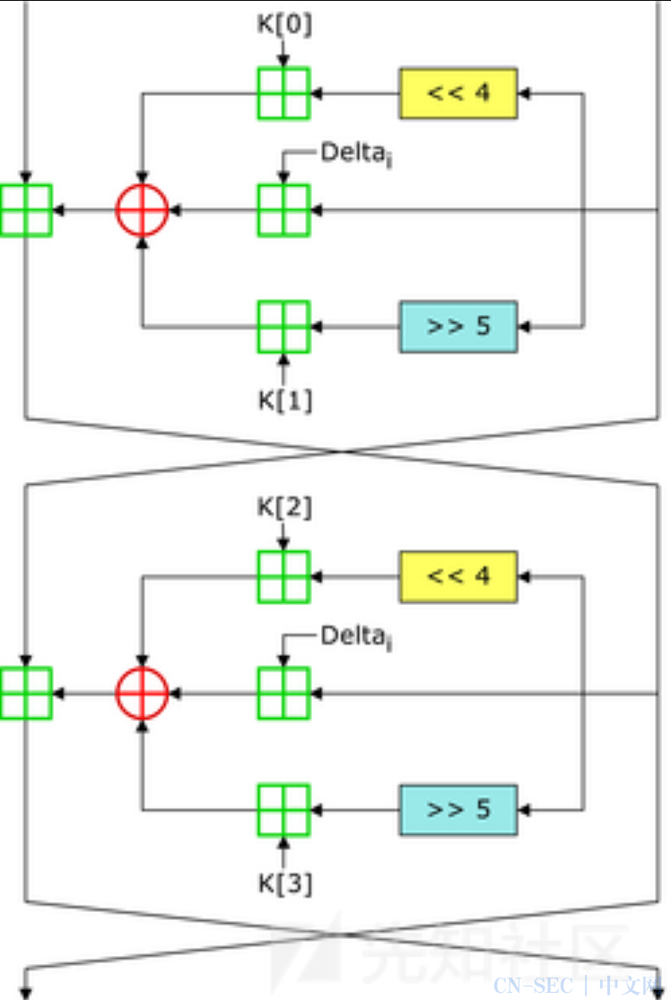
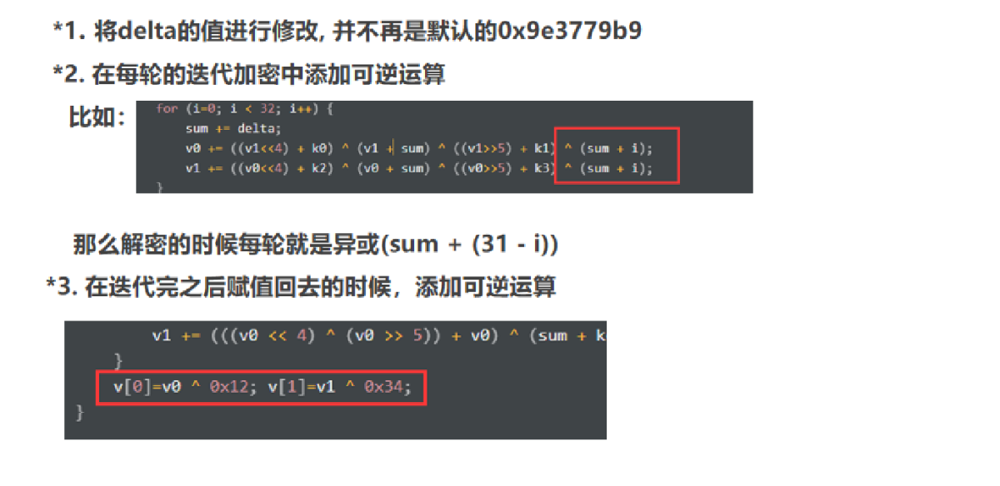
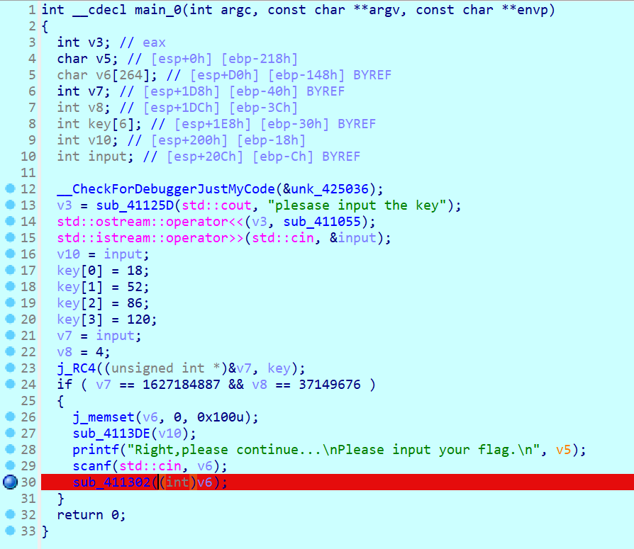
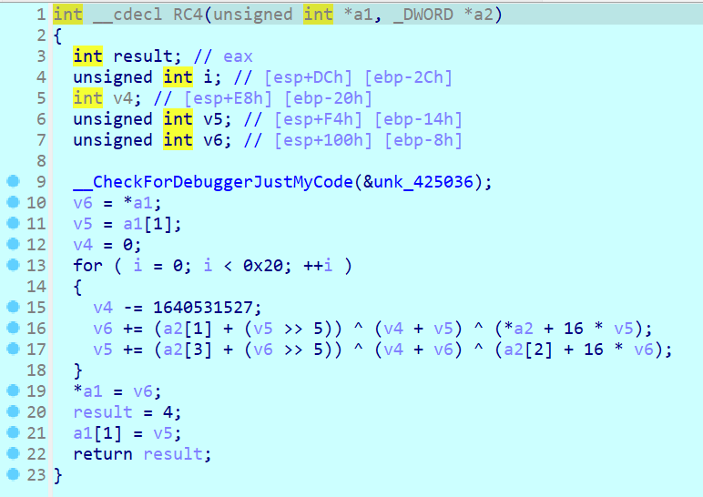
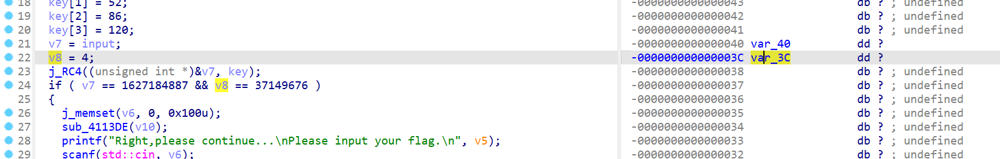
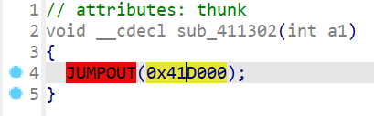
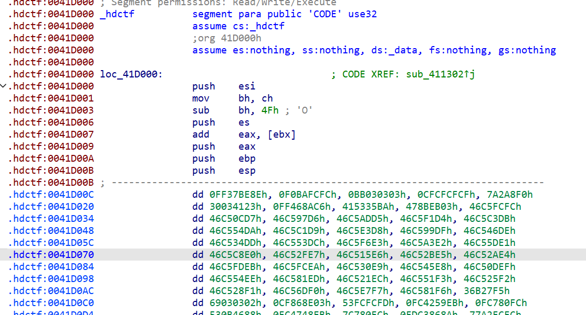
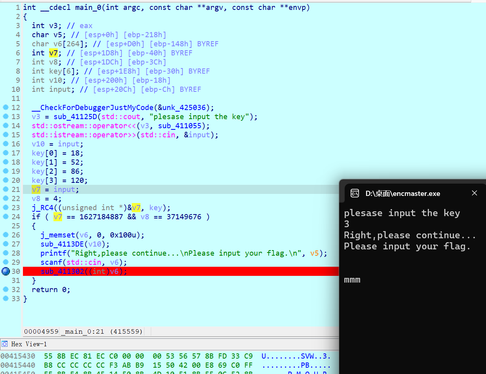
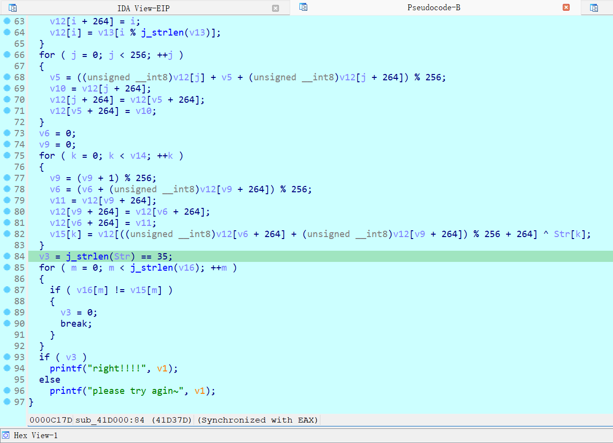
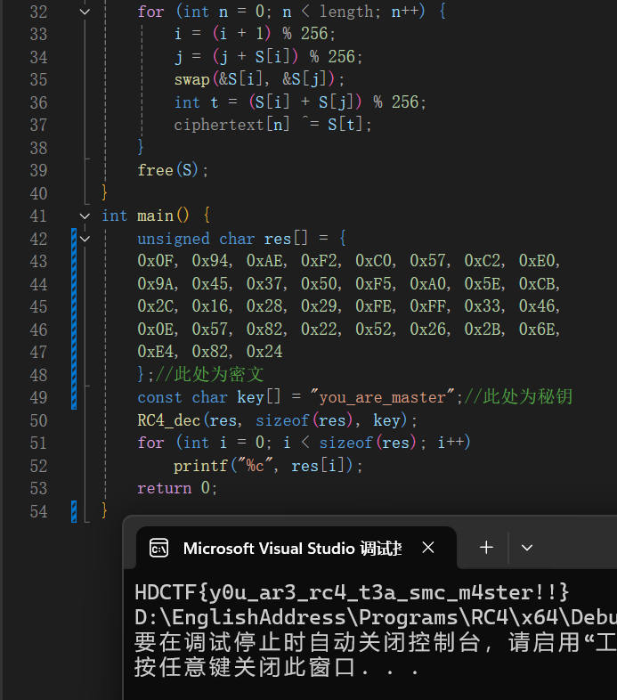

# Tea加密

## 算法详解

​`TEA`​在加密的过程中要加密的**明文**使用2个32位无符号整数（2×4字节），**秘钥**为4个32位无符号整数（4×4字节），更长的明文可通过分为多个4字节为单位的小组分别进行加密（循环）

加密流程示意图：



## 实战识别

在逆向分析实战中判断`TEA`​算法的可从其**3行核心加密中出现的右移4左移5，两行各有3个小括号互相异或的加密流程**和**单次加密循环32次**以及**运算中出现的**​**​`sum`​**​**和**​**​`delta`​**​**变量**看出

## 代码实现

下面是`TEA`​算法**加密**过程的C语言函数实现

```c
#include <stdio.h>
#include <stdint.h>
void encrypt(uint32_t* temp, uint32_t* key) // 解密函数
{  
    uint32_t v0 = temp[0], v1 = temp[1];
    int sum = 0;    // 初始sum值，注意此处要修改为delta的32倍
    uint32_t delta = 0x9e3779b9;  // 和加密函数一致的delta常量
    for (int i = 0; i < 32; i++) {
        sum += delta;
        v0 += ((v1 << 4) + key[0]) ^ (v1 + sum) ^ ((v1 >> 5) + key[1]);
        v1 += ((v0 << 4) + key[2]) ^ (v0 + sum) ^ ((v0 >> 5) + key[3]);// 不要修改算式！
    }
    temp[0] = v0;
    temp[1] = v1;
}
```

下面是TEA算法解密过程的C语言代码实现

```c
#include <stdio.h>
#include <stdint.h>
void decrypt(uint32_t* temp, uint32_t* key) // 解密函数
{  
    uint32_t v0 = temp[0], v1 = temp[1];
    int sum = 0x9e3779b9 * 32;    // 初始sum值，注意此处要修改为delta的32倍
    uint32_t delta = 0x9e3779b9;  // 和加密函数一致的delta常量
    for (int i = 0; i < 32; i++) {
        v1 -= ((v0 << 4) + key[2]) ^ (v0 + sum) ^ ((v0 >> 5) + key[3]);// 不要修改算式！
        v0 -= ((v1 << 4) + key[0]) ^ (v1 + sum) ^ ((v1 >> 5) + key[1]);
        sum -= delta;
    }
    temp[0] = v0;
    temp[1] = v1;
}
int main() {
    uint32_t key[4] = 
    {
        // 此处存放密钥
    };  
    uint32_t temp[2];  // 存储每组密文
    uint8_t flag[32] = 
    {
        // 此处存放要解密的数据
    };
    for (int i = 0; i < 32; i += 8)// 有多少字节的密文，就填i<多少（此处为32）
    {  
        temp[0] = *(uint32_t*)&flag[i];
        temp[1] = *(uint32_t*)&flag[i + 4];

        decrypt(temp, key);// 调用解密函数

        for (int j = 0; j < 2; j++) // 输出解密后的数据
        {
            for (int m = 0; m < 4; m++) 
            {
                printf("%c", temp[j] & 0xff);  // 按字节输出，恢复原始字符
                temp[j] >>= 8;
            }
        }
    }
    return 0;
}
```

## 魔改

魔改TEA的一些方法：



4. ​`腾讯TEA`​  
    TEA的变种，标准TEA中使用的32轮加密，而腾讯只用了16轮。
5. ​`CBC模式的TEA`​

将明文分组与前一个密文分组进行异或运算，然后再进行加密，对于第一组的话就设置一个初始值来和第一组明文异或。

每一轮是取v0和v1，data1, data2和v0，v1异或，异或之后的data1和data2传入指针进行tea加密，之后再将加密之后的赋值回的v0和v1。

逆向方法：

```c
void encrypt(uint32_t* v, uint32_t* k) {
    uint32_t v0 = v[0], v1 = v[1], sum = 0, i;

    data1 ^= v0;
    data2 ^= v1;
    v0 = data1;
    v1 = data2;        

    uint32_t delta = 0x6e75316c;
    uint32_t k0 = k[0], k1 = k[1], k2 = k[2], k3 = k[3];
    for (i = 0; i < 32; i++)
    {
        sum += delta;
        v0 += ((v1 << 4) + k0) ^ (v1 + sum) ^ ((v1 >> 5) + k1) ^ (sum + i);
        v1 += ((v0 << 4) + k2) ^ (v0 + sum) ^ ((v0 >> 5) + k3) ^ (sum + i);
    }
    data1 = v0;
    data2 = v1;
}

```

## 例题

### [HGAME 2023 week1]a\_cup\_of\_tea

阅读反汇编代码，恢复部分函数名和符号如下

```c
int __fastcall main(int argc, const char **argv, const char **envp)
{
  int v3; // eax
  char *v4; // rcx
  __m128i si128; // [rsp+20h] [rbp-19h] BYREF
  int Buf2[8]; // [rsp+30h] [rbp-9h] BYREF
  __int16 v8; // [rsp+50h] [rbp+17h]
  __int128 Buf1; // [rsp+58h] [rbp+1Fh] BYREF
  __int128 v10[2]; // [rsp+68h] [rbp+2Fh] BYREF
  __int16 v11; // [rsp+88h] [rbp+4Fh]

  Buf2[0] = 0x2E63829D;
  Buf1 = 0i64;
  memset(v10, 0, sizeof(v10));
  v11 = 0;
  Buf2[1] = 0xC14E400F;
  si128 = _mm_load_si128((const __m128i *)&xmmword_1400022B0);
  Buf2[2] = 0x9B39BFB9;
  Buf2[3] = 0x5A1F8B14;
  Buf2[4] = 0x61886DDE;
  Buf2[5] = 0x6565C6CF;
  Buf2[6] = 0x9F064F64;
  Buf2[7] = 0x236A43F6;
  v8 = '}k';// 按R变字符串
  printf("nice tea!\n> ");
  scanf("%50s");
  sub_1400010B4((unsigned int *)&Buf1, si128.m128i_i32);
  sub_1400010B4((unsigned int *)&Buf1 + 2, si128.m128i_i32);
  sub_1400010B4((unsigned int *)v10, si128.m128i_i32);
  sub_1400010B4((unsigned int *)v10 + 2, si128.m128i_i32);
  v3 = memcmp(&Buf1, Buf2, 0x22ui64);
  v4 = "wrong...";
  if ( !v3 )
    v4 = "Congratulations!";
  printf(v4);
  return 0;
}

```

可知Buf2为密文，si128是密文，核心加密算法在sub_1400010B4，其分组进行了四次

```c
__int64 __fastcall sub_1400010B4(unsigned int *a1, int *a2)
{
  int v2; // ebx
  int v3; // r11d
  int v4; // edi
  int v5; // esi
  int v6; // ebp
  unsigned int v7; // r9d
  __int64 v8; // rdx
  unsigned int v9; // r10d
  __int64 result; // rax

  v2 = *a2;
  v3 = 0;
  v4 = a2[1];
  v5 = a2[2];
  v6 = a2[3];
  v7 = *a1;
  v8 = 32i64;
  v9 = a1[1];
  do
  {
    v3 -= 1412567261;
    v7 += (v3 + v9) ^ (v2 + 16 * v9) ^ (v4 + (v9 >> 5));
    result = v3 + v7;
    v9 += result ^ (v5 + 16 * v7) ^ (v6 + (v7 >> 5));
    --v8;
  }
  while ( v8 );
  *a1 = v7;
  a1[1] = v9;
  return result;
}

```

由>>5和*16（即<<4）易知其为TEA加密算法，由此即可写出解密代码

```c
#include<stdio.h>
#include<string.h>
#include<stdint.h>
int main()
{
    unsigned int key1 = 0x12345678;
    unsigned int key2 = 0x23456789;
    unsigned int key3 = 0x34567890;
    unsigned int key4 = 0x45678901;
    unsigned int sum = 0x79bde460;
    int i = 32;
    unsigned int enc1 = 0x9F064F64;
    unsigned int enc2 = 0x236A43F6;//一定要注意把数据设置为无符号类型！！！
    int enc[2] = { 0 };
    do
    {
        enc2 -= (sum + enc1) ^ (key3 + 16 * enc1) ^ (key4 + (enc1 >> 5));
        enc1 -= (sum + enc2) ^ (key1 + 16 * enc2) ^ (key2 + (enc2 >> 5));
        sum -= -1412567261;
        --i;
    } while (i);
    *enc = enc1;
    enc[1] = enc2;
    for (int j = 0; j < 2; j++) // 输出解密后的数据
    {
        for (int m = 0; m < 4; m++)
        {
            printf("%c", enc[j] );  // 按字节输出，恢复原始字符
            enc[j] >>= 8;
        }
    }
    printf("%c%c", 0x6b, 0x7d);
    return 0;


    //第一轮：hgame{Te
    //第二轮：a_15_4_v
    //第三轮：3ry_h3a1
    //第四轮：thy_drln
    //补充后缀：k}
    //hgame{Tea_15_4_v3ry_h3a1thy_drlnk}
}

```

注意在原程序的密文定义中v8紧跟在enc数组的栈内地址后面，其没有进行tea加密，而是以明文形式存储着密文的最后两位内容

### [HDCTF 2023]enc



进入main_0函数，经分析可知"input key"阶段进行的是TEA加密，并给出了key秘钥的内容(此处笔误写成了RC4)



查看栈段的调用发现v7和v8是连着的



传入RC4加密函数是v7的地址，根据后面if中的条件中对v7和v8的判断得出密文，可用TEA解密代码得出

```c
#include <stdio.h>
#include <stdint.h>
void decrypt(uint32_t* temp, uint32_t* key) // 解密函数
{  
    uint32_t v0 = temp[0], v1 = temp[1];
    int sum = 0xC6EF3720;    // 初始sum值，注意此处要修改为delta的32倍
    uint32_t delta = 0x9e3779b9;  // 和加密函数一致的delta常量
    for (int i = 0; i < 32; i++) {
        v1 -= ((v0 << 4) + key[2]) ^ (v0 + sum) ^ ((v0 >> 5) + key[3]);// 不要修改算式！
        v0 -= ((v1 << 4) + key[0]) ^ (v1 + sum) ^ ((v1 >> 5) + key[1]);
        sum -= delta;
    }
    temp[0] = v0;
    temp[1] = v1;
}

int main() {
    uint32_t key[4] = 
    {
        0x12,0x34,0x56,0x78
    };  
    uint32_t temp[2];  // 存储每组密文
        temp[0] = 0x60FCDEF7;
        temp[1] = 0x236DBEC;
        decrypt(temp, key);// 调用解密函数
        for (int j = 0; j < 2; j++) // 输出解密后的数据
        {
            for (int m = 0; m < 4; m++) 
            {
                printf("%d", temp[j] & 0xff);  // 按字节输出，恢复原始字符
                temp[j] >>= 8;
            }
        }
    return 0;
}

```

得出解密结果为00030004（要以整数输出），即key为3

点开最后处理v6的sub\_411302函数



发现是一堆未识别出的数据



打断点进入调试模式



步进运行程序将loc_0041D000地址的数据分析为指令，再在loc_0041D000处按P将其分析为函数，分析伪代码可知该函数为RC4加密



```c
#include <stdio.h>
#include <stdlib.h>
void swap(unsigned char* a, unsigned char* b) {
    // 交换两个字节
    unsigned char temp = *a;
    *a = *b;
    *b = temp;
}
void RC4_dec(unsigned char* ciphertext, int length, const char* key) {
    // RC4解密函数
    int i, j;
    unsigned char* S;
    unsigned char k[256];
    int keylen = 0;
    while (key[keylen] != '\0') {
        keylen++;
    }
    for (i = 0; i < 256; i++) {    // 初始化密钥数组k
        k[i] = key[i % keylen];
    }
    S = (unsigned char*)malloc(256 * sizeof(unsigned char));    // 初始化S盒
    for (i = 0; i < 256; i++) {
        S[i] = i;
    }
    j = 0;
    for (i = 0; i < 256; i++) {
        j = (j + S[i] + k[i]) % 256;
        swap(&S[i], &S[j]);
    }
    i = 0;
    j = 0;
    for (int n = 0; n < length; n++) {
        i = (i + 1) % 256;
        j = (j + S[i]) % 256;
        swap(&S[i], &S[j]);
        int t = (S[i] + S[j]) % 256;
        ciphertext[n] ^= S[t];
    }
    free(S);
}
int main() {
    unsigned char res[] = {
    0x0F, 0x94, 0xAE, 0xF2, 0xC0, 0x57, 0xC2, 0xE0,
    0x9A, 0x45, 0x37, 0x50, 0xF5, 0xA0, 0x5E, 0xCB,
    0x2C, 0x16, 0x28, 0x29, 0xFE, 0xFF, 0x33, 0x46,
    0x0E, 0x57, 0x82, 0x22, 0x52, 0x26, 0x2B, 0x6E,
    0xE4, 0x82, 0x24
    };//此处为密文
    const char key[] = "you_are_master";//此处为秘钥
    RC4_dec(res, sizeof(res), key);
    for (int i = 0; i < sizeof(res); i++)
        printf("%c", res[i]);
    return 0;
}

```

用RC4代码解密即可




